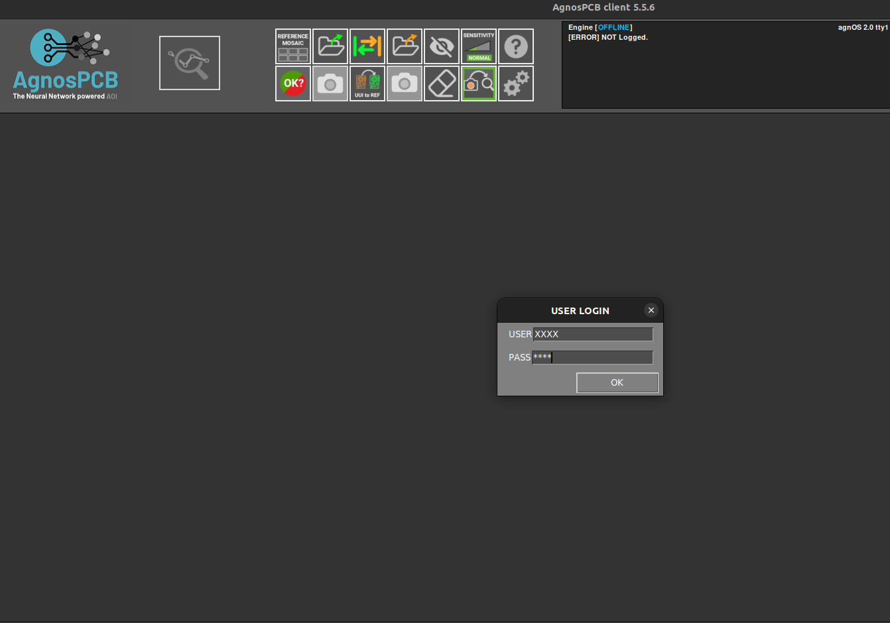

# Account Created
___

Upon completing the account creation process, you will promptly receive an email containing vital information to facilitate your interaction with our platform. Here's a detailed breakdown of the email content:

Hello **[User's Name]**,

We have created an account for you, please take note of the following login credentials:

-  User ID: **[Your assigned User ID]**
- Password: **[Your assigned Password]**

 

In addition to your login credentials, your account includes access to **[number of inspections selected]** inspections, empowering you to initiate inspections and make the most of our services.

Furthermore, your User ID and Password are valid for both the AgnosPCB APP and our inspection platform, ensuring seamless access across multiple interfaces. You can access the web application [here](https://ai.agnospcb.com/) and refer to a concise guide on using the WebApp with a regular camera [here](https://agnospcb.com/how-to-use-it/).

If you require assistance with installation, we've provided detailed instructions in the "[Installation process](Installation_process.md "Installation process")" section of our platform. For offline or online versions, you can refer to the "[Assembly guide](Assembly_guide.md "Assembly guide")" to learn how to assemble the version you possess. Additionally, detailed instructions on connecting the camera are available in the "[Connect the camera](Connect-the-camera.md "Connect the camera")" section, offering options for connecting to the AgnosPCB laptop, microcomputer, or Nuc.

To further enhance your experience, we recommend familiarizing yourself with the platform's functionalities by referring to the [user guide](User_guide.md "User guide"). Additionally, the [FAQ](FAQ.md "FAQ"), [Troubleshooting](Troubleshooting.md "Troubleshooting"), and [inspection workflow](Inspection_workflow.md "Inspection workflow") sections provide valuable resources to address any queries or issues you may encounter.

!!! note "Note"

    For optimal results, we advise uploading photos with a resolution of 12 Megapixels. The quality of the photo directly influences the accuracy of the inspection results. In the event that you do not possess a camera of sufficient quality, we can provide you with PCBA photos captured using our inspection platform.

Throughout the trial period, our team will monitor the results and provide feedback on how to enhance the detection capabilities of the software. It's important to note that the quality of the photos significantly impacts the results. Rest assured, all images uploaded to AgnosPCB will be promptly removed from our servers within 24 hours.
