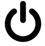
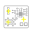

# Control panel buttons/Action Buttons

## Control panel buttons

These buttons will be enabled or disabled depending on the inspection stage you are in.

**Start the inspection process.** This button is enabled only after you have a REFERENCE and TO BE INSPECTED images already set. Keyboard shortcut: ENTER. When clicked, will inspect the image taken for the circuit/panel and look for faults.

**IMPORTANT: How Error report works**

If you get false positives or faults not properly detected can be reported to us. It is very important for us to get this information, as the neural network will learn from its mistakes. If you find a reflection on a surface marked as fault, a not perfectly indicated issue anything you want us to review, just report it pressing the **UP arrow key after placing the mouse’s cursor on top of it.** It will take less than a second and will let the software adapt its detection capacities to your particular manufacturing process.

**Log-out button.** Click here to log out. You will be asked again for your user credentials next time you launch the software.

**Turn it OFF:** This button will turn the Raspberry 400 off. If you need to get the USB DRIVE with the inspection images safely, turn the raspberry 400 off before unplug it.

## ACTION Buttons

**The action buttons are located in the upper right corner of the inspection areas.**

**LOAD photo:** Use this ICON to load a **“reference”** or **“to be inspected”** photo. If you have stored a **“reference”** image and want to retrieve it to use it again, use this button. You can do the same with an image of a **“to be inspected”** circuit/ panel. This button will get non-functional if you have the **AUTO-PROCESSING** option enable, which will automatically process every photo taken with the camera.

**CROP IMAGE:** Useful when the panel/circuit in the photo is too small. Cropping the image will “force” the software to focus in the selected area. Only available in the **REFERENCE** canvas. The software will automatically look for the same area in every photo taken of the panels to be inspected after it has been set. To remove the CROP boundaries, click on the icon again.

**Auto-signalling:** In order to **highlight** the faults detected you have two options: 1) change the color of the faults mask using the Action button **“layers”** (explained below) or 2) enabling this feature. It will place a yellow cross on top of the faults detected. Not visible in the magnification areas.

**Auto Analyze:** if activated, the next photo taken will be **automatically** processed. That means that the image will be analyzed for faults right after being taken. This option reduces the processing time for every inspection.

**Faults Mask-colors:** Once the analysis of the panel/circuit has been carried out, the results will be shown as a new mask on top of the image. If faults have been detected, they will be highlighted in red/blue or green. Depending on the PCBA´s color / material you are working with, you may need to change the opacity and color of the mask in order to easily pinpoint where those faults are. Every time you click on the ICON the mask color will change. Its opacity can be modified spinning the mouse’s wheel when it is placed on top of the ICON.

## Other features: ZOOM

The ZOOM will let you appreciate the faults with more detail. It can be used to check if the photos taken are, or not, in focus. In order to use it, spin the mouse’s wheel on any “REFERENCE” or “TO BE INSPECTED” areas.

## IMPORTANT: How Error Report works

If you get false positives or faults not properly detected can be reported to us. It is very important for us to get this information, as the neural network will learn from its mistakes. If you find a reflection on a surface marked as fault, a not perfectly indicated issue anything you want us to review, just report it pressing the **UP arrow key after placing the mouse’s cursor on top of it.** It will take less than a second and will let the software adapt its detection capacities to your particular manufacturing process.

