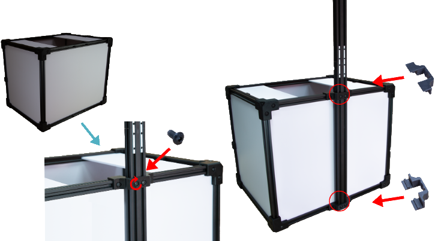
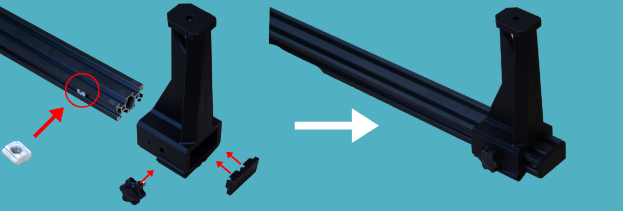

# Assembly guide

The main structure of the platform is already assembled, what you will need to do is to assemble the additional parts such as the led lights and the camera. Follow the instructions below as indicated and shown in the pictures using the elements included in the package.

## How to install LED light panels

Slide both upper light diffusers to make room
  

Next tighten the screw to hold the lights and pass the cable under the platform. Repeat this process on both sides

## How to install the mast

Then, once the LED lights are in place, we move on to mount the camera mast. To do this we join the two parts of the mast together as shown in the image and put a cover on the edge.
  

  To mount the mast to the platform, use the brackets supplied to secure the mast, ensuring that the screws are tightened securely.

 

  Attach the camera bracket to the mast as shown.

  Finally, connect the camera to the support and secure it by tightening the screw. Then connect the dummy battery and USB cable.

## SONY CAMERA. Notes.

You got the SONY camera with the 50 mm 1.8f fixed lens already pre-configured but, if accidentally, its photo settings change you will need to set them again as below:

1. Set the mode dial to A (Aperture Priority) pressing the round button and selecting the A mode.

2) Select the value F7.1 by turning the control dial (right image). Setting the aperture to 7.1 will let you get the most detailed photos of your PBCAs

3) Pressing the MENU button, go to setting and set the AEL w/shutter to ON

4) inside the same MENU, the last tab has an option called USB connection. Set it to PC REMOTE.

⚠️**IMPORTANT**: all the PCB to be inspected have to be **perfectly leveled**. If the panel/circuit has a certain tilt angle, not all the elements shapes will be perfectly defined limiting the software recognition capacities.

To capture the whole dimension of the panel / circuit you are inspected, move the camera UP in the mast. For smaller circuits/ panel, move it down but **never use digital zoom**.

**Do not use the DIGITAL ZOOM** with the 50mm optics system. It will only **artificially** increase the size of the digital image not adding real info to the photograph. 

If you change any parameter or adjust the camera while the system is ON, the camera will get unresponsive. You will need to disconnect it from the laptop and reconnect it again.

If everything is fine, you will get **highly detailed photographs** of your PCBa. Above, example of two photos taken with the inspection platform. No **shadows cast nor direct light reflections are present**.

