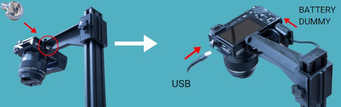
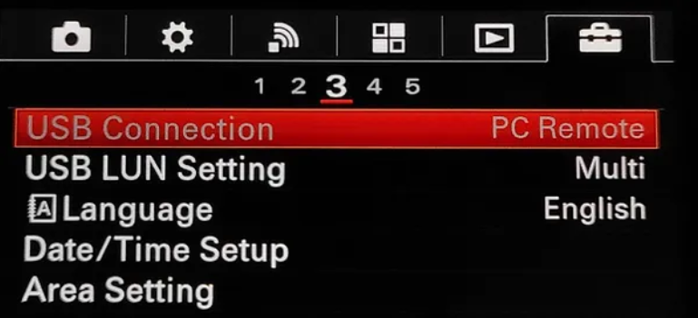

# Assembly guide

The primary framework of the platform has already been constructed, leaving you with the task of assembling supplementary components such as the LED lights and camera. To accomplish this, refer to the **step-by-step** instructions provided below, accompanied by corresponding visual aids depicting the process. Utilize the components included in the **package** to complete the assembly with precision and ease.

## How to install LED light panels

To install the **LED light panels**, start by sliding both upper **light diffusers** to create space for installation.
  

{ align=right }

 Then, carefully tighten the screws to secure the lights in place, ensuring they are properly aligned. After securing the lights, pass the cable **under the platform** to ensure a tidy setup. Repeat this procedure on both sides of the platform for uniform illumination. 

## How to install the mast

Then, once the **LED lights** are in place, we move on to mount the camera mast. To do this we join the two parts of the mast together as shown in the image and put a cover on the edge.
  

  To mount the mast to the platform, **use the brackets supplied** to secure the mast, ensuring that the screws are tightened securely.

 

  Attach the camera bracket to the **mast** as shown.

  Finally, connect the camera to the support and secure it by tightening the screw. Then connect the **dummy battery** and **USB** cable.

## SONY Camera. 

You got the **SONY camera** with the 50 mm 1.8f fixed lens already pre-configured but, if accidentally, its photo settings change you will need to set them again as below:

1. Set the **mode dial to A** (Aperture Priority) pressing the round button and selecting the A mode.

2) Select the **value F7.1** by turning the control dial (right image). Setting the aperture to 7.1 will let you get the most detailed photos of your PCBAs

3) Pressing the **MENU** button, go to setting and set the AEL w/shutter to ON

4) inside the same MENU, the last tab has an option called USB connection. Set it to **PC REMOTE**.

???+ warning "Important"

    All the PCB to be inspected have to be perfectly leveled. If the panel/circuit has a certain tilt angle, not all the elements shapes will be perfectly defined limiting the software recognition capacities.

To capture the whole dimension of the panel / circuit you are inspected, move the camera UP in the mast. For smaller circuits/ panel, move it down but **never use digital zoom**.

**Do not use the DIGITAL ZOOM** with the 50mm optics system. It will only **artificially** increase the size of the digital image not adding real info to the photograph. 

If you change any parameter or adjust the camera while the system is **ON**, the camera will get unresponsive. You will need to disconnect it from the laptop and reconnect it again.

If everything is fine, you will get **highly detailed photographs** of your PCBA. Above, example of two photos taken with the inspection platform. No shadows cast nor direct light reflections are present.

