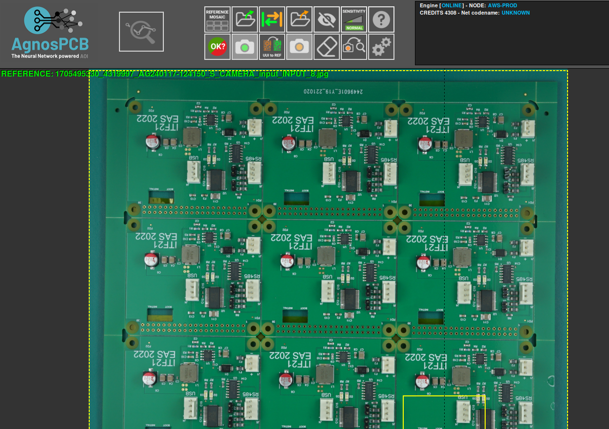
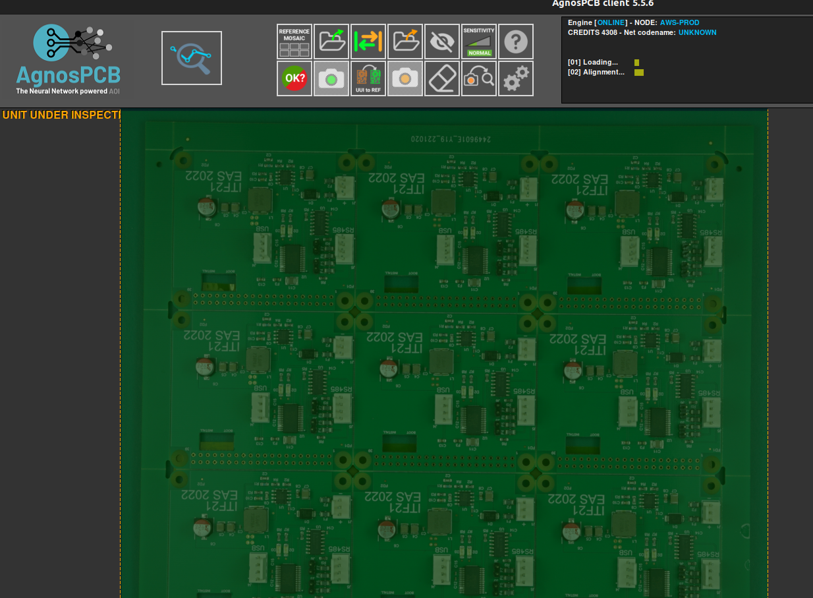
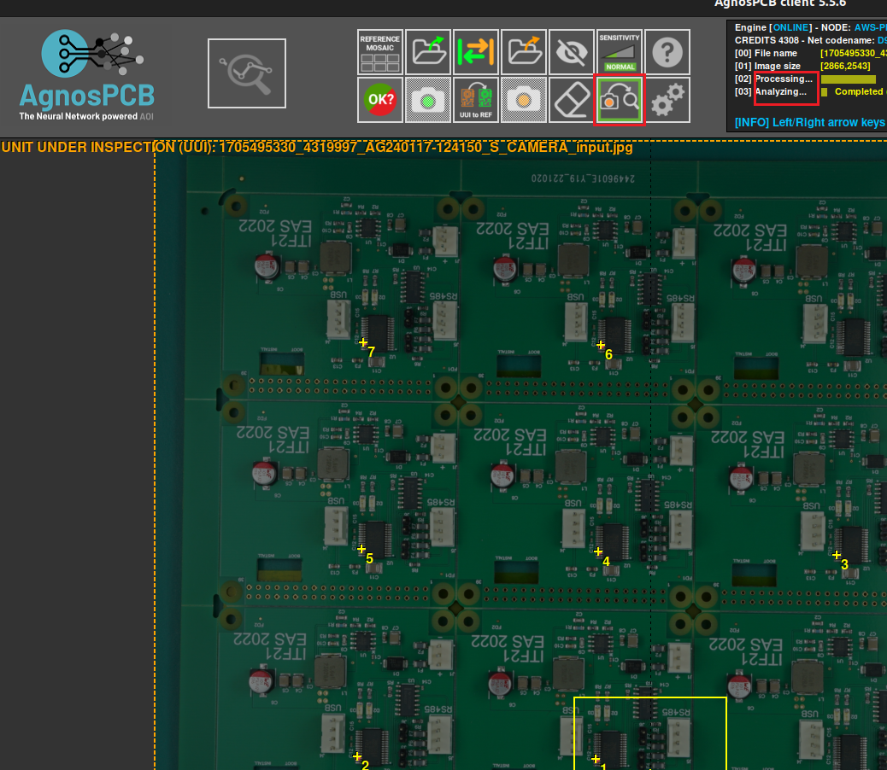
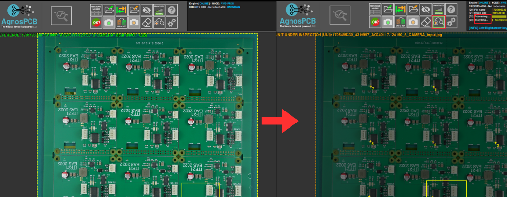

# Auto processing

**"Auto processing"** is a functionality tailored for the inspection and assessment of **PCBs**. When activated, this feature triggers an automated examination of the next UUI photographed or uploaded to the system. The purpose is to swiftly identify any potential faults or defects within the board's design or assembly.

By employing **"Auto processing"**, the inspection process becomes more efficient and streamlined. Instead of manually scrutinizing each **PCB** after it's been photographed or loaded, the system automatically analyzes the image for faults in real-time, right after the picture is taken. This immediate feedback loop enables quick detection of issues, minimizing the time required for inspection and subsequent corrective actions.

This feature is particularly beneficial in manufacturing environments where PCBs are produced in large quantities and precision is crucial. By automating the analysis process, **"Auto processing"** helps to accelerate quality control procedures, reduce production downtime, and ensure that only flawless PCBs proceed further along the manufacturing line.

In a scenario where autoprocessing remains deactivated, our inspection process begins with the essential step of loading the **REFERENCE**. This REFERENCE serves as our benchmark, providing a standard against which we'll compare the subsequent **UUI**. 

Once the **REFERENCE** is loaded, we proceed to introduce the **UUI**. However, since autoprocessing isn't engaged, the program refrains from immediately analyzing the image or initiating fault detection algorithms. 

This delay requires manual intervention to **activate UUI processing.** In this way, we activate the programme's ability to detect errors within the **UUI**, ensuring a thorough evaluation against the established **REFERENCE**.

Conversely, with autoprocessing activated, the workflow undergoes a significant transformation. After saving the **REFERENCE** and loading the **UUI**, the program seamlessly transitions into autoprocessing mode. Here, the program takes the reins, automatically initiating image processing and error detection algorithms. 

