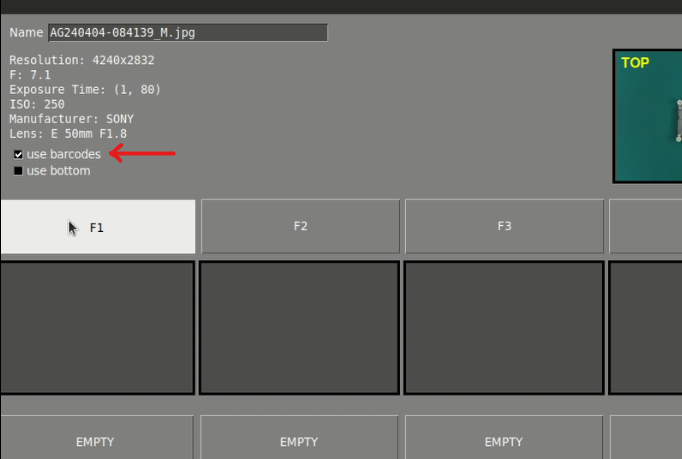
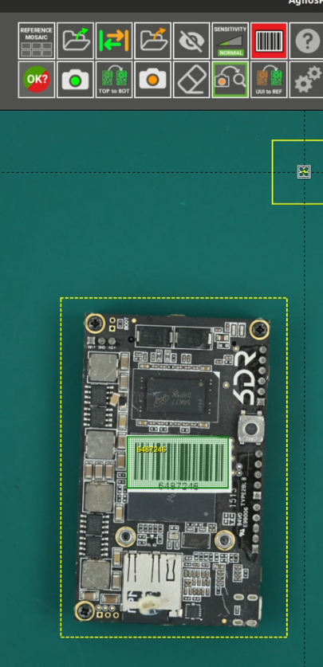
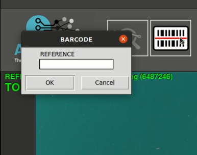

# **Barcode reader**
___

The AgnosPCB software incorporates a barcode reader function.

First, open the application and log in with your credentials as usual.

You can either take a **REFERENCE** photo or upload one directly from your files using the **"Open reference"** button.

Save the reference in the mosaic and make sure to set the option **"use barcodes"** as shown below:

If the barcode is not automatically recognized, select the **"draw barcode area"** button and choose the barcode area.

Once the **REFERENCE** is loaded, use the **"Open UUI"** button or take a picture of the UUI. The UUI's barcode will be read automatically.
Proceed with the [inspection process](Inspection_workflow.md/#how-to-do-an-inspection) as usual. 

Once you've selected all the errors, you can finish the inspection by clicking on the **"finish inspection"** button. This will open a window where you can rename the file, add comments, and select if the UUI is OK or NOT OK if it has unpassable errors.

This action automatically generates a pdf report that you can find in the **PCB_OUT folder**. At the top of the report, you'll see data such as the date, whether the PCB passed the inspection or not, the data, observations, the **UUI** and **REFERENCE** image, the errors, and their specifications. Additionally, it'll show the barcode identification number.

{ align=right }
If you already have a stored **REFERENCE**, you can retrieve it and continue with your inspection. To do this, press the **"read barcode"** button, then read the barcode using the handheld reader, and the **REFERENCE** will load automatically.

