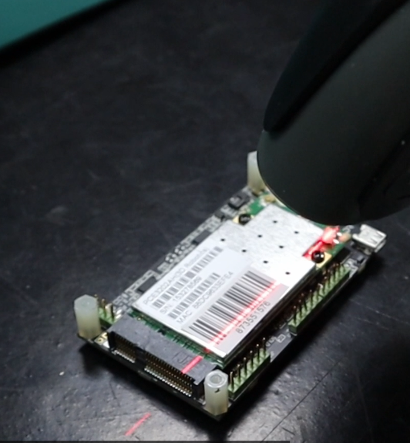

# Barcode reader

If the PCB you're inspecting has a **barcode**, it'll bring some changes to how the inspection process works.

First, you'll still need to open the application and log in with your credentials as usual.

{ align=right }

Next, you can either take a **REFERENCE** photo or upload one directly from your files using the **"Open reference"** button.

Once you've got the reference open, things start to change a bit. When you save the reference in the mosaic, you'll need to make sure to set the option **"use barcodes"**. 

Then, you'll have to select the **"draw barcode area"** button and choose the barcode area.

After you've uploaded the **REFERENCE**, you can use the **"Open UUI"** button or take a picture of the UUI. Once it's uploaded, it'll be automatically processed, and the software will start pointing out potential errors. You can scroll through them using the **"right"** or **"left"** keys and mark an error using the **"up"** key. Even though you're using a barcode, you can still use other functions mentioned in the Inspection workflow section, like sensitivity, exclusion area, and settings. You can also select the errors and specify them or not.

Once you've selected all the errors, you can finish the inspection by clicking on the **"finish inspection"** button. This will open a window where you can rename the file, add comments, and select if the UUI is OK or if it has unpassable errors. After this, a pdf report will be generated.

{ align=right }

This action automatically generates a pdf report that you can find in the **PCB_OUT folder**. Inside the report, you'll see data such as the date, whether the PCB passed the inspection or not, the data, observations, the **UUI** and **REFERENCE** image, the errors, and their specifications. Additionally, it'll show the barcode identification number.

{ align=right }
If you already have a stored **REFERENCE**, you can retrieve it and continue with your inspection. To do this, press the **"read barcode"** button, then read the barcode using the handheld reader, and the **REFERENCE** will load automatically.

