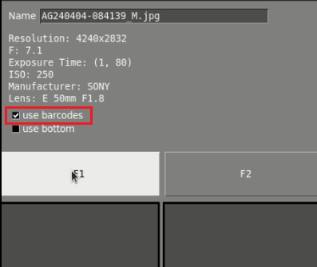

# Barcode reader

In case the pcb to be inspected has a barcode, some changes will be generated in the inspection process. The start will be the same, you will have to open the application and insert your credentials. Then you can take a REFERENCE photo or upload it directly from the file with the ¨Open reference¨ button. Once you have opened the reference, the first changes start when it comes to the inspection, because when you save the reference in the mosaic you have to make sure to set the option ¨use barcodes¨.

Then you must select the "draw barcode area" button and select the barcode area.

After uploading the REFERENCE, use the "Open UUI" button or take a picture of the UUI. Once uploaded it will be automatically processed and will start pointing out possible errors. To scroll through them use the "right" or "left" keys and to mark an error use the "up" key.
 

Despite using a barcode you can also use the other functions mentioned in the "inspection workflow" section such as sensitivity, exclusion area, settings and so on. You can also select the errors and specify them or not.

After you have selected all the errors you can finish the inspection by clicking on the "finish inspection" button.  Pressing the button will open a window where you can rename the file, add comments and select if the UUI is OK or if it has unpassable errors. After this a pdf report will be generated.

This action will automatically generate a pdf report that you can find in the PCB_OUT folder. Inside the report will appear data such as date, if the pcb has passed or not the inspection, the data, the observations, the UUI and REFERENCE image and the errors together with their specifications. In addition, it will show the barcode identification number.

In case you already have a stored REFERENCE you can retrieve it and continue with your inspection. To do this press the button ¨read barcode¨

Then read the barcode using the hand gun and the REFERENCE is loaded automatically. (poner foto del video) 