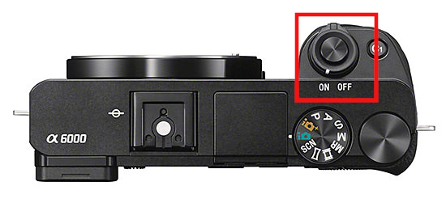
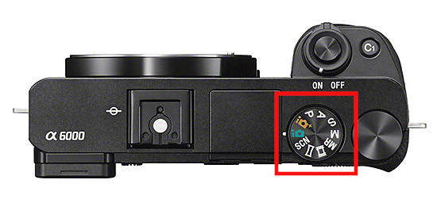
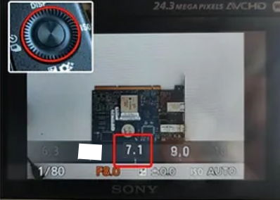
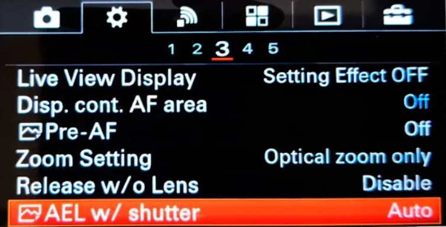
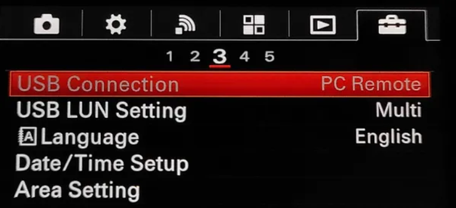
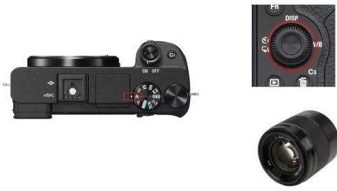

# Connecting the camera 

## Powering on the camera

First, be sure to connect the **micro USB cable and battery dummy** to the camera as shown in the picture:

{ align=right }

!!! warning "Important"
    For convenience, do not mount the camera on the mast until it has been completely configured.

___
## Parameters

The SONY camera have a 50 mm 1.8f fixed lens already pre-configured but, if accidentally, its photo settings change you will need to set them again as below:

**1)** Turn on the camera by moving the selector in the top of the camera to "ON".

**2)** Set the mode **dial to A** (Aperture Priority) pressing the round button and selecting the A mode.

**)** Select the value **F7.1** by turning the control dial. Setting the aperture to 7.1 will get the most detailed photos of your PBCAs.

**4)** Pressing the **MENU** button, go to setting and set the **AEL w/shutter to ON**

**3)** inside the same **MENU**, the last tab has an option called USB connection. Set it to **PC REMOTE**.

!!! warning "important"

    All the PCB to be inspected have to be perfectly leveled. If the panel/circuit has a certain tilt angle, not all the elements shapes will be perfectly defined limiting the software recognition capacities.

To capture the whole dimension of the panel / circuit you are inspected, move the camera UP in the mast. For smaller circuits/ panel, move it down but **never use digital zoom**.

!!! warning "important"

    Do not use the DIGITAL ZOOM with the 50mm optics system. It will only artificially increase the size of the digital image not adding real info to the photograph.

If you change any parameter or adjust the camera while the system is ON, the camera will get unresponsive. You will need to disconnect it from the laptop and reconnect it again.

If everything is fine, you will get **highly detailed photographs** of your PCBa. Above, example of two photos taken with the inspection platform. No **shadows cast nor direct light reflections are present**.

## **Using the 50MM FE 1.8 LENS**

In the case you have changed, accidentally, the default camera´s configuration, follow these steps:
1) Set the mode dial to **A (Aperture Priority)**
2) Select the value **F7.1** by turning the control dial (see image).

{ align=right }

!!! note "Note"

    Do not use DIGITAL ZOOM with the 50mm optics system. It will only artificially increase the size of the digital image not adding real info to the photograph. 
    If everything is fine, you will get highly detailed photographs of your PCBAs.

If you want to know how to connect the specific version you are using you can see it in the following sections:

[Connecting ONLINE units](Connect_to_the_Nuc.md "Connecting ONLINE units")

[Connecting OFFLINE units](connecting_offline_units.md "Connecting OFFLINE units")

___

## Optical/Digital Zoom

When using a DIGITAL ZOOM, the camera’s optics are not adjusted. It is accomplished electronically, so no optical resolution is gained. That means that you are not providing useful info to the software. 

If you are using our inspection platform and are inspecting a small circuit/panel: Move the camera DOWN until it is about 45 cm over from the circuit you are inspecting. The structure of the platform will not allow going down further in any case. From that distance, take the photos.

Do **not use the camera controls** to increase the size of the circuit/ panel. That will only degrade the quality of the image taken. The laptop will take control of the camera and set the best configuration under every circumstance.

