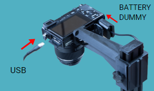
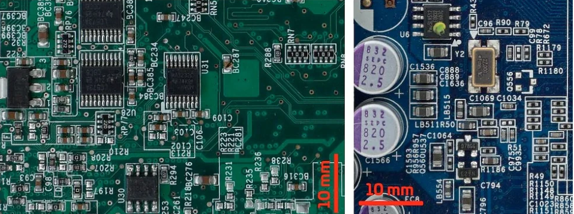

# Connect the camera 

First, be sure to connect the **USB and battery dummy** to the camera as shown in the picture.

## SONY Camera

You got the SONY camera with the 50 mm 1.8f fixed lens already pre-configured but, if accidentally, its photo settings change you will need to set them again as below:

1. Set the mode **dial to A** (Aperture Priority) pressing the round button and selecting the A mode.

2) Select the value **F7.1** by turning the control dial (right image). Setting the aperture to 7.1 will let you get the most detailed photos of your PBCAs

3) Pressing the **MENU** button, go to setting and set the **AEL w/shutter to ON**

4) inside the same **MENU**, the last tab has an option called USB connection. Set it to **PC REMOTE**.

<Important> Important: all the PCB to be inspected have to be perfectly leveled. If the panel/circuit has a certain tilt angle, not all the elements shapes will be perfectly defined limiting the software recognition capacities.</Important>

To capture the whole dimension of the panel / circuit you are inspected, move the camera UP in the mast. For smaller circuits/ panel, move it down but **never use digital zoom**.

**Do not use the DIGITAL ZOOM** with the 50mm optics system. It will only **artificially** increase the size of the digital image not adding real info to the photograph. 

If you change any parameter or adjust the camera while the system is ON, the camera will get unresponsive. You will need to disconnect it from the laptop and reconnect it again.

If everything is fine, you will get **highly detailed photographs** of your PCBa. Above, example of two photos taken with the inspection platform. No **shadows cast nor direct light reflections are present**.

## **Using the 50MM FE 1.8 LENS**

In the case you have changed, accidentally, the default camera´s configuration, follow these steps:
1) Set the mode dial to **A (Aperture Priority)**
2) Select the value **F7.1** by turning the control dial (see image).

<Note> NOTE:Do not use DIGITAL ZOOM with the 50mm optics system. It will only artificially increase the size of the digital image not adding real info to the photograph.
If everything is fine, you will get highly detailed photographs of your PCBAs. 
</Note>

