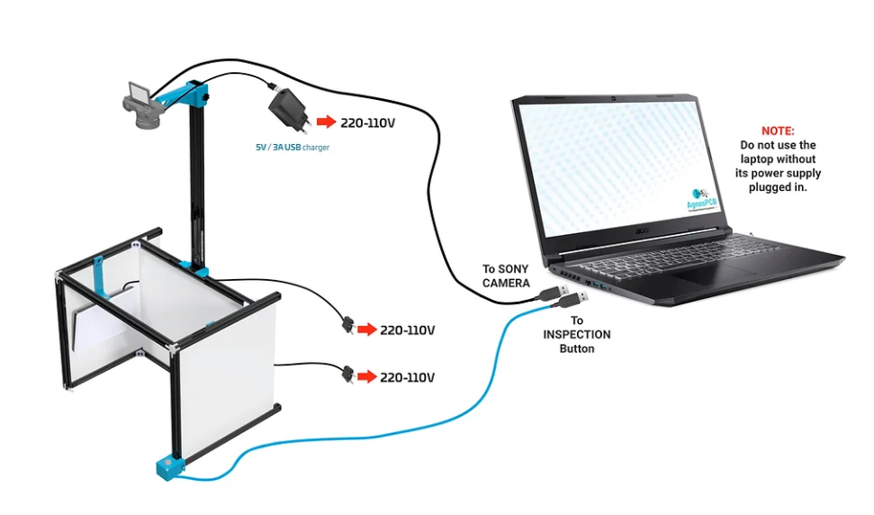

# Connect to the AgnosPCB laptop

First, you need to connect everything as indicated below:
1) Connect the **2m USB cable from the CAMERA micro-usb** port to a laptop´s USB port.
2) Insert the battery DUMMY into the CAMERA´s battery slot, and connect it to the provided 5V/3A USB power supply. See the diagrams below for details.

3) Connect the second **2m USB cable from INSPECTION BUTTON** to another laptop´s USB port.

4) Plug both LED panels into 110 or 220V sockets. Both LED panels light emission can be adjusted and turned ON/OFF using a single remote control (provided). Note that both lights have a master power switch

It does not matter to which USB port you connect the CAMERA and INSPECTION button, the computer will automatically recognize both devices properly.

