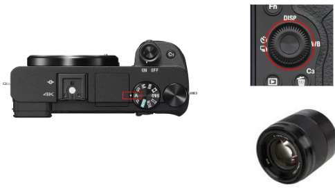

# Connect to the Nucc

The Intel NUC will be in charge of taking the photos using the best possible camera parameters. The microcomputer will do everything for you. Just pushing the ACTION button, you will be executing, all the steps needed in most of the inspection processes.
 
First, you need to connect everything as indicated below:
1) Connect the 2m USB cable from the CAMERA micro-usb port to any of the INTEL NUC **BLUE** USB PORTS (diagram below)
2) Insert the battery DUMMY into the CAMERA’s battery slot, and connect it to the provided 5V/3A USB power supply (as a separate unit or in the power strip).

3) Plug both LED panels into 110 or 220V sockets. Both LED panels can be adjusted and turned ON/OFF using a single remote control (provided).
4) Connect the ACTION button to the INTEL NUC USB port (any available).

5) Connect the Full-HD monitor to the NUC´s HDMI port and the keyboard+mouse to the USB fronts port as below.

The SONY camera will use a battery DUMMY, so it can be ON for unlimited time. That battery dummy needs a 5V and 3A power supply (provided with the KIT as a separate unit or integrated in the power strip). At the same time, the camera will be controlled from the computer, so use the provided High-speed 2m USB-micro USB cable to connect the camera to any free USB port of your INTEL NUC (or compatible).

 **NOTE: USING THE 50MM FE 1.8 LENS**

In the case you have changed, accidentally, the default camera´s configuration, follow these steps:
1) Set the mode dial to **A (Aperture Priority)**
2) Select the value **F7.1** by turning the control dial (see image).
 
All the other parameters will be controlled by the INTEL NUC microcomputer.

**NOTE: Do not use the DIGITAL ZOOM** with the 50mm optics system. It will only artificially increase the size of the digital image not adding real info to the photograph.
If everything is fine, you will get highly detailed photographs of your PCBAs. 