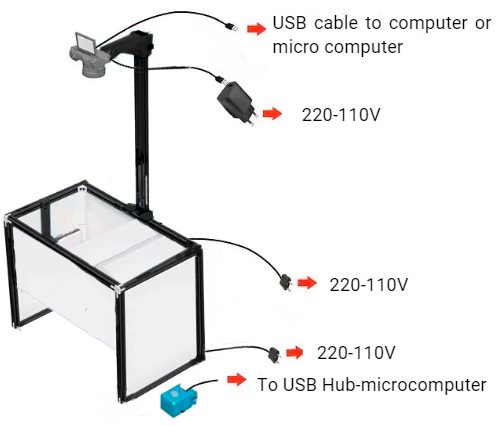
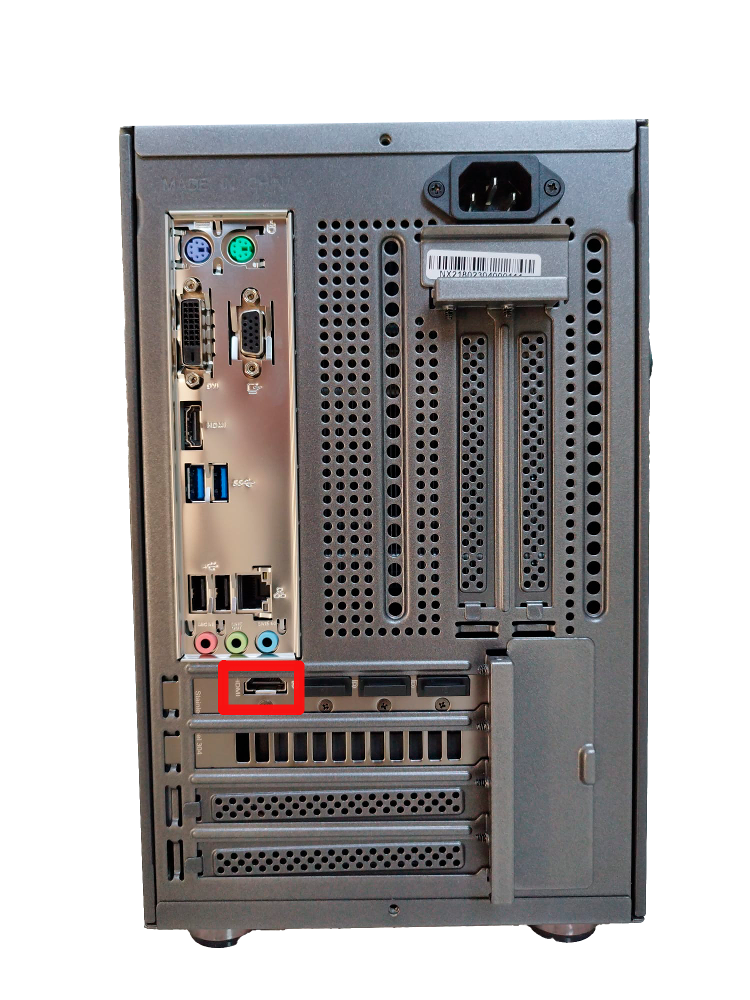

# Connect to the microcomputer

 The microcomputer will do everything for you. Just pushing the **ACTION button**, you will be executing, all the steps needed in most of the inspection processes.
 
First, you need to connect everything as indicated below:
1) Connect the **2m USB cable** from the CAMERA micro-usb port to any of the microcomputer
2) Insert the **battery DUMM**Y into the CAMERA’s battery slot, and connect it to the provided **5V/3A USB power supply** (as a separate unit or in the power strip).

3) Plug both **LED panels** into **110 or 220V sockets**. Both LED panels can be adjusted and turned ON/OFF using a single remote control (provided).
4) Connect the **ACTION button** to the microcomputer.

5) Connect the **Full-HD monitor** and the **keyboard+mouse** to the **USB fronts** port as below.

The **SONY camera** will use a battery DUMMY, so it can be ON for unlimited time. That battery dummy needs a 5V and 3A power supply (provided with the **KIT** as a separate unit or integrated in the power strip). At the same time, the camera will be controlled from the computer, so use the provided High-speed 2m USB-micro USB cable to connect the camera to any free **USB port.**

 If you want to lear how to connect the camra you can go to this section **[How to connect the camera](Connect-the-camera.md "Title")**

 <Note>Note: When connecting the monitor, be sure to connect it to the HDMI port of the graphics card.</Note> 

 