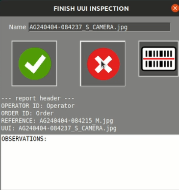

# Generating a report

Generating a report is a straightforward process that begins with performing an inspection.

{ align=right }

Once you've completed the inspection and are ready to generate the report, the first step is to locate and click on the **"finish inspection"** button.

After clicking this button, a new screen will appear, providing you with options to customize the report. Here, you can rename the file, add comments, and indicate whether the **UUI** is okay or if it contains unpassable errors. Once you've made your selections, a pdf report will be automatically generated

Following the generation of the report, it will be conveniently saved in the **PCB_OUT folder**. This folder serves as the default location for all generated reports, ensuring easy access to your inspection data.

When you open the report, you'll find a wealth of information presented in a clear and organized manner. This includes the date of the inspection, the number of failures detected, the exclusion area, and the sensitivity settings used during the inspection. Additionally, the report provides specific details such as the name of the **REFERENCE** and the **UUI**.

Visually, the report offers a comprehensive view of the inspection process, featuring images of the **UUI**, the **REFERENCE**, and the exclusion layer. It also includes a detailed breakdown of the selected errors, along with any accompanying remarks or specifications.

