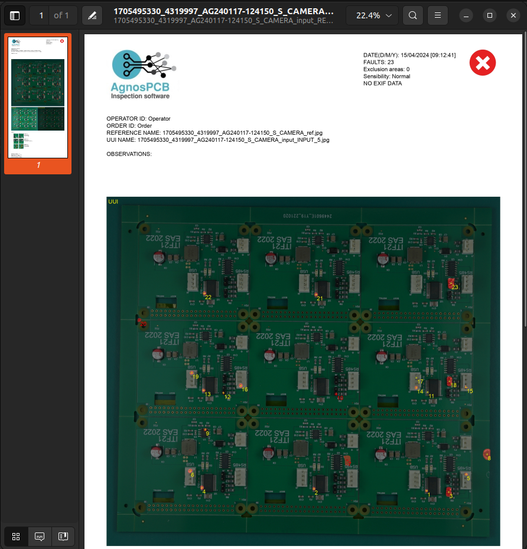

# Generating a report

To generate a **report** you must first perform an **[Inspection](Inspection_workflow.md "Title")**. 

Once you have completed the inspection to generate the report the first step is to click on the **¨finish inspection¨** button.

Once you have clicked on the button, the following screen will appear  where you can rename the file, add comments and select if the UUI is OK or if it has unpassable  errors. A **pdf report** will then be generated.

After generating the report it will be **automatically saved in the PCB_OUT** folder. All generated reports will be automatically stored there.

When the report is opened it will **include various data** such as the date, the number of failures, the area of exclusion and the sensitivity used. It also includes more specific data such as the name of the **REFERENCE** and the **UUI**.

Also, more visually, it includes a picture of the **UUI, the REFERENCE and the exclusion layer**. It also includes the selected errors including the selected remarks or specifications.

