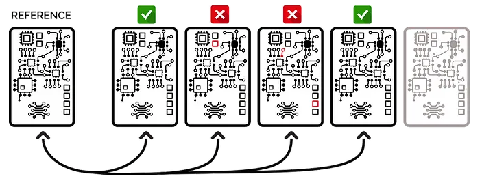
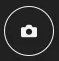

# Inspection workflow

## STARTING THE INSPECTION PROCESS

### **Signing-up + Inspecting your first PCBAs**

You need an account **user** ID and **password** to use the Agnospcb Inspection tool. You can get one for **free to test the service capabilities​.**

Populate the **USER** and **PASSWORD** fields with your details and click on **SUBMIT**. Your login info will be stored (encrypted) so you do no have to input them again.

The Agnospcb Inspection tool software will **“compare”** the photograph of your **REFERENCE** circuit/panel (“golden sample”) with all the photos you will take of the circuit to be inspected (photos to **“ANALYZE“**)

All the faults found on the inspected circuit/panel will be highlighted (if any).

To set the **REFERENCE**, click on the ICON **“LOAD”**and select the desired photo or press the key R to order the camera take a photo of what will be the **REFERENCE** circuit/panel. If you are using the Agnospcb microcomputer, you can create a REFERENCE image just pressing the INSPECTION button for 4 seconds. That will take a photo of what will be the “REFERENCE” circuit/panel and set it on the LEFT canvas. **NOTE**: We strongly recommend using our inspection platform to get crisp, detailed and shadow-less images of the PCBAs. The **REFERENCE** photo will remain as GOLDEN SAMPLE as long as you do not change it for another one. After signing-in, the software will automatically retrieve the last REFERENCE photograph used. Now, take a photo of the circuit you want to **“ANALYZE“**: 1) If you got the Agnospcb inspection platform with the microcomputer, you just need to push the INSPECTION BUTTON for a second. If the “AUTO-ANALYZE” enabled, the software will automatically process the image, otherwise, press “PROCESS IMAGE” or ENTER on your keyboard. 2) If you are using your own computer and the SONY software, click on the SHOT button.

**NOTE:** You can manually select a “to be inspected” photo, clicking on the LOAD ICON of the “TO BE INSPECTED AREA” and select it using the **TO ANALYZE** button. The software will automatically rotate and align it. **NOTE:** while the neural network will discard any **minor differences** related to lighting conditions, positional or geometric changes among the circuit/elements, we **recommend placing** the boards to be inspected (within the possibilities) in the same position when taking the photos. **NOTE: The inspection resulting images will be stored in the /PCB_OUT folder.**  

**COMPUTERS USERS: Auto Analyze STEPS:**
SET your **REFERENCE** image (Button **REFERENCE**)
ENABLE “AUTO ANALYZE” ticking its box
Take a photo of a circuit you want to inspect using the **REMOTE app** (You can use the key ” 1″ from your keyboard to take the photo when the **REMOTE tool** is active) or using your own camera system.
The software will display the result of the inspection within seconds
**REPEAT:** Take another photo of the next PCBA you want to inspect. The software will process it automatically.

## Inspection process

A video always helps at this point. The sequence you need to follow to start the inspection process will be this:

- Turn on the **LED Panels** using the remote control (ON button). You can adjust the brightness with the UP and DOWN arrows. Set it to maximum if your warehouse lighting environment is dark. Set it to about 80% of its maximum brightness for daylight working conditions.
- Turn on the **Sony** camera. Previously connected to the microcomputer and with the battery dummy already inserted.
- Switch on the Raspberry 400. It will check if the camera is OK, sending a set of commands that will prepare the camera for the inspection process.
- Wait for the system to boot. You will see in your monitor how the OS start and the inspection software gets ready.
- Insert your user credentials and click on SUBMIT. If there was a previous REFERENCE image, it will be loaded.
- Start your inspection process setting a REFERENCE image and then, taking photos of the circuits/ panels to be integrity checked.
​

**NOTE:** make use of the REPORT feature. That will dramatically improve the recognition capacity of the system in the long run.

**NOTE:** Check this quick guide about how to get the best inspection results with the inspection platform.