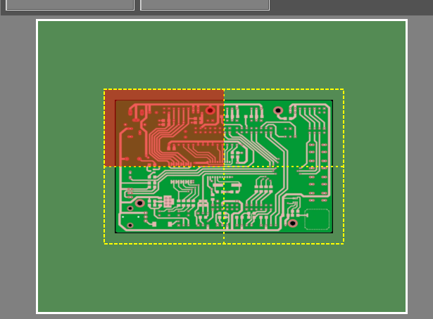
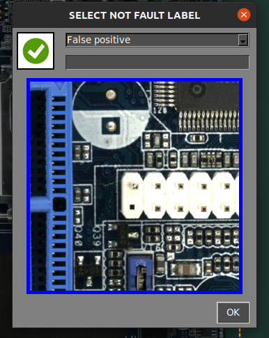

# **Inspection workflow**
___

## **Launching the software**
___

- Connect the power supply to the inspection platform on the rear panel
- Turn on the monitor
- Connect the power supply to the computer and turn on it
- Once the system have started, open the app by pressing doubleclick in the desktop icon
- **For ONLINE units only**: a login windows will pop up asking for your AgnosPCB's account credentials. The credentials will be stored in the unit for future use and it will not require to login again.

{.center}

## **Inspection procedure**
___

### **Generating a REFERENCE**

The Agnospcb Inspection tool software will **“compare”** the photograph of your **REFERENCE** circuit/panel (“golden sample”) with all the photos you will take of the circuit to be inspected (photos to “ANALYZE“)

To proceed with the REFERENCE taken, click in the reference icon in the main menu:

{.center}

A new window will pop up with mutiple tools:

In this window we have to set the images needed to cover all the PCBA.

In case you can not determine how many images are needed to cover your PCBA/panel, you can place your PCBA/panel in the middle of the inspection area and press the **AUTO** button. The system will scan the PCBA/panel and 
**set the optimal proportions automatically.**

{.center}

In the lower are of the window you can set/unset the grid in the livew preview and set the exposure to take the image.

{.center}

!!! warning "Important"
    The default value (16000) set is **the optimal value in most of the cases.** Ajust this parameter just in case of very clear/dark component that are hardly visible by the software. 

This window allows to move the camera to any quadrant of the PCBA. Just click in the desired quadrant in the miniature.

{.center}

The camera will focus on the selected area once the capture has started.

!!! warning "Important"
    For a proper focusing, select an area **without tall components.**

It also possible to focus the optics before start the capture by pressing in the **FOCUS** button. This helps to find a area where the optics focus correctly.

{.center}

To start the capture processing simply click in the **CAPTURE REFERENCE** button. The AOI will focus automatically in the selected quadrant and starts capturing the whole PCBA in a matter of seconds.

{.center}

{.center}

After capturing the PCBA, the mosaic window will pop up allowing to store the image for quick usage.

!!! note "Note"
    All taken REFERENCES will be stored automatically. The mosaic helps to quickly load the most used REFERENCES.

{.center}

Once the capture process is finished, the REFERENCE image will be displayed in the main window and will allow you to set [exclusion mask](Set_exclusion_area.md) or [draw a barcode](Barcode_reader.md) area for reading.

{.center}

### **Capturing an UUI**

After generating or uploading a previous REFERENCE image, we can proceed with the capture of the **UUI** (Unit Under Inspection) image by pressing the button.

{.center}

A livepreview window will pop up showing a gosthing of the REFERENCE image. This helps to align the UUI PCBA with the REFERENCE.

!!! warning "Important"
    The **AgnosPCB** software is capable to align both images (**REFERENCE** and **UUI**) automatically. However, it is important to position the UUI PCBA correctly to avoid geometric deformations that can cause false positive detections.

{.center}

The capturing process will start by clicking in the **START INSPECTION** button.

!!! note "Note"
    Focusing is not necessary as the focus parameter is already stored with the REFERENCE image, making the inspection really fast.

The inspection process shall be executed in parallel in case of a multi-image inspection.

Once the capturing process have ended the fineal result will be returned showing the detected errors if there is any. It is possible to change the [detection sensitivity](Set_sensitivity.md) by pressing the button in the main window or by pressing **1, 2 or 3 key.**

{.center}

{.center}

If errors are detected, a **red frame** will appear around the main window. **Green frame** if there are no errors.

### **Reporting errors**

Once the inspection is complete, the operator must monitor the flagged errors, marking them as **actual error** or **false positive detection**.
To do this, simply scroll through the errors using the **left and right arrows** on the keyboard.

To mark a real error, just move to the fault and press the **up arrow** on your keyboard. A new window will appear showing the bug in detail and allowing you to categorise it by selecting a type of fault of the list.

{.center}

In addition, there is a empty fiel to **add a comment.**

In case the operator founds an error **not detected** by the software, it possible to flag and report it by moving the cursor to the fault area and press **up arrow** key. The reporting window will appear as usual. 

When the software marks an area that is not an actual error, the operator can flagged it as a **false positive** by pressing **down arrow** key. Also a window will appear allowing to add a comment.

{.center}

!!! note "Note"
    Note the **red icon** {width=20px} marks the actual faults and the **green icon** {width=20px}  the false positive faults.

### **Generating a final PDF report**

Once the reporting have finished, the operator can generate a final PDF report by pressing the following button:

{.center}

A window appears allowing you to mark the inspection as **OK** or **NOT OK**. If the PCBA passes the quality check successfully, press the green icon.

{.center}

It is possible to add comments that will be included in the report. The PDF will be generated in the **REPORTS** folder.

{.center}

{.center}