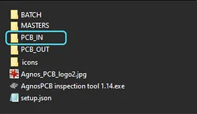
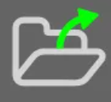
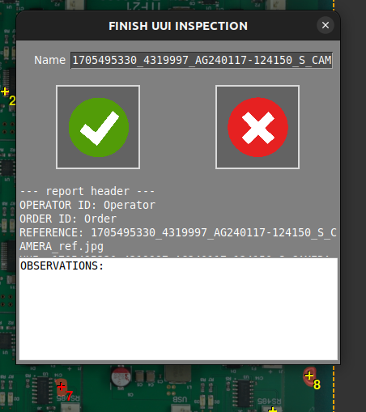
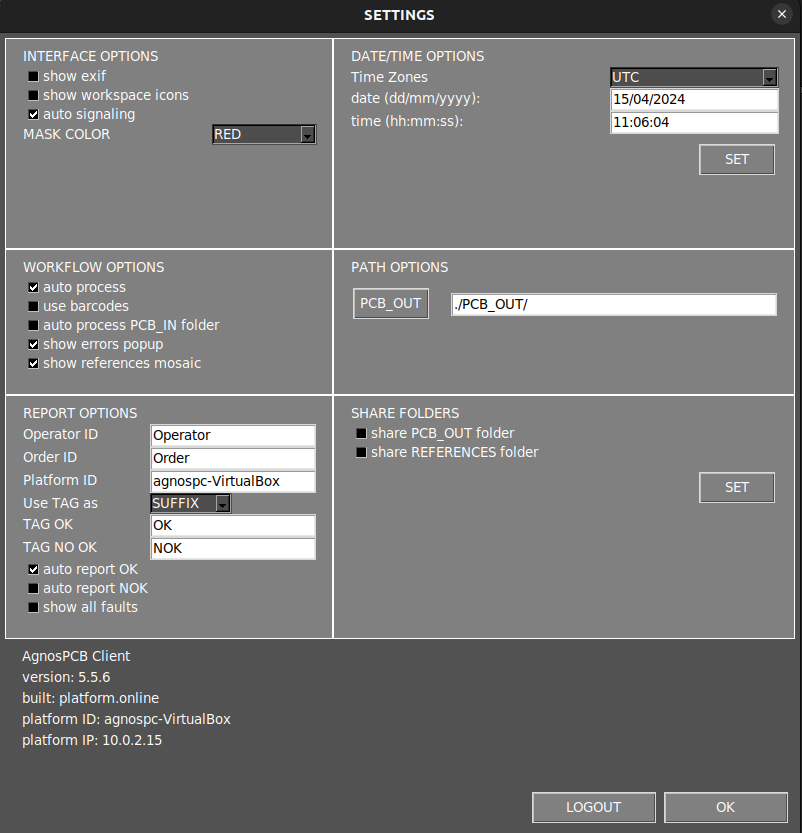
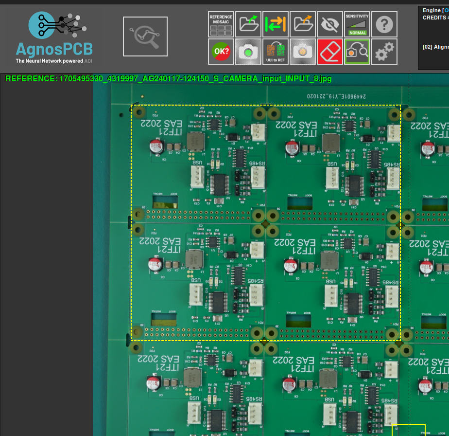

# Inspection workflow

## Inspection process

A video always helps at this point. The sequence you need to follow to start the inspection process will be this:

- Turn on the **LED Panels** using the remote control (ON button). You can adjust the brightness with the UP and DOWN arrows. Set it to maximum if your warehouse lighting environment is dark. Set it to about 80% of its maximum brightness for daylight working conditions.
- Turn on the **Sony** camera. Previously connected to the microcomputer and with the battery dummy already inserted.
- Insert your user credentials and click on **SUBMIT**. If there was a previous REFERENCE image, it will be loaded.
- Start your inspection process setting a **REFERENCE** image and then, taking photos of the circuits/ panels to be integrity checked.

???+ note "Note"

    Make use of the REPORT feature. That will dramatically improve the recognition capacity of the system in the long run.

???+ info "Info"

    Check this quick guide about how to get the best inspection results with the inspection platform

## Starting the inspection process

### **Signing-up + Inspecting your first PCBAs**

You need an account **user** ID and **password** to use the Agnospcb Inspection tool. You can get one for **free to test the service capabilities​.**

Populate the **USER** and **PASSWORD** fields with your details and click on **SUBMIT**. Your login info will be stored (encrypted) so you do no have to input them again.

The Agnospcb Inspection tool software will **“compare”** the photograph of your **REFERENCE** circuit/panel (“golden sample”) with all the photos you will take of the circuit to be inspected (photos to **“ANALYZE“**)

All the faults found on the inspected circuit/panel will be highlighted (if any).

To set the **REFERENCE**, click on the ICON **“LOAD”**and select the desired photo or press the key R to order the camera take a photo of what will be the **REFERENCE** circuit/panel. If you are using the Agnospcb microcomputer, you can create a REFERENCE image just pressing the INSPECTION button for 4 seconds. That will take a photo of what will be the “REFERENCE” circuit/panel and set it on the LEFT canvas. 

???+ note "Note"

     We strongly recommend using our inspection platform to get crisp, detailed and shadow-less images of the PCBAs. The REFERENCE photo will remain as GOLDEN SAMPLE as long as you do not change it for another one. 

{ align=right }

After signing-in, the software will automatically retrieve the last REFERENCE photograph used. Now, take a photo of the circuit you want to **“ANALYZE“**: 1) If you got the Agnospcb inspection platform with the microcomputer, you just need to push the INSPECTION BUTTON for a second. If the “AUTO-ANALYZE” enabled, the software will automatically process the image, otherwise, press “PROCESS IMAGE” or ENTER on your keyboard. 2) If you are using your own computer and the SONY software, click on the SHOT button.

???+ note "Note"

    You can manually select a “to be inspected” photo, clicking on the LOAD ICON of the “TO BE INSPECTED AREA” and select it using the TO ANALYZE button. The software will automatically rotate and align it

???+ warning "Important"

    While the neural network will discard any minor differences related to lighting conditions, positional or geometric changes among the circuit/elements, we recommend placing the boards to be inspected (within the possibilities) in the same position when taking the photos. The inspection resulting images will be stored in the /PCB_OUT folder.

{ align=right }

**COMPUTERS USERS: Auto Analyze STEPS:**
SET your **REFERENCE** image (Button **REFERENCE**)
ENABLE “AUTO ANALYZE” ticking its box
Take a photo of a circuit you want to inspect using the **REMOTE app** (You can use the key ” 1″ from your keyboard to take the photo when the **REMOTE tool** is active) or using your own camera system.
The software will display the result of the inspection within seconds
**REPEAT:** Take another photo of the next PCBA you want to inspect. The software will process it automatically.

## How to do an inspection

{ align=right }
Start by opening the** Agnospcb application** and entering your username and password. Once opened, load the reference of your file with the "open reference" button and the reference will be automatically loaded on the screen. Also, save the reference in the mosaic, remember that you can load the different references by using the keys where they are saved such as **F1, F2, F3, F4....**

{ align=right }
After uploading the **REFERENCE**, use the **¨Open UUI¨** button to upload the UUI photo. Once uploaded it will be processed automatically and will start pointing out possible errors. To move through them use the **"right"** or **"left"** keys and to mark an error use the **"up"** key.

When marking an error you can either not specify it or you can mark it as one of the following options:

Once you have checked and marked all errors in the **UUI** you can finish the inspection by clicking on the **¨finish inspection¨** button.

{ align=right }

Pressing the button will open a window where you can rename the file, add comments and select if the UUI is OK or if it has unpassable errors. After this a **pdf report** will be generated.

To view the generated repote you must go to the **¨PCB_OUT¨ folder**, where all generated reports will be stored.

The report will show the date, whether or not the pcb has passed the inspection, the data, the observations, the **UUI** and **REFERENCE** image and the errors together with their specifications.

### Other functions 

- **Draw exclusion area**

With this button you can select one or more areas that will be completely **ignored** by the processor. That is, no errors found in those areas will be detected. You can select as many areas as you want. 

{ align=right }
- **Remove area**

In case you have selected an area by mistake with the previous function or you do not want to keep it selected, you can use this button to **deselect it.**

{ align=right }
- **Swap workplace**

With this button you can switch between **REFERENCE** and **UUI.** You can either press the button or use the **TAB** keyboard shortcut

- **Sensitivity**
The app allows you to change the sensitivity levels for error detection from **normal, high and very high**. Note that the higher the sensitivity, the more errors it can detect.

Example: **normal sensitivity**

Example: **high sensitivity**

Example: **very high sensitivity**

Note how it detects twice as many possible errors at very high sensitivity compared to normal sensitivity.

- **UUI to REFERENCE**

This button allows you to change a **UUI** image and convert it into a **REFERENCE.**

{ align=right }

Finally, you can change other aspects with the **¨settings¨** button. Once clicked, the following screen will appear where you can change and adjust factors such as workflow, path and others to your liking.

- In case you want to analyze only a part of the **UUI image** you can select the part to be analyzed by **right-clicking** and dragging to include the desired area.

Once the area is selected in the reference image, loading the **UUI** automatically inspects only the selected area.

