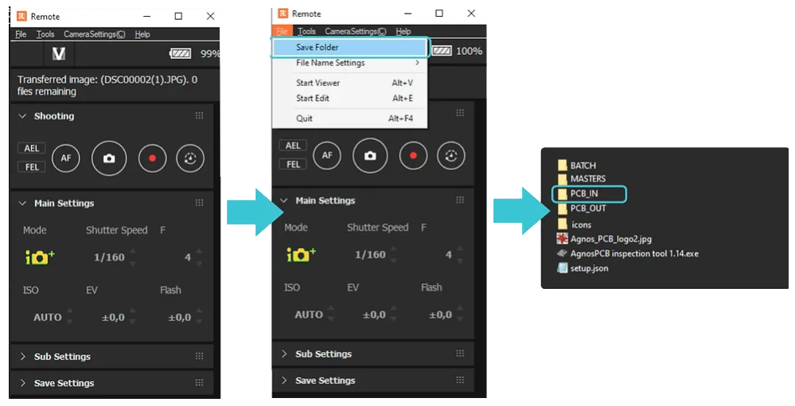

# Installation process

**PC System recommended Requirements​**

- OS:Windows 10 (64-bit)
- CPU: Intel® Core™ i5-7600 or better / Ryzen 5 2500U or better
- RAM:16GB of system memory

**Internet connection**
- Fiber internet service : 100-1000Mbps*

The processing time is highly dependent on the transmission speed of the internet connection. The faster the speed, the faster the inspection. Wired connection to the router is highly recommended.

To install it, **download the software** clicking on the button above (get the password contacting us).

Windows OS: **After extracting** and launching the .exe file (“AgnosPCB inspection tool vX.XX.exe), the software will locally create 4 folders: BATCH / MASTER / PCB-IN and PCB_OUT

**NOTE:** Additionally, you need to install the **SONY DESKTOP software** if you are not using our inspection platform to take the photos of your PCB/As **folders**

- **BATCH:** by default, the folder where the software will look for photographs during the BATCH INSPECTION process (can be changed).
- **MASTERS:** the suggested location of the GOLDEN SAMPLES / REFERENCES images of the PCBAs
- **PCB_IN:** the inspection tool will look for new images of the circuit to be inspected inside this folder. If you are using our inspection platform, you have to set this folder as the default destination for the photographs taken (check image below to see how to do it)
- **PCB_OUT:** the destination folder of all the inspection results images.

In the **REMOTE software**, go to the **File** menu

-> **Save Folder** and select the Inspection tool /**PCB_IN folder** as the destination for the photos. That will allow the software to find the latest photos taken to your PCBAs

Agnospcb inspection tool: User interface elements

Upon launching the Agnospcb inspection tool software the user interface will appear. It has different panels and inspection areas:

​Help Icon: click to get to this USER Guide
User account credentials: Use your user and pass credentials to get access to the inspection process.
Activity log: provides useful information about the inspection process.
Settings : where the configuration ICONs are. Useful tools in your inspection process.
REFERENCE PANEL (green) : The “golden sample” image. Can be loaded using the LOAD icon (from the Reference area).
UNIT UNDER INSPECTION (orange): this is the image of the panel to be inspected. Can be loaded using the LOAD icon (from the inspection area)
Magnification area: this frame will display, the same areas of the REFERENCE, INSPECTED and RESULT circuit/panels. Move the mouse to check different zones of the circuit. Use the mouse’s wheel to modify the zoom magnification.