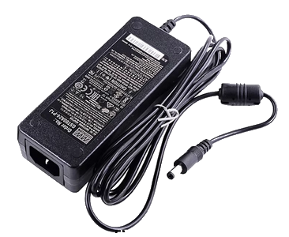
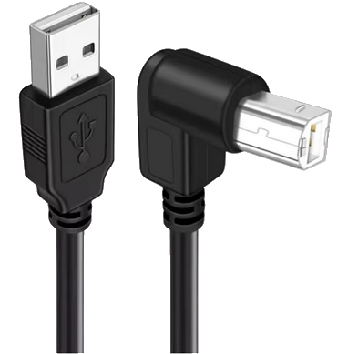

#  **Package contents**
___

The elements included in the package are described below.

!!! warning "Important"

    If there is any missing part or defective [send us an email](mailto:support@agnospcb.com).

## **Components**
___

| Component | Image |
| --------- | :-----: |
| Pre-mounted AOI platform|  {width=300px} |
|Platform 12V power supply|  {width=300px}|
|2x AC power cord|  {width=300px}|
| Socket strip |  {width=300px}|
| EU to UK/USA AC adapter if required |  {width=300px}|
| ASD MAT + ESD Wrist Strap + Ground Lead |  {width=300px}|
| Maintance kit |  {width=300px} |
| Mouse & Keyboard |  {width=300px}|
|HDMI cable|  {width=300px}|
|USB A to USB B angled cable |  {width=300px}|
|  **\*ONLINE UNITS ONLY\*** Pre-programed Mini-computer + Keyboard and mouse |  {width=300px} |
|  **\*OFFLINE UNITS ONLY\*** Pre-programed desktop computer + Keyboard and mouse |  {width=300px} |
| **OPTIONAL** 24¨ FULL-HD IPS monitor | {width=300px} |

