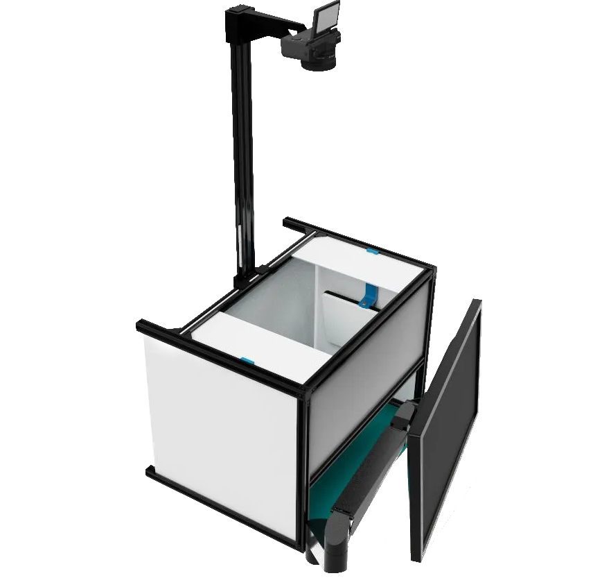

#  Package content

Created to make the process of photographing the **panels / PCBAs** as easy as possible by providing images of the highest quality, detailed pictures with the best illumination.

This is what Agnospcb’s neural network needs to be able to perfectly detect any kind of fault present.

## Components

1. **SONY ALPHA** camera (24.3 megapixel APS-C CMOS sensor, Bionz X image processor. Preconfigured).
2. 50mm Ylens Optics
3. ASD MAT + ESD Wrist Strap + Ground Lead
4. 2x 108 LED 30W pure Light Side Panels + remote control
5. Black anodized aluminum structure **(PRE-MOUNTED)**
6. White **LIGHT** diffuser panels (6)
7. SONY NP-FW50 dummy USB battery (8,4 V)
8. Pre-programed Intel NUC Mini-computer + Keyboard and mouse  **INSPECTION BUTTON**
9. 5V, 3A USB power supply (or power strip with USB port)
10. 2m USB 2.0 micro-USB cable (x2)
11. **OPTIONAL** 22¨IPS ASUS FULL-HD Light-weight **MONITOR**

