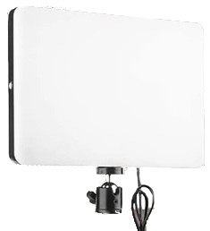

#  Package content

Created to make the process of photographing the **panels / PCBAs** as easy as possible by providing images of the highest quality, detailed pictures with the best illumination.

This is what Agnospcb’s neural network needs to be able to perfectly detect any kind of fault present.

## Components
| Component | Image |
| --------- | :-----: |
| Sony Alpha Camera|  {width=300px} |
| 50mm Ylens Optics |  {width=300px}|
| ASD MAT + ESD Wrist Strap + Ground Lead |  {width=300px}|
| 2x 108 LED 30W pure Light Side Panels + remote control |  {width=300px} |
| Black anodized aluminum structure **(PRE-MOUNTED)** |  {width=300px}|
| 2x Black anodized aluminum mast |  {width=300px}|
| SONY dummy battery |  {width=300px} |
|  **\*ONLINE UNITS ONLY\*** Pre-programed Intel NUC Mini-computer + Keyboard and mouse + **INSPECTION BUTTON** |  {width=300px} |
|  **\*OFFLINE UNITS ONLY\*** Pre-programed desktop computer + Keyboard and mouse + **INSPECTION BUTTON** |  {width=300px} |
| 2x 2m USB 2.0 micro-USB cable |  {width=300px} |
| **OPTIONAL** 22¨ FULL-HD monitor **MONITOR** | {width=300px} |

