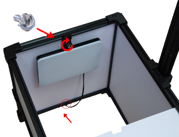

# Platform assembly

The primary framework of the platform has already been constructed, leaving you with the task of assembling supplementary components such as the LED lights and camera. 
  
!!! warning "Important"

    Before starting the assembly, make sure all the components listed in the section [package content](Package_content.md "package content") have been shipped and are in good condition.

## How to install LED light panels
___

To install the **LED light panels**, start by sliding both upper **light diffusers** to create space for installation.
  

{ align=right }

 Then, carefully tighten the screws to secure the lights in place, ensuring they are properly aligned. After securing the lights, pass the cable **under the platform** to ensure a tidy setup. Repeat this procedure on both sides of the platform for uniform illumination. 

## How to install the mast 

___

Next, once the LED lights are in place, move on to assembling the camera mast. To do this, join the two parts of the mast as shown in the picture and place a cover on both edges.

  

!!! note "Note"

    Make sure that each half of the mast is secured by **4 screws**. This will prevent the mast from falling.

  To mount the mast to the platform, **use the brackets supplied** to secure the mast, ensuring that the screws are tightened securely.
  

 
!!! note "Note"

    The screws are premounted in the rails to prevent the move of the nut during the shipping. Unscrew them by hand and aling the bracket with the nuts.

## Installing the camera
___

For convenience, follow the instructions in the [configuring the SONY camera](Connect-the-camera.md/#parameters "Configuring the SONY camera") section to setup the camera **before** mounting it on the mast.  
Attach the camera bracket and the camera to the **mast** as shown:

