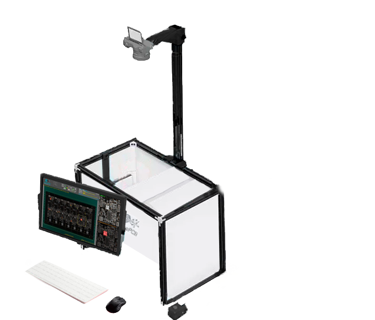
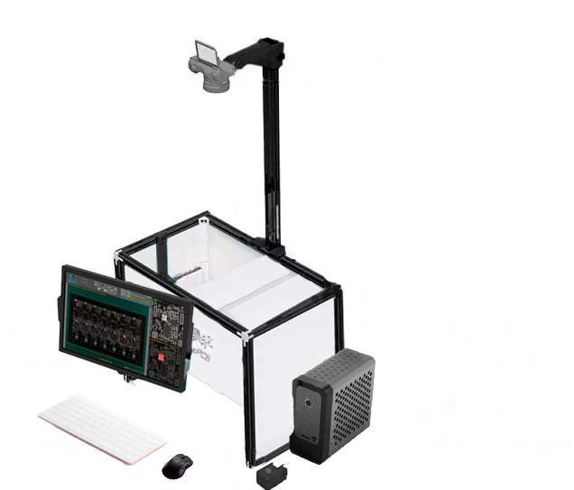
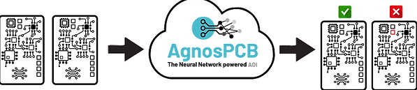

#  **Products and services**
___

AgnosPCB AOI provides three types of products/services:

## **ONLINE AOI inspection platform:**
___

The **ONLINE AOI inspection platform** simplifies and speeds up the inspection process. With a single click, the platform automatically adjusts the camera settings to optimal values and starts the inspection, reducing the time and effort required for setup so users can focus on other tasks while the platform scans for errors.

Using its detection algorithms and imaging pipeline, the platform identifies and highlights anomalies or defects present in the electronic panels or circuits under inspection.

The interface is designed to be intuitive: users can navigate the software, customize inspection settings, and access detailed reports with ease.

The ONLINE AOI inspection platform also prioritizes **data privacy and security**. Learn more in the [AgnosPCB privacy statement](https://agnospcb.com/how-we-protect-your-data-privacy-statement/).

The inspection area provided by the platform is **27×34 cm** (10.6×13.3 inches).

[Link to product](https://agnospcb.com/product/agnospcb-online-inspection-plaftorm/)

## **OFFLINE AOI inspection platform:**
___

The **OFFLINE AOI inspection platform** is a robust counterpart to the ONLINE version, using the same AI-based error recognition system with the added advantage of local processing. This makes it a good fit for scenarios where internet connectivity is unreliable or unavailable, or where data location requirements call for complete autonomy.

One of the key advantages of the OFFLINE AgnosPCB system is its inspection speed: it can complete a full inspection in as little as **5 seconds**, processing all data locally. No data is transmitted to external servers or cloud platforms, keeping sensitive data confidential and secure.

The OFFLINE AOI inspection platform also provides a generous inspection area of **27×34 cm** (10.6×13.3 inches), large enough to thoroughly examine a wide range of electronic panels and circuits with precision.

[Link to product](https://agnospcb.com/product/agnospcb-offline-inspection-plaftorm/)

## **API Service:**
___

The **API Service** integrates AgnosPCB's inspection capabilities into your existing AOI system. 

If you already have a robust **optical system** and want to add AgnosPCB's detection capabilities, the API Service offers a straightforward way to do so. Simply upload an image of your PCB or panel to our cloud server through the API, and within moments receive a detailed inspection result powered by AgnosPCB's neural network technology.

### **OFFLINE AOI Rental Program**

 With this program, you can **rent** an OFFLINE AOI unit for up to two months, letting you evaluate it firsthand before committing to a purchase.

Here's how it works: once enrolled in the rental program, you get access to an **OFFLINE AOI** unit for a duration of your choosing, up to a maximum of two months. During this rental period, you can fully use the unit, running inspections and evaluating its performance in your own workflow.

If you decide to purchase the OFFLINE AOI unit after the rental period, the rental payments you've already made will be deducted from the total cost of the unit, so your rental investment counts fully towards the purchase price.

Please check specific plans and pricing on our [products](https://agnospcb.com/products/) page