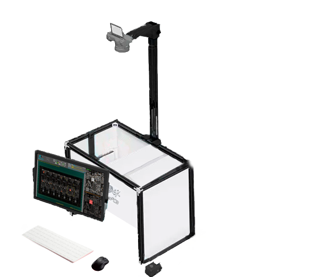
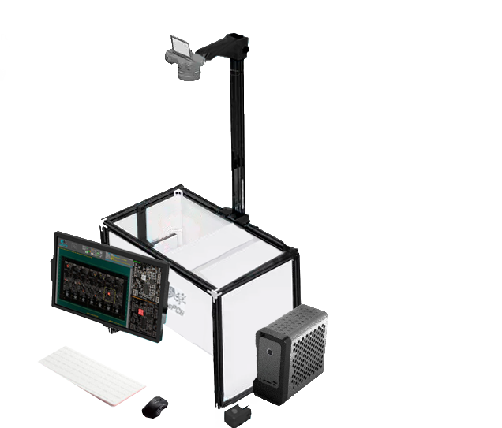
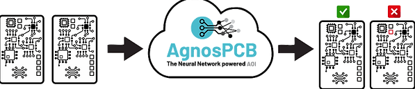

#  Products and services

AgnosPCB AOI provides three types of products/services:

## ONLINE AOI inspection platform:

The **ONLINE AOI inspection platform** functionality lies its remarkable ability to simplify and expedite the inspection process. With just a single click, users can initiate the inspection procedure, triggering the platform to automatically adjust the camera settings to optimal values. This **intelligent automation** significantly reduces the time and effort required for setup, enabling users to focus their attention on other critical tasks while the platform swiftly scans for potential errors.

Through its advanced algorithms and sophisticated imaging technologies, the platform identifies and highlights any anomalies or defects present within the electronic panels or circuits, ensuring thorough inspection and quality assurance.

Moreover, the platform's intuitive interface enhances user experience, providing a seamless and **intuitive navigation experience.** Users can effortlessly navigate through various functionalities, customize inspection settings, and access comprehensive reports with ease. 

In addition, the ONLINE AOI inspection platform prioritizes **data privacy and security**.  AgnosPCB privacy statement. ADD LINK

Furthermore, the inspection area provided by the platform is **27×34 cms** (10.6×13.3 inches). 

[Link to product](https://agnospcb.com/product/agnospcb-online-inspection-plaftorm/)

## OFFLINE AOI inspection platform:

The **OFFLINE AOI inspection platform** stands as a robust counterpart to its online counterpart, boasting the same cutting-edge AI-based error recognition system  but with the added advantage of local processing. This distinctive feature renders it an ideal choice for scenarios where internet connectivity is unreliable or unavailable, or when the need for complete autonomy and data privacy is paramount.

One of the most compelling aspects of the AOI OFFLINE AgnosPCB system is its lightning-fast inspection capabilities. With an awe-inspiring speed, this system can perform a comprehensive inspection in a mere **5 seconds**, all while processing every iota of data locally. This means that not a single bit of information is transmitted to external servers or cloud-based platforms, ensuring the utmost confidentiality and security of sensitive data.

In addition, the OFFLINE AOI inspection platform boasts a generous inspection area spanning **27×34 cms** (10.6×13.3 inches). This expansive coverage ensures that a wide array of electronic panels and circuits can be thoroughly examined with precision and accuracy.

[Link to product](https://agnospcb.com/product/agnospcb-offline-inspection-plaftorm/)

## API Service:

The **API Service** represents a dynamic solution meticulously crafted to seamlessly integrate the formidable capabilities of the AgnosPCB solution into your existing AOI system. 

For users equipped with a robust **optical system** seeking to augment their capabilities with the unparalleled prowess of AgnosPCB, the API Service offers a straightforward pathway. Simply upload an image of your PCB or panel to our cloud server utilizing the intuitive API, and within moments, receive a comprehensive inspection result that encapsulates the power of AgnosPCB's neural network technology.

### OFFLINE AOI Rental Program

 With this program, you have the opportunity to **rent** our state-of-the-art OFFLINE AOI units for a period of up to two months, allowing you to experience the benefits of our cutting-edge technology firsthand before committing to a purchase.

Here's how it works: Upon enrolling in the rental program, you'll gain access to one of our premium **OFFLINE AOI** units for a duration of your choosing, up to a maximum of two months. During this rental period, you'll have the opportunity to fully utilize the capabilities of the unit, conducting inspections and evaluating its performance in your specific workflow environment.

Should you decide to proceed with **purchasing** the OFFLINE AOI unit after the rental period, we offer a seamless transition process. The rental payment that you've already made will be deducted from the total cost of the unit, ensuring that you receive full credit for your rental investment towards the purchase price. This not only simplifies the purchasing process but also provides you with added peace of mind, knowing that your rental payments are contributing towards the acquisition of the unit.

## Prices

**ONLINE AOI System:**
The ONLINE AOI system provides a seamless inspection experience, with an initial allocation of **200 free inspection credits upon activation**. Once these credits are consumed, a subscription is required to continue accessing the system's capabilities. Subscribers benefit from constant free upgrades and updates to the inspection tool software and neural network architectures, ensuring they always have access to the **latest advancements and improvements**. AgnosPCB periodically releases updates to enhance functionality and address evolving industry needs. Depending on the chosen subscription plan, users gain access to additional features such as Barcode reader or PDF creation report, as well as a specific number of monthly inspections tailored to their requirements.

**OFFLINE AOI System:**
In contrast to the subscription-based model of the ONLINE system, the OFFLINE AOI system operates on a **one-time payment** basis. Upon purchase, users receive a comprehensive AOI solution without any limitations, monthly payments, or recurring fees. This allows for complete ownership and control of the system, with no ongoing financial commitments. Additionally, the OFFLINE system can be easily updated or upgraded using a USB drive, providing flexibility and convenience for users to adapt to evolving needs and technological advancements.

**API Service:**
To access our API service, a **minimum subscription plan of SILVER+** is required. This service empowers users to seamlessly integrate the AgnosPCB solution into their existing systems and workflows. Documentation and code examples are provided via email, enabling users to efficiently implement and leverage the API service to enhance their inspection processes. With the API service, users can harness the power of AgnosPCB's advanced capabilities while maintaining compatibility with their existing infrastructure, unlocking new possibilities for efficiency and productivity.
