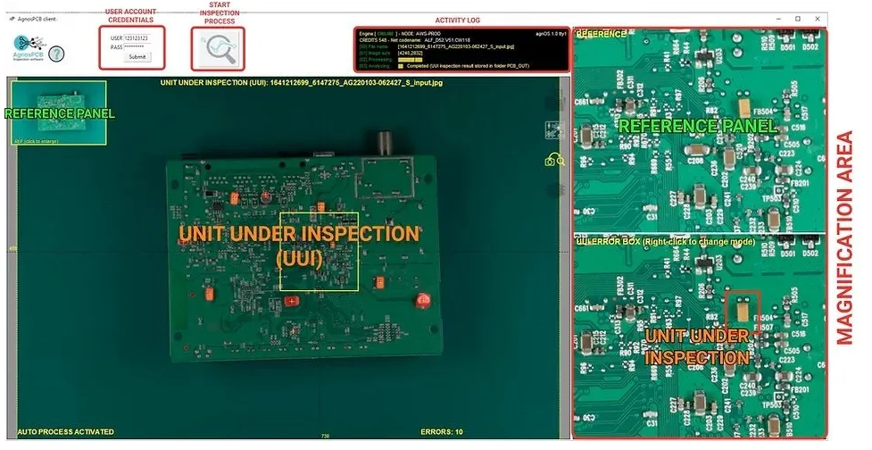

# Raspberry 400 software use guide (Linux)

**Internet connection: minimum requirements**

**Wired internet** connection or Fiber internet service speed: 100-1000Mbps*

The processing time is **highly dependent** on the transmission speed of the internet connection. The faster the speed, the faster the inspection. Wired connection to the router is **highly recommended**.

**The Raspberry 400** will be in charge of controlling the camera, adjusting the optical parameters to get the best possible image of the circuit/ panel to be inspected. The USB drive connected to one of its USB ports will store the results of all the inspections done. This USB drive can be extracted only if the Raspberry is OFF. The operating system (OS) of this device is stored inside the **micro SD** card already provided with the KIT. The Inspection button is connected to this microcomputer. Pressing this button, you can trigger the important events of the inspection process: set a REFERENCE image or START the inspection process, taking a new photograph. More details about its functions explained at the very end of this guide. If you need to update/restore your Raspberry 400 system, get **here**. **NOTE:** you need to connect your raspberry 400 to your internet network. To do that, click on the NETWORK icon shown below, pick the right network and type the password. That should be all.

Upon powering up the Raspberry 400 microcomputer, the Agnospcb inspection tool software user interface will appear. Every time you power up the system, the Agnospcb inspection software with be automatically launched. Alternatively, you can launch it double-clicking on its Desktop´s shortcut. It user interface has these panels and inspection areas:
​- **Help Icon**: click to get to this USER Guide
- **User account** credentials: Use your user and pass credentials to get access to the inspection process.
- **Activity log**: provides useful information about the inspection process.
- **Settings**: where the configuration ICONs are. Useful tools in your inspection process.
- **REFERENCE PANEL (green box)** : The “golden sample” image. Can be loaded using the LOAD icon (from the Reference area).
- **UNIT UNDER INSPECTION (orange)**: this is the image of the panel to be inspected. Can be loaded using the LOAD icon (from the inspection area)
- **Magnification area**: this frame will display, the same areas of the REFERENCE, INSPECTED and RESULT circuit/panels. Move the mouse to check different zones of the circuit. Use the mouse’s wheel to modify the zoom magnification.

