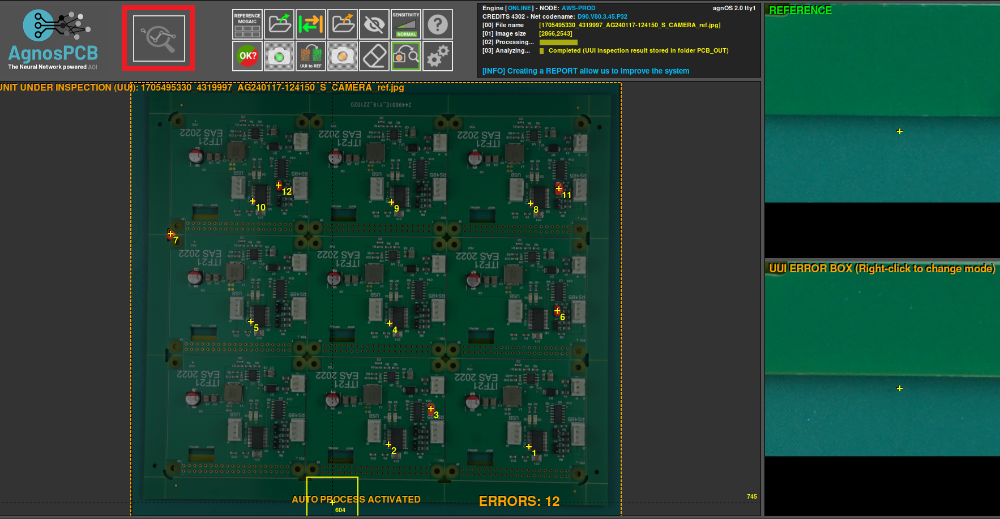
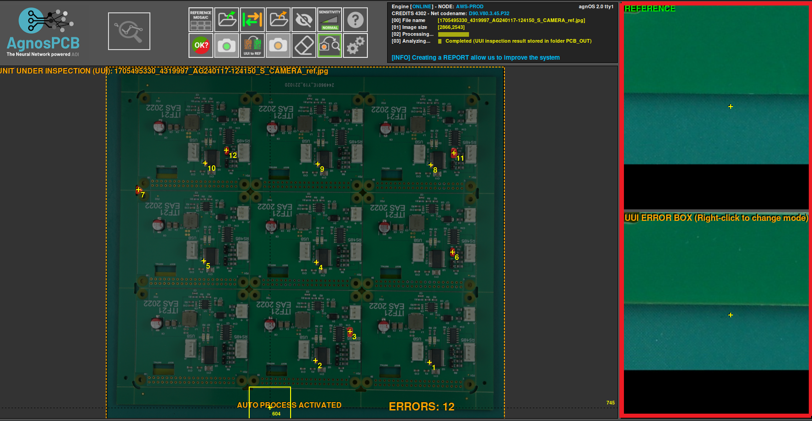
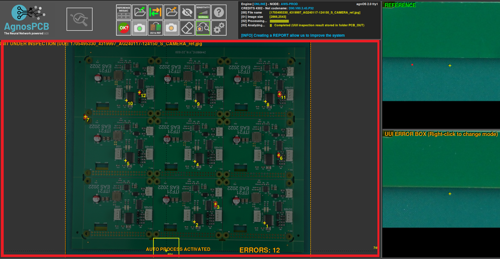
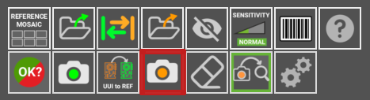

# Screen Layout

## Action buttons

Within this section of the interface you can see your unique customer **identifier**. This identifier serves as a distinctive marker, distinguishing you amidst the myriad of clients or users within the system. Positioned prominently on the screen, it acts as a gateway to your **personalized experience**, granting access to a plethora of tailored features and functionalities.

In the upper left side of the scrren you find the button **"start inspection"** to initiate a process of meticulous examination and evaluation. With a simple click, you set into motion a sequence of actions that will culminate in an **inspection** of your UUI detecting any possible errors to make the process **quicker and simpler**.

Next, in the right side the area indicated in the image shows an inside at the **application's operational prowess**: the area where all processes are meticulously documented. Here lies a window into the application's inner workings, offering a comprehensive overview of tasks executed, resources allocated, and outcomes achieved. With each entry in the log, a trail of **breadcrumbs** is laid, guiding users through the labyrinth of operations undertaken by the application, providing clarity, transparency, and invaluable insights into its **functionality and performance**.

This is the **focal part**, the main part where the image your are working on is. Being the **REFERENCE** or the **UUI**, here you can work with them, adding functions or simply marking the errors.

Within this section of the interface, you'll encounter **two distinct parts**. The first part showcases the **REFERENC**E image, serving as a standard for comparison. Here, you'll find a visual representation of what an ideal **PCB** should look like, providing a benchmark against which you'll assess the **UUI**.

Under the **REFERENCE** image is the second part, where you'll find the **UUI** image. This image presents the actual PCB currently under scrutiny.Together, these images facilitate a **side-by-side comparison**.

In this part of the screen, you'll see a bunch of **buttons** and options explained below. These buttons are like **tools** that help you do different things in the program. So, take your time to get to know these buttons and what they can do. They're here to help you make the most out of the program and get your work done **faster**.

**Start the inspection process**. This button is enabled only after you have a REFERENCE and TO BE INSPECTED images already set. Keyboard shortcut: **ENTER**. When clicked, the AOI will inspect the image taken for the circuit/panel and look for faults. If the Auto-analysis is enabled, the AOI will automatically inspect the last photo taken, so this button will be disabled

 

**Reference moaic:** in the reference mosaic you can store references as files.

**LOAD REFERENCE as file**: Use this ICON to load a **“reference”** or **“to be inspected”** photo. If you have stored a **“reference”** image and want to retrieve it to use it again, use this button. You can do the same with an image of a **“to be inspected”** circuit/ panel. This button will get non-functional if you have the **AUTO-PROCESSING** option enable, which will automatically process every photo taken with the camera. All the REFERENCE photos can be found inside the folder HOME/APP/REFERENCE. In a folder named after the YEAR-MONTH-DAY-TIME moment when the photo was taken. **You can rename the photos as you please**.

**Swap:** with this you can swap betewn a reference and an UUI.

**LOAD a UUI file**: Use this ICON to load a **“UUI”** photo

**Exclusion:** Creates an **¨exclusion area¨** where the system will not look for faults. You can create as many areas as required. All of them will be saves with the REFERENCE

**Sensitivity:** Change the system sensitivity (NORMAL/HIGH/VERY HIGH). Set back to normal, automatically after carrying out a new inspection. Shortcut: 1, 2 ,3 Keys

**Barcode reader** Select this button to read any PCB containing a barcode REFERENCE

**Help:** This button will get you to this **USER GUIDE**

**Report:** selecting this button will create a report that will include the detected errors

**Take REFERENCE photo:** Take a photo of what will be a REFERENCE PCB/Panel. Shorcut: R

**UUI to REFERENCE:** 

**Take an UUI photo:** Takes a photo of a Unit Under Inspection PCBA/Panel. Shortcut: s

**Eraser:** Erase an **¨exclusion area¨** if you click on it.

**Auto Analyze**:  if activated, the next photo taken will be **automatically** processed. That means that the image will be analyzed for faults right after being taken. This option reduces the processing time for every inspection.

**Settings**: With this button you can change other functions to suit your needs.

## Other features: Zoom

The **ZOOM** feature is designed to allow you to closely examine faults with greater precision. Its purpose extends to verifying whether captured photos are sufficiently focused or not. To activate this function, simply rotate the mouse wheel while positioned over either the **"REFERENCE"** or **"TO BE INSPECTED"** areas.

???+ warning "Important"

    How Error Report works. If you get false positives or faults not properly detected can be reported to us. It is very important for us to get this information, as the neural network will learn from its mistakes. If you find a reflection on a surface marked as fault, a not perfectly indicated issue anything you want us to review, just report it pressing the UP arrow key after placing the mouse’s cursor on top of it. It will take less than a second and will let the software adapt its detection capacities to your particular manufacturing process.

