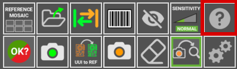

# **User Interface**
___

## **Main working areas**
___
The following image describes the main working areas of the **AgnosPCB inspection software**.

{.center}

## **Start inspection**
___

{.center}

The **Inspection start** button is located in the upper left corner. A simple click triggers a sequence of actions to inspect the current **UUI** image. This buttom is available when the [Auto process button](#auto-process) is set **OFF**. This is useful to avoid spend credits when you are testing how to take pictures of your PCBAs.

## **Activity log**
___

{.center}

The **activity log** area is located in the top right side and shows the **current avaible credits** and application's operational details. This log serves as a guide, offering clarity and insights into the application's functionality and performance.

## **Main workspace**
___

{.center}

This is the main section where you work with the images, whether it's the **REFERENCE** or the **UUI.**.

## **Side-by-side comparison**
___

{width=400px; .center}

This interface section, is divided in two parts. The first displays the **REFERENCE** image, serving as a standard for comparison, while the second part shows the **UUI** image. These images are maginified and move in parallel showing exactly the same area in the **REFERENCE** and **UUI** where the cursor is pointing in the main workspace.

## **Buttons panel**
___

{.center}

Here are located various **buttons and options**. They're designed to **optimize** your workflow and speed up your tasks.

### **Reference mosaic**

{width=350px; .center}

{width=600px; .center}

The reference mosaic is used to store REFERENCES as files to quickly find and load any fo them. The mosaic menu automatically appears after taking a REFERENCE by using the software with the [take REFERENCE photo button](#take-reference-photo) or by loading it with [as a file](#load-reference-as-file). A REFERENCE stored in the mosaic can be quickly loaded by pressing a **F button** (F1-F10).

### **LOAD REFERENCE as file**

{width=350px; .center}

{.center}

Use this icon to load a image previously captured as a **REFERENCE**. All the **REFERENCE** images can be found inside the folder **APP/REFERENCE** in a folder named after the time the picture was taken.

!!! note "Note"
    Since version 7, the software **does not allows** to load images taken from any source other than the platform itself as the images contains specific parametres for the optics.

### **Swap**
 
{width=350px; .center}

Toggles between **REFERENCE** and **UUI** images in the [main workspace area](#main-workspace).

### **Barcode area drawing**

{width=350px; .center}

{.center}

Click this button to manually draw a rectangle in the **REFERENCE** image where there is a barcode. The software will read it and use that code to name the images and include it in the final **PDF report**.

### **Exclusion**

{width=350px; .center}

{.center}

Creates an exclusion area where the system will not look for faults. You can create as many areas as required. This function is detailed in the [following section](Set_exclusion_area.md).

### **Sensitivity**

{width=350px; .center}

Change the system fault detection sensitivity (NORMAL/HIGH/VERY HIGH). Set back to normal, automatically after carrying out a new inspection. Shortcut: 1, 2 ,3 Keys

### **Help**

{width=350px; .center}

This button will get you to this **USER GUIDE**

### **Report**

{.center}

{.center}

Selecting this button will create a report that includes the detected errors. This report could be tagged as an **OK** or **NOT OK** inspection, depending on the manufacturing criteria. To learn more about this feature go to the following [section](Generating%20_a_report.md).

### **Take REFERENCE photo**

{.center}

{.center}

This button open a window with the utils to generate a **REFERENCE** image from a PCB or panel. In [generate a reference](Inspection_workflow.md#Generate%20a%20REFERENCE) section you will learn more about this function.

Shortcut: r

### **UUI to REFERENCE**

{.center}

This function turns the current **UUI** image in a **REFERENCE**. This is useful when some of the components of the PCBA has been changed for a equivalent and the **Neural Network** detects it as an error due to a visual difference but the PCBA is correct. To learn more about this feature go to the following [section](UUI_to_REFERENCE.md).

### **Take an UUI photo**

{.center}

{.center}

Takes a photo of a **Unit Under Inspection** PCBA/Panel. If the [auto process](#auto-process) button is active, the inspection will start automatically once the UUI image is taken.  

Shortcut: s

### **Eraser**

{.center}

Deletes a drawn **exclusion area**.

### **Auto process**

{.center}

If activated, the next **UUI** photo taken will be **automatically** processed. That means that the image will be analyzed for faults right after being taken. This option reduces the processing time for every inspection.

!!!warning "Important"
    For **ONLINE UNITS** please note that each processed image will automatically be sent to our server and **will consume credits**. If you are testing how to take your photos we recommend to disable this function until you are sure the photos are good enough in order to **avoid spending credits unnecessarily.**

### **Settings**

{.center}

With this button you can change other functions to suit your needs.

