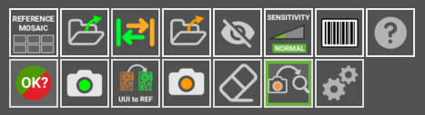

# Screen Layout

### Start inspection

In the upper left corner, you'll find the **"Start Inspection"** button. A simple click triggers a sequence of actions to inspect your UUI, making the process faster and easier by detecting any errors.

### Inner workings

On the right side, the highlighted area reveals the application's **operational details**, documenting tasks, resources, and outcomes. This log serves as a guide, offering clarity and insights into the application's functionality and performance.

### Main section

This is the main section where you work with the images, whether it's the **REFERENCE** or the **UUI.** Here, you can add functions or mark errors.

### Side-by-side comparison

In this interface section, you'll find two parts. The first displays the **REFERENCE** image, serving as a standard for comparison, while the second part shows the **UUI** image. These images enable a side-by-side comparison.

### Buttons panel

Here, you'll find various **buttons and options**, like tools, to help you navigate the program. Take your time to explore them, they're designed to **optimize** your workflow and speed up your tasks.

**Start the inspection process**. This button is enabled only after you have a **REFERENCE** and **UUI** images already set. Keyboard shortcut: **ENTER**. When clicked, the AOI will inspect the image taken for the circuit/panel and look for faults. If the Auto-analysis is enabled, the AOI will automatically inspect the last photo taken, so this button will be disabled

 

**Reference mosaic:** in the reference mosaic you can store references as files.

**LOAD REFERENCE as file**: Use this ICON to load a **“reference”** or **“to be inspected”** photo. If you have stored a **“reference”** image and want to retrieve it to use it again, use this button. You can do the same with an image of a **“to be inspected”** circuit/ panel. This button will get non-functional if you have the **AUTO-PROCESSING** option enable, which will automatically process every photo taken with the camera. All the REFERENCE photos can be found inside the folder HOME/APP/REFERENCE. In a folder named after the YEAR-MONTH-DAY-TIME moment when the photo was taken. You can rename the photos as you please.

**Swap:** with this you can swap between a reference and an UUI.

**LOAD a UUI file**: Use this ICON to load a **“UUI”** photo

**Exclusion:** Creates an **¨exclusion area¨** where the system will not look for faults. You can create as many areas as required. All of them will be saves with the REFERENCE

**Sensitivity:** Change the system sensitivity (NORMAL/HIGH/VERY HIGH). Set back to normal, automatically after carrying out a new inspection. Shortcut: 1, 2 ,3 Keys

**Barcode reader** Select this button to read any PCB containing a barcode REFERENCE

**Help:** This button will get you to this **USER GUIDE**

**Report:** selecting this button will create a report that will include the detected errors

**Take REFERENCE photo:** Take a photo of what will be a REFERENCE PCB/Panel. Shortcut: R

**UUI to REFERENCE:** 

**Take an UUI photo:** Takes a photo of a Unit Under Inspection PCBA/Panel. Shortcut: s

**Eraser:** Erase an **¨exclusion area¨** if you click on it.

**Auto Analyze**:  if activated, the next photo taken will be **automatically** processed. That means that the image will be analyzed for faults right after being taken. This option reduces the processing time for every inspection.

**Settings**: With this button you can change other functions to suit your needs.

## Other features: Zoom

The **ZOOM** feature is designed to allow you to closely examine faults with greater precision. Its purpose extends to verifying whether captured photos are sufficiently focused or not. To activate this function, simply rotate the mouse wheel while positioned over either the **"REFERENCE"** or **"TO BE INSPECTED"** areas.

???+ warning "Important"

    How Error Report works. If you get false positives or faults not properly detected can be reported to us. It is very important for us to get this information, as the neural network will learn from its mistakes. If you find a reflection on a surface marked as fault, a not perfectly indicated issue anything you want us to review, just report it pressing the UP arrow key after placing the mouse’s cursor on top of it. It will take less than a second and will let the software adapt its detection capacities to your particular manufacturing process.

