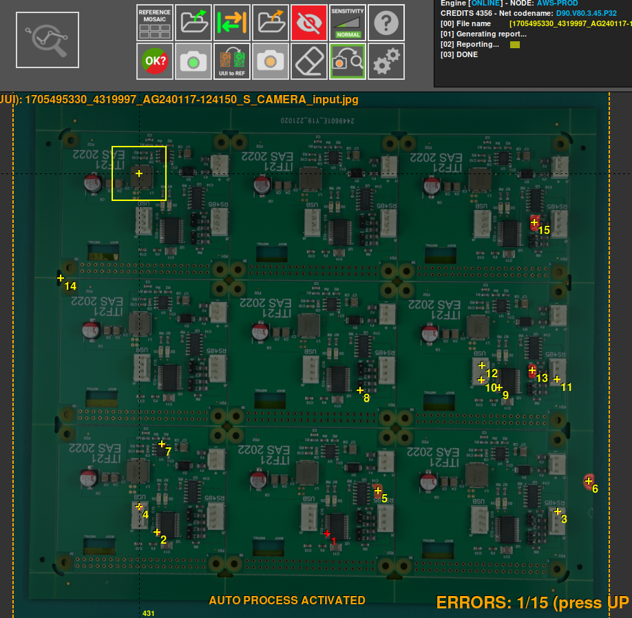

# Set exclusion area

The exclusion area is used to analyze the PCB by excluding certain items that are not necessary or not wanted to be analyzed. For this we use the button ¨draw exclusion area¨.

Then, using the REFERENCE photo, select the area to be excluded. You can select as many areas as you want. 

Now, examining the UUI will not detect any errors in the selected areas.

In case you have selected the wrong area or you do not want to select it anymore, you can use the ¨remove area¨ button to deselect it.

Likewise, the number of selected exclusion areas is displayed when the report is generated.

An image of the REFERENCE and the selected exclusion areas will also appear.

