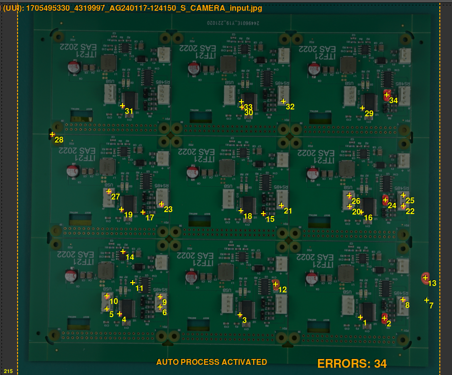

# Set sensitivity

Sensitivity is the level of stringency applied to **detect errors**. The higher the sensitivity, the more possible errors are detected. We offer three different types of sensitivity, **normal, high and very high.** 

Usually the **normal** level is **sufficient** to detect all errors but if you want to perform a more thorough inspection you can increase the sensitivity level according to your needs.

**Example:**

Sensivility set **normal**

Sensitivity  set **High**

Sensitivity set **Very high**

As shown in the pictures, raising the sensitivity level from normal to very high can detect up to twice as many possible errors. You can vary the sensitivity level by simply changing it using the **following button **

