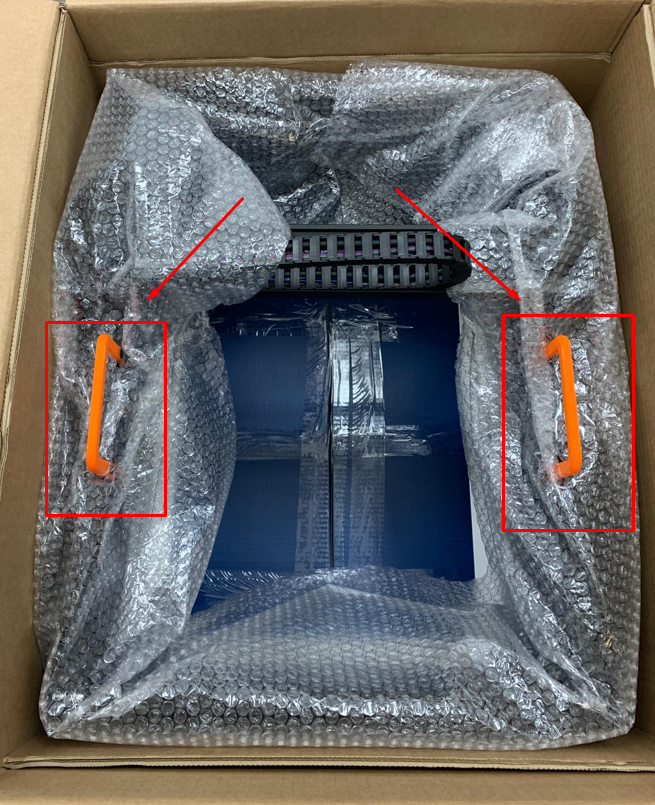
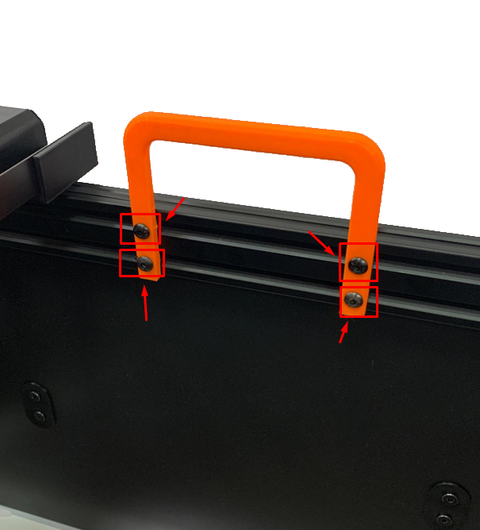
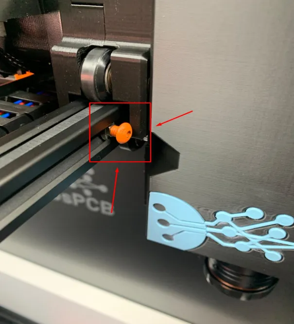
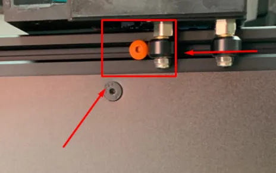
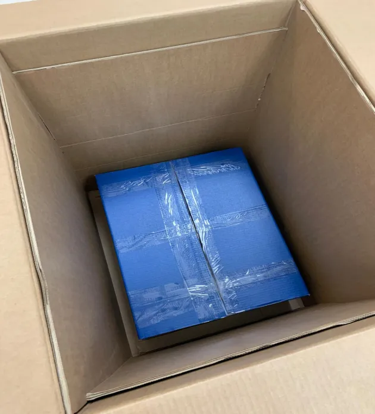

!!! warning "Important"

    If there is any missing part or defective [send us an email](mailto:support@agnospcb.com).

!!! warning "Important"

    After completing the unboxing, make sure to remove all the orange parts from the inspection platform.

!!! warning "Important"
    **For OFFLINE units only** 

    Ensure to remove the GPU protection before booting the computer.

    

       <iframe width="560" height="315" src="https://www.youtube.com/embed/npedVH6Q4I0?si=yWQ4Yp_C_VUOfj0u" title="YouTube video player" frameborder="0" allow="accelerometer; autoplay; clipboard-write; encrypted-media; gyroscope; picture-in-picture; web-share" referrerpolicy="strict-origin-when-cross-origin" allowfullscreen></iframe>
    

=== "Step 1"
    **Take out the inspection platform**

    Start by pulling the orange handles shown in the photograph to carefully lift the inspection platform out of the packaging.

    {.center}

=== "Step 2"
    **Remove the Orange Handles**

    Remove the orange handles by unscrewing the four fastening screws, do not forget to remove the screws and nuts from the profiles once the handle is extracted. Repeat this process for the handle on the opposite side.

    {.center}

=== "Step 3"
    **Remove the cart fastening screws**

    Unscrew the screws that keep the carriage fixed.

    {.center}

    {.center}

=== "Step 4"
    **Take out the Blue Box with Accessories**
    
    Take the blue box that contains all the necessary accessories out of the packaging. Inside, you will find the accessories listed on the website.

    {.center}

    **Continue with the [Conection guide](./Connection_guide.md)**
