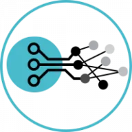

# Update your AOI computer

To update your **AOI computer**, you'll need to follow a series of steps carefully to ensure the process goes smoothly.

Firstly, begin by **downloading** the update file provided to you. This file is typically packaged in a ZIP format for easy downloading. Once the download is complete, locate the **ZIP file** on your computer.

Next, you'll need to extract the contents of the ZIP file. Within the ZIP file, you should find a folder named **"AGNOS_UPDATE"**. Extract this folder onto a USB drive that you have prepared for the update process. It's important to ensure that the extracted folder on the **USB drive** retains the exact name "AGNOS_UPDATE". This specific naming convention ensures that the AOI computer recognizes and processes the update files correctly.

Once you've prepared the **USB drive** with the update files, it's time to initiate the update process on your AOI computer. Begin by powering on the computer and waiting for the system desktop to **fully load**. Ensure that no other applications are running in the background, as this can interfere with the update process.

With the computer up and running, insert the USB drive containing the extracted **"AGNOS_UPDATE"** folder into an available **USB** port on the AOI computer. Make sure the USB drive is **securely connected** to avoid any interruptions during the update process.

Upon inserting the **USB drive**, you should notice that a terminal window automatically opens on the computer screen. This **terminal window** is where the application update process will take place. The update process will begin automatically, and you may see progress indicators or messages within the terminal window indicating the **update's progress.**

Once the update process is complete, you'll receive a **confirmation message** within the terminal window. At this point, it's safe to remove the USB drive from the computer. Your AOI computer has now been **successfully updated** with the latest changes and improvements.

{ align=right }

By following these steps meticulously, you can ensure that your AOI computer receives the necessary updates without encountering any issues. If you encounter any difficulties or have questions during the update process, don't hesitate to seek further assistance.