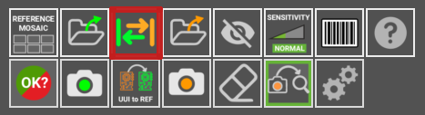
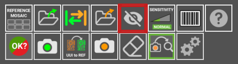
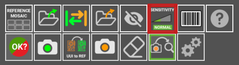
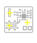
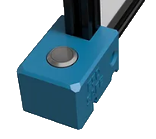
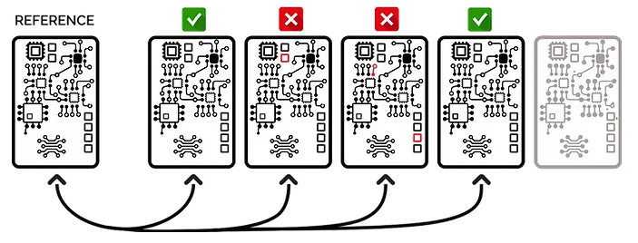

# User guide

## User interface

Upon launching the Agnospcb inspection tool software, the user interface will appear. It has different panels and inspection areas:

- **Reference panel (green )**: The “golden sample” image. Can be loaded using the LOAD icon (from the Reference area). 
- **Unit Under Inspection (orange)**: this is the image of the panel to be inspected. Can be loaded using the LOAD icon (from the inspection area)
- **Magnification canvas** : this frame will display, the same areas of the REFERENCE and RESULT circuit/panels. Move the mouse to check different zones of the circuit. Use the mouse’s wheel to modify the zoom magnification. 
- **Activity log**: provides useful information about the inspection process
- **Settings**: where the configuration ICONs are. Useful tools in your inspection process.

  

    

**Start the inspection process**. This button is enabled only after you have a REFERENCE and TO BE INSPECTED images already set. Keyboard shortcut: **ENTER**. When clicked, the AOI will inspect the image taken for the circuit/panel and look for faults. If the Auto-analysis is enabled, the AOI will automatically inspect the last photo taken, so this button will be disabled

**Reference moaic:** in the reference mosaic you can store references as files.

**LOAD REFERENCE as file**: Use this ICON to load a **“reference”** or **“to be inspected”** photo. If you have stored a **“reference”** image and want to retrieve it to use it again, use this button. You can do the same with an image of a **“to be inspected”** circuit/ panel. This button will get non-functional if you have the **AUTO-PROCESSING** option enable, which will automatically process every photo taken with the camera. All the REFERENCE photos can be found inside the folder HOME/APP/REFERENCE. In a folder named after the YEAR-MONTH-DAY-TIME moment when the photo was taken. **You can rename the photos as you please**.

**Swap:** with this you can swap betewn a reference and an UUI.

**LOAD a UUI file**: Use this ICON to load a **“UUI”** photo

**Exclusion:** Creates an **¨exclusion area¨** where the system will not look for faults. You can create as many areas as required. All of them will be saves with the REFERENCE

**Sensitivity:** Change the system sensitivity (NORMAL/HIGH/VERY HIGH). Set back to normal, automatically after carrying out a new inspection. Shortcut: 1, 2 ,3 Keys

**Barcode reader** Select this button to read any PCB containing a barcode REFERENCE

**Help:** This button will get you to this **USER GUIDE**

**Report:** selecting this button will create a report that will include the detected errors
 

**Take REFERENCE photo:** Take a photo of what will be a REFERENCE PCB/Panel. Shorcut: R

**UUI to REFERENCE:** 

**Take an UUI photo:** Takes a photo of a Unit Under Inspection PCBA/Panel. Shortcut: s

**Eraser:** Erase an **¨exclusion area¨** if you click on it.

**Auto Analyze**:  if activated, the next photo taken will be **automatically** processed. That means that the image will be analyzed for faults right after being taken. This option reduces the processing time for every inspection.

**Settings:** you can change some parameters here. 

**CROP IMAGE**: Useful when the panel/circuit in the photo is too small. Cropping the image will “force” the software to focus in the selected area. Only available in the **REFERENCE** canvas. The software will automatically look for the same area in every photo taken of the panels to be inspected after it has been set. To remove the CROP boundaries, click on the icon again.

**Auto-signalling**: In order to **highlight** the faults detected you have two options: **1)** change the color of the faults **mask** using the Action button **“MASK-COLOR”** or **2)** enabling this feature. It will place a yellow cross on top of the faults detected. Not visible in the magnification areas.

Faults **Mask-colors**: Once the analysis of the panel/circuit has been carried out, the results will be shown as a new mask on top of the image. If faults have been detected, they will be highlighted in red/blue or green. Depending on the PCBA´s color / material you are working with, you may need to change the opacity and color of the mask in order to easily see where those faults are. Every time you click on the ICON the mask color will change. Its opacity can be modified spinning the mouse’s wheel when it is placed on top of the ICON.

## The inspection button

**The Inspection button will let you** take the best possible photo of your circuits / panels just pressing it. It will quickly start the process of configuring the camera with the best parameters, prepare the software, so it can use the latest photo taken, and analyze it looking for faults. Just in a matter of a fraction of a second.

 **This button can be used for:**

1) **SET** a **REFERENCE** image: PRESS it for **5 seconds** until you hear the camera shooting. The AOI software will use that image as **REFERENCE** to compare all the next images of the circuits.

2) **INITIALIZE** the inspection process: Just press it for a second and the camera will capture an image of the circuit / panel to be analyzed. Alternatively, you can click, with the mouse, on the INSPECTION BUTTON (icon below) on the user interface to do the same.

## Inspection process

At this point, you should have already set up the inspection platform and everything should be connected to the laptop.

The points listed below will guide you through the steps you need to make to inspect a circuit/ panel your first time.

**1.** Turn **ON** the **LEDs** panels using the switch and/or remote control. Set, using the UP and DOWN arrows, their brightness. If you are inside a well-lit room, you may not need to set them to their maximum brightness.

**2.** **Turn ON** the CAMERA.

**3.** Quick-check if the camera is set in **aperture** mode (A).

**4.** **Turn ON** the computer and wait for the system to boot.

**5.** **The Inspection software tool** needs to be launched.

**6.** Check if the camera respond to the **INSPECTION BUTTON**, pressing it for 5 seconds (or key “R”). That should set a **REFERENCE** image. This is a photo taken  to a circuit/panel you already know is in good condition. As the camera parameters are controlled from the laptop, you do not have to do           anything. Just check if the image is in focus. You can use the mouse’s wheel to increase the zoom magnification and take a closer look at the     elements. 

**7.** Once the **REFERENCE** photo of the circuit/panel has been set, you can now take photos of the units you want to inspect (units under inspection). Press the **INSPECTION BUTTON** for **one second** to take a photo (or key “S”)

**8.** You are ready to go. The system should be now indicating, if any, faults on the UUI (Unit Under Inspection). Go to point 7 and repeat the process  once a new UUI has been placed under the camera.

All the inspection results will be stored in the PCB_OUT folder you will find in the external USB drive. The REFERENCE images will be moved to the folder called “REFERENCE”. You can find all of them there , in the case you need any of the REFERENCE images previously used.

<Note> Note: the “R” key from the keyboard will work as a camera trigger button too. “R” will set a REFERENCE image. “S” will take a photo of an image to be inspected.</Note>

<Note> Note: If you activate the AUTO-ANALYSIS option, all the photos taken pressing “R” or the INSPECTION BUTTON for one second, will be automatically processed.</Note>

<Important>IMPORTANT: By default, we send the camera already configured, but from time to time, re-check the camera is operating with the Aperture MODE enabled </Important>

First, tap on the round button indicated above. The select rotating the dial, the Aperture MODE **(A)**. Then, using the same dial, select the value F8.0 (right image). **Setting the aperture to F8.0 will let you get the most detailed photos of your circuits / panels.**

With some tips about how to improve the fault detection results and comments about what not to do.

## Light sources and panel/circuit orientation

The inspection platform uses 2 LED lights and diffuser panels to get rid of cast shadows. But if you take photos of the circuits varying its orientation every inspection, large electronic elements (like capacitors, coils and connectors) present on the circuits/ panels will be seen differently from the camera’s point of view.

**Try to place the circuit always with the same orientation.** 

The software is capable, within a second, of auto-aligning the images, but the light projected will fall very differently over the electronic components if the circuit is rotated by 90/180 degrees. That will lead the neural network to make mistakes when looking for faults. Try to avoid it always placing the panels/circuits with the same orientation.

## Optical/Digital Zoom

When using a DIGITAL ZOOM, the camera’s optics are not adjusted. It is accomplished electronically, so no optical resolution is gained. That means that you are not providing useful info to the software. 

If you are using our inspection platform and are inspecting a small circuit/panel: Move the camera DOWN until it is about 45 cm over from the circuit you are inspecting. The structure of the platform will not allow going down further in any case. From that distance, take the photos.

Do **not use the camera controls** to increase the size of the circuit/ panel. That will only degrade the quality of the image taken. The laptop will take control of the camera and set the best configuration under every circumstance.

## Cropping tool

Useful when the panel/circuit in the photo is too small. Cropping the image will “force” the software to focus on the selected area and will reduce the inspection time.
 
**You can only crop an image in the REFERENCE canvas.**

The software will automatically look for the same area in every photo taken of the panels to be inspected after the cropping boundary has been set. To remove the CROP boundaries, click on the CROP icon again.

## Circuit / Panel with many small electronic elements

The neural network powering the Agnospcb software behaves as a very skilled technician. But it can only detect faults **that can be seen**. Any minor displacement, solder paste change or short-circuit “hidden” under a shadow or light reflection may become **identifiable** if we **slightly** change **the lighting conditions / orientation of the panel/ circuit.** 

If you are inspecting a panel/ circuit with electronic elements casting pronounced shadows over other component/s, elements with very small pins or just obstructing the camera point of view, we recommend following this methodology which can lead to increase the detection rate:

1) Run a **regular inspection** and check results.

2) Slightly rotate the panel/ circuit and **run a second inspection.** 

3) Every inspection takes between 1-4 seconds so, a third one could be done quickly. Run a third inspection but, in this case, rotating in the opposite direction the panel/ circuit.

The vast majority of inspections do not require this methodology, but it is interesting to note the possibility **of increasing the detection capability of the system by carrying out this process.**

**The camera does not respond**

Check if the battery dummy is connected to the correct USB power supply, capable of delivering 3A. Check if the USB cable is properly connected and fully inserted. Does the R and S keys of the keyboard trigger the camera? 
