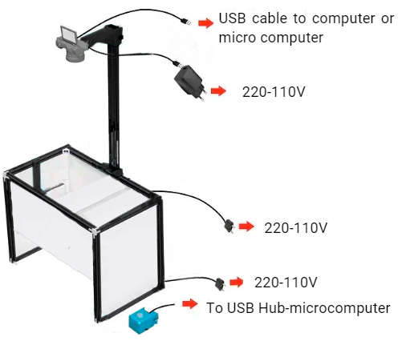
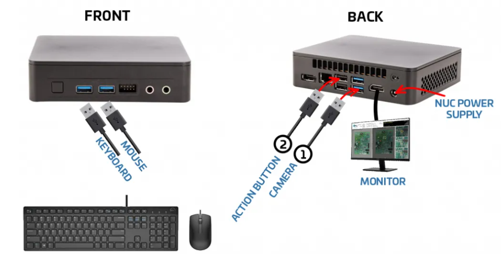
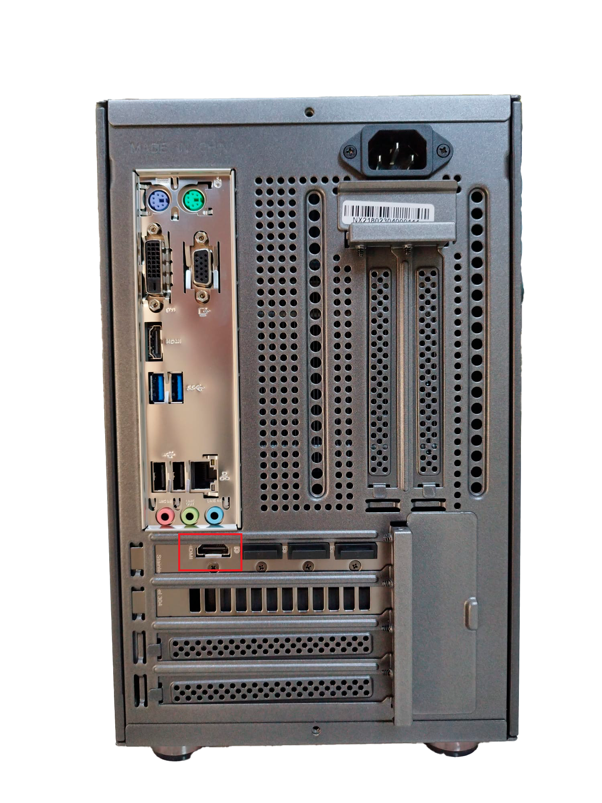

# Connecting OFFLINE units

___

**OFFLINE AOI** machines are powered by a desktop computer with the **AgnosPCB Neural Network** installed on it, making internet connection not necessary to perform inspections. 

The CPU must be connected as indicated below:

&emsp;**1)** Connect the 2m USB cable (the straight cable) from the CAMERA micro-usb port to any USB 3.0 port (**BLUE** ports) of the INTEL NUC (diagram below)

&emsp;**2)** Insert the **battery DUMMY** into the Sony’s camera battery slot, and connect it to the provided 5V/3A USB power supply (as a separate unit or in the power strip).

&emsp;**3)** Plug both LED panels into 230VAC sockets. Both LED panels can be adjusted and turned ON/OFF using a single remote control (provided).

&emsp;**4)** Connect the ACTION button to the INTEL NUC USB port (any available).

&emsp;**5)** Connect the monitor to the NUC´s HDMI graphics card port and the keyboard and mouse to any USB ports as below.

The **SONY camera** uses a battery DUMMY, so it can be ON for unlimited time. That battery dummy needs a 5V and 3A power supply (provided with the KIT as a separate unit or integrated in the power strip). At the same time, the camera will be controlled from the computer, so use the provided high-speed 2m USB-micro USB cable to connect the camera to your **INTEL NUC**.

To install and configure the camera go to following section: [How to connect the camera](Connect-the-camera.md "Title")

???+ warning "Important"

    When connecting the monitor, be sure to connect it to the HDMI port of the **graphics card** as shown below:
    { width=500px; aling=right}
