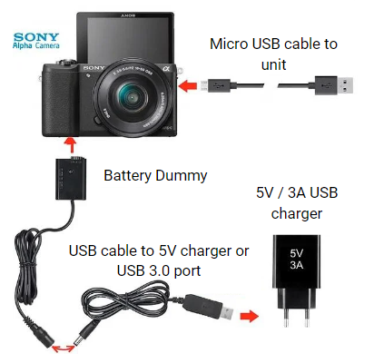

# **Connecting OFFLINE units**
___

AgnosPCB **OFFLINE AOI** machines are powered by a desktop computer with the **AgnosPCB Neural Network** installed on it, making internet connection not necessary to perform inspections. 

The CPU must be connected as indicated below:

1. Connect the 2m USB cable (the straight cable) from the CAMERA micro-usb port to any USB 3.0 port (**BLUE** ports) of the CPU (diagram below)

2. Insert the **battery DUMMY** into the Sony’s camera battery slot, and connect it to the provided 5V/3A USB power supply (as a separate unit or in the power strip).

    

3. Plug both LED panels into AC sockets. Both LED panels can be adjusted and turned ON/OFF using a single remote control (provided).

4. Connect the ACTION button to an USB port of the CPU unit (any available).

    

5. Connect the monitor to the CPU´s HDMI graphics card port and the keyboard and mouse to any USB ports.

!!! warning "Important"

    When connecting the monitor, be sure to connect it to the HDMI port of the **graphics card** as shown below:
    { width=500px; aling=right}

The **SONY camera** uses a battery DUMMY, so it can be ON for unlimited time. That battery dummy needs a 5V and 3A power supply (provided with the KIT as a separate unit or integrated in the power strip). At the same time, the camera will be controlled from the computer, so use the provided high-speed 2m USB-micro USB cable to connect the camera to your **INTEL NUC**.

To install and configure the camera go to following section: [How to connect the camera](Connect-the-camera.md "How to connect the camera")
