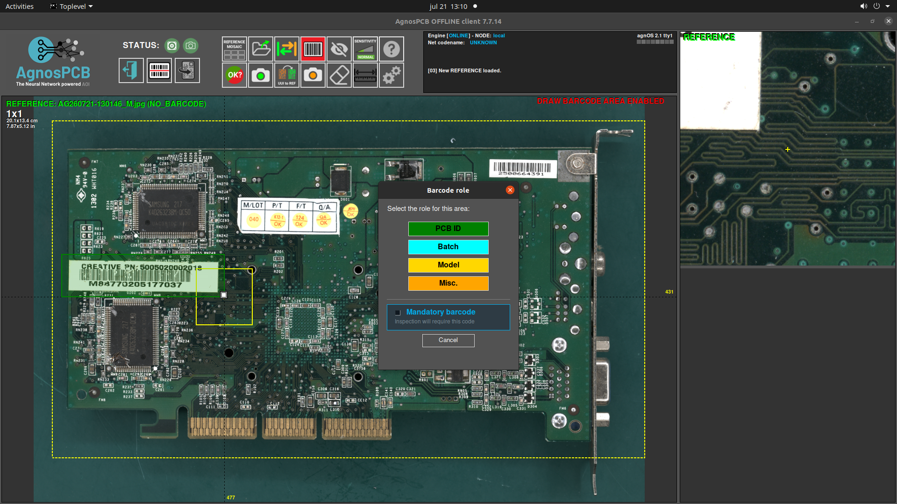
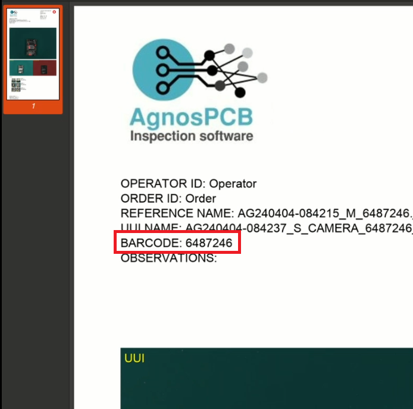
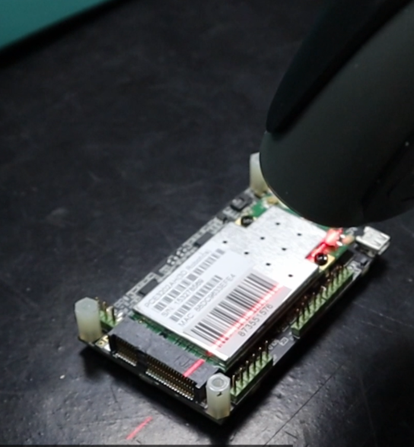

# Barcode reader

The AgnosPCB software incorporates a barcode reader function that supports **1D barcodes, QR and Datamatrix**.

You can either take a **REFERENCE** photo or upload one directly from your files using the **"Open reference"** button.

{.center}

Press the **"draw barcode area"** button and draw an area where the code is placed in the panel.
Define what type of code is placed in that area: **ID, Batch ID, Model or Misc.**

{.center}

You can configure up to four different types of codes to be read.
If the **mandatory barcode** option is set on a specific code, the inspections won't continue if the code has not been read correctly. In these cases, it will allow the operator to add it manually.

Once the REFERENCE is loaded, proceed with the inspection by taking a picture of the UUI. The UUI's codew will be read automatically in the same area of the REFERENCE's barcode.

Proceed with the [inspection process](../how_to/Inspection_workflow.md) as usual. 

The scanned codes will be included in the final PDF report of the UUI.

{.center}

## Load a REFERENCE by barcode

If you already have a **REFERENCE** stored, you can easily retrieve it using the code associated with it. To do this, press the **"read barcode"** button, then read the barcode using the handheld reader, and the **REFERENCE** will load automatically. It is also possible to enter the code manually.

{.center}

{.center}

{.center}
