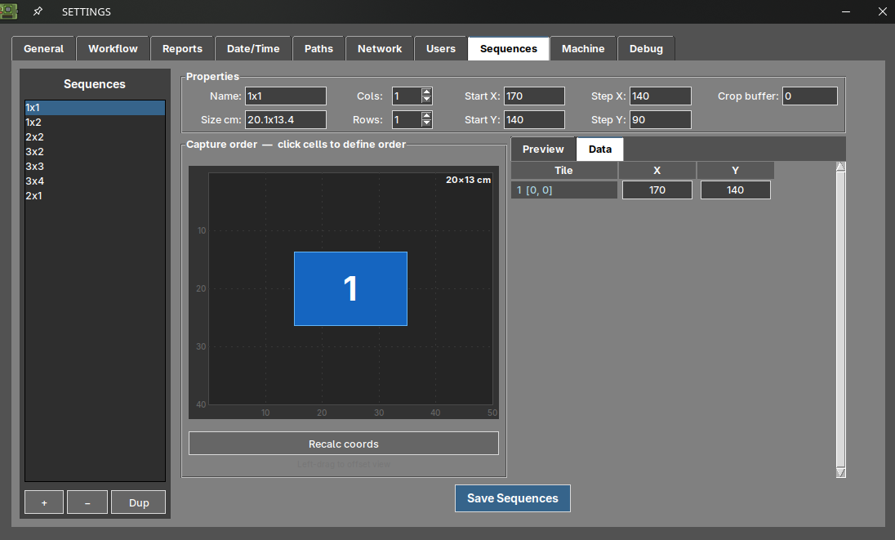
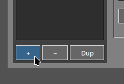
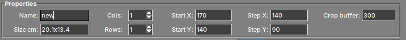
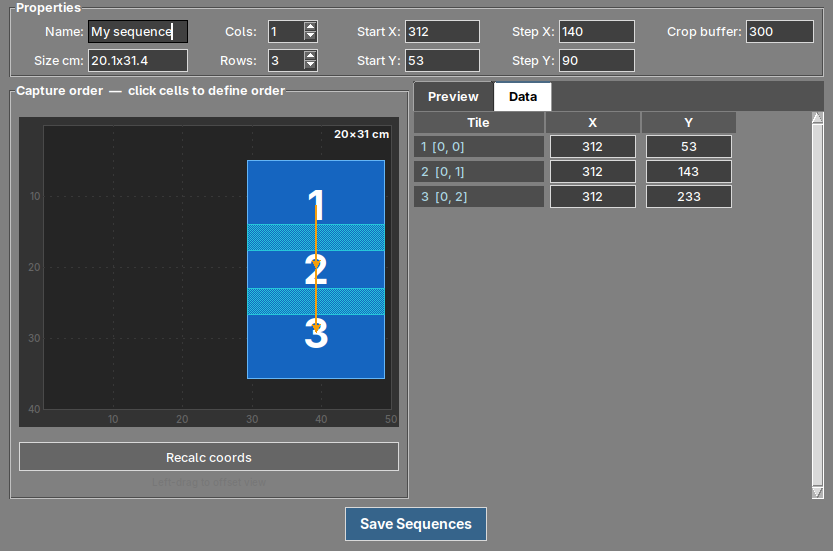
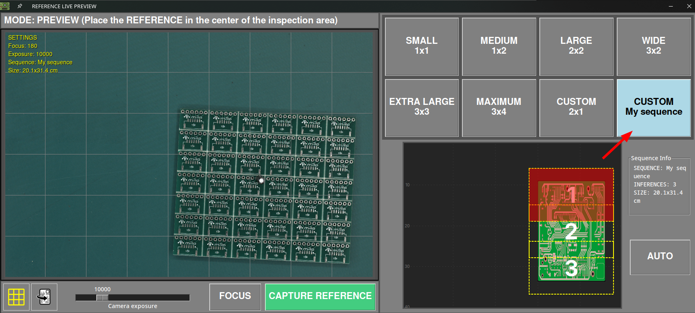

# Séquences de capture personnalisées

## Qu'est-ce qu'une séquence de capture ?

L'AOI ne photographie pas la carte entière en une seule prise. La caméra se déplace au-dessus de la zone d'inspection et prend une **grille de photographies**, que le logiciel assemble ensuite en une seule image. Cette grille est ce que nous appelons une **séquence**.

Le logiciel comprend un ensemble de séquences prédéfinies couvrant les tailles de carte les plus courantes :

| Séquence | Grille | Captures |
| --- | --- | --- |
| **SMALL** | 1x1 | 1 |
| **MEDIUM** | 1x2 | 2 |
| **LARGE** | 2x2 | 4 |
| **WIDE** | 3x2 | 6 |
| **EXTRA LARGE** | 3x3 | 9 |
| **MAXIMUM** | 3x4 | 12 |

Une **séquence personnalisée** vous permet de définir votre propre grille lorsqu'aucune des séquences prédéfinies ne convient à votre carte.

## Quand en avez-vous besoin ?

Créer une séquence personnalisée est utile lorsque :

- Votre carte a une forme qui ne correspond à aucune des grilles prédéfinies, typiquement des **panneaux longs et étroits**.
- La plus petite séquence prédéfinie qui couvre votre carte couvre également une grande zone vide autour d'elle, ce qui fait que l'AOI photographie de l'espace où il n'y a pas de carte.
- Vous inspectez le même produit de façon répétée et voulez que la grille de capture s'y ajuste le plus précisément possible.

Chaque capture de la grille est traitée séparément, et la fenêtre d'aperçu en direct affiche le nombre d'inférences effectuées par la séquence sélectionnée. Une grille ajustée à votre carte évite les captures inutiles.

## Où la trouver

Ouvrez le [menu des paramètres](../how_to/Settings_menu.md) et allez dans l'onglet **Sequences**.

{.center}

!!! note "Note"
    Cet onglet n'est accessible qu'aux utilisateurs ayant le rôle **admin**.

## Les paramètres

| Champ | Description |
| --- | --- |
| **Name** | Nom de la séquence. C'est le nom qui sera ensuite affiché dans la fenêtre d'aperçu en direct. |
| **Size cm** | Zone de carte couverte par la séquence. Elle est calculée automatiquement à partir des autres valeurs, ce qui permet de vérifier que la grille couvre effectivement votre carte. |
| **Cols** / **Rows** | Nombre de colonnes et de lignes de la grille, de **1 à 8**. |
| **Start X** / **Start Y** | Position de la **première capture**, exprimée en pas moteur de la plateforme. |
| **Step X** / **Step Y** | Distance parcourue par la caméra entre une capture et la suivante, également en pas moteur. |
| **Crop buffer** | Chevauchement entre captures adjacentes, en pixels. |

!!! tip "À propos du crop buffer"

    Les captures adjacentes doivent se chevaucher légèrement pour que le logiciel puisse les assembler. Si le chevauchement est trop faible, les jonctions entre captures peuvent devenir visibles, et s'il est trop important, vous photographiez deux fois la même zone sans aucun bénéfice.

## Créer une séquence personnalisée

### 1. Ajouter la séquence

Appuyez sur le bouton **+** sous la liste des séquences pour en créer une nouvelle.

{width=250px .center}

Le bouton **−** supprime la séquence sélectionnée dans la liste, et **Dup** la duplique. Dupliquer une séquence prédéfinie proche de ce dont vous avez besoin est généralement plus rapide que de partir de zéro.

### 2. La nommer et définir la grille

Donnez à la séquence un nom descriptif — c'est ce que vous rechercherez ensuite dans l'aperçu en direct — et définissez le nombre de **colonnes** et de **lignes** dont votre carte a besoin.

{.center}

Le champ **Size cm** se met à jour automatiquement lorsque vous modifiez les valeurs, ce qui permet de vérifier si la zone résultante couvre votre carte.

### 3. Positionner la grille et définir l'ordre de capture

Définissez **Start X** et **Start Y** pour placer la première capture, et **Step X** et **Step Y** pour fixer la distance parcourue par la caméra entre deux captures. Appuyez ensuite sur **Recalc coords** pour recalculer la position de chaque capture à partir de ces valeurs.

Le canevas affiche la grille résultante à l'échelle. **Cliquez sur les cellules** dans l'ordre dans lequel vous voulez qu'elles soient photographiées pour définir l'ordre de capture.

{.center}

Dans l'exemple ci-dessus, un panneau haut et étroit est couvert avec **1 colonne et 3 lignes**. La première capture se trouve en X 312, Y 53, et avec un **Step Y** de 90, les captures suivantes se situent en Y 143 et Y 233. L'onglet **Data** liste les coordonnées de chaque capture et permet de les modifier une par une si vous devez affiner une position précise.

Vous pouvez aussi **cliquer avec le bouton gauche et faire glisser** sur le canevas pour déplacer la vue, et **cliquer avec le bouton droit et faire glisser** pour ajuster visuellement la zone de chevauchement.

### 4. Vérifier le résultat

Sélectionnez une capture et ouvrez l'onglet **Preview** pour voir l'image de la caméra en direct à cette position exacte. C'est le moyen le plus rapide de confirmer que la grille couvre effectivement votre carte avant d'enregistrer.

!!! note "Note"
    L'aperçu nécessite que la plateforme soit connectée, car la caméra se déplace physiquement jusqu'à la position sélectionnée.

### 5. Enregistrer

Appuyez sur **Save Sequences**. La configuration est enregistrée dans le fichier **sequences.json** de votre unité.

## Utiliser votre séquence

Une fois enregistrée, votre séquence apparaît comme une option **CUSTOM** dans la fenêtre d'aperçu en direct, aussi bien lors de la prise d'une image de RÉFÉRENCE que lors du démarrage d'une inspection.

{.center}

La sélectionner affiche le panneau **Sequence Info** avec le nom de la séquence, le nombre d'inférences qu'elle effectue et la zone qu'elle couvre.
