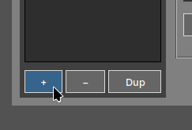
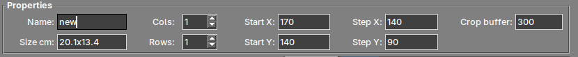
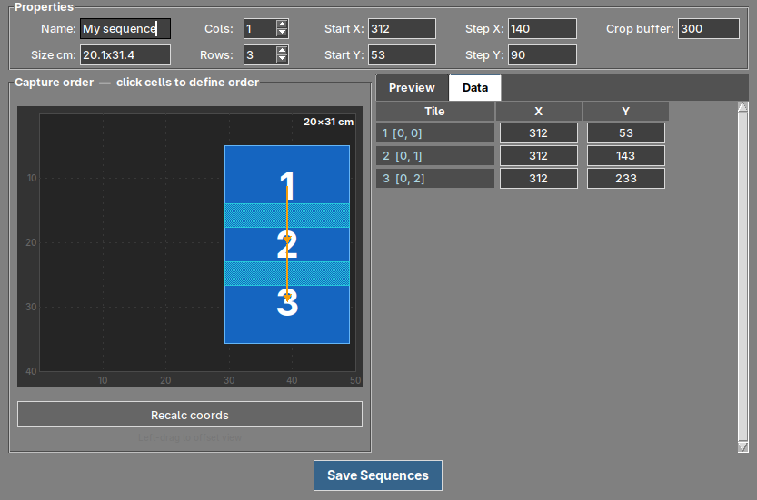
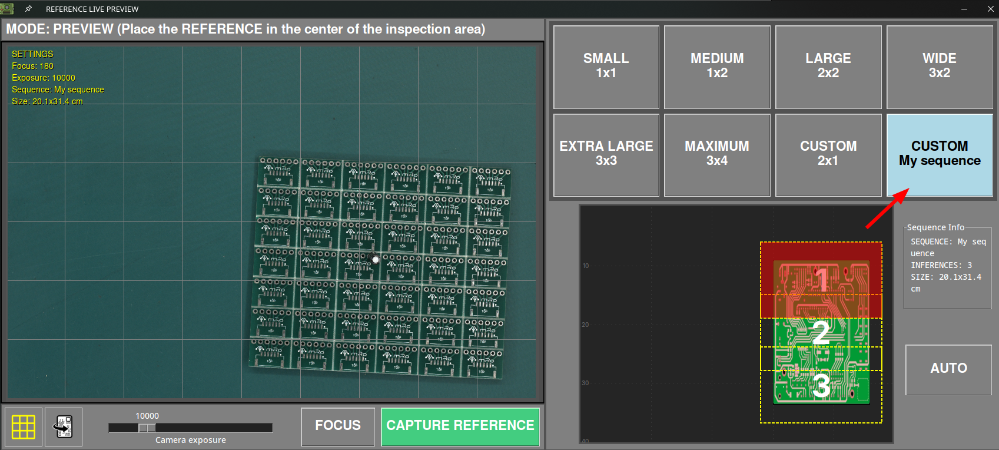

# Custom capture sequences

## What is a capture sequence?

The AOI does not photograph the whole board in a single shot. The camera moves over the inspection area and takes a **grid of photographs**, which the software then stitches together into one image. That grid is what we call a **sequence**.

The software includes a set of predefined sequences that cover the most common board sizes:

| Sequence | Grid | Captures |
| --- | --- | --- |
| **SMALL** | 1x1 | 1 |
| **MEDIUM** | 1x2 | 2 |
| **LARGE** | 2x2 | 4 |
| **WIDE** | 3x2 | 6 |
| **EXTRA LARGE** | 3x3 | 9 |
| **MAXIMUM** | 3x4 | 12 |

A **custom sequence** lets you define your own grid when none of the predefined ones fits your board properly.

## When do you need one?

Creating a custom sequence is worthwhile when:

- Your board has a shape that does not match any of the predefined grids, typically **long and narrow panels**.
- The smallest predefined sequence that covers your board also covers a lot of empty area around it, so the AOI is photographing space where there is no board.
- You inspect the same product repeatedly and want the capture grid to fit it as tightly as possible.

Each capture of the grid is processed separately, and the live preview window displays how many inferences the selected sequence performs. A grid adjusted to your board avoids unnecessary captures.

## Where to find it

Open the [settings menu](../how_to/Settings_menu.md) and go to the **Sequences** tab.

{.center}

!!! note "Note"
    This tab is only available to users with the **admin** role.

## The parameters

| Field | Description |
| --- | --- |
| **Name** | Name of the sequence. It is the name displayed later in the live preview window. |
| **Size cm** | Board area covered by the sequence. It is calculated automatically from the rest of the values, so you can use it to check that the grid actually covers your board. |
| **Cols** / **Rows** | Number of columns and rows of the grid, from **1 to 8**. |
| **Start X** / **Start Y** | Position of the **first capture**, expressed in motor steps of the platform. |
| **Step X** / **Step Y** | Distance the camera travels between one capture and the next, also in motor steps. |
| **Crop buffer** | Overlap between adjacent captures, in pixels. |

!!! tip "About the crop buffer"

    Adjacent captures need to overlap slightly so the software can stitch them together. If the overlap is too small the seams between captures may become visible, and if it is too large you are photographing the same area twice without any benefit.

## Creating a custom sequence

### 1. Add the sequence

Press the **+** button below the sequences list to create a new one.

{width=250px .center}

The **−** button deletes the sequence selected in the list, and **Dup** duplicates it. Duplicating a predefined sequence that is close to what you need is usually faster than starting from scratch.

### 2. Name it and set the grid

Give the sequence a descriptive name — it is what you will look for later in the live preview — and set the number of **columns** and **rows** your board needs.

{.center}

The **Size cm** field updates automatically as you change the values, so you can check whether the resulting area covers your board.

### 3. Position the grid and define the capture order

Set **Start X** and **Start Y** to place the first capture, and **Step X** and **Step Y** to set how far the camera moves between captures. Then press **Recalc coords** to recalculate the position of every capture from those values.

The canvas displays the resulting grid to scale. **Click on the cells** in the order you want them to be photographed to define the capture order.

{.center}

In the example above, a tall and narrow panel is covered with **1 column and 3 rows**. The first capture is at X 312, Y 53, and with a **Step Y** of 90 the following captures fall at Y 143 and Y 233. The **Data** tab lists the coordinates of every capture, and lets you edit them one by one if you need to fine-tune a specific position.

You can also **left-click and drag** on the canvas to move the view, and **right-click and drag** to adjust the overlap zone visually.

### 4. Check the result

Select a capture and open the **Preview** tab to see the live camera image at that exact position. This is the quickest way to confirm that the grid really covers your board before saving.

!!! note "Note"
    The preview requires the platform to be connected, since the camera physically moves to the selected position.

### 5. Save

Press **Save Sequences**. The configuration is stored in the **sequences.json** file of your unit.

## Using your sequence

Once saved, your sequence appears as a **CUSTOM** option in the live preview window, both when taking a REFERENCE image and when starting an inspection.

{.center}

Selecting it displays the **Sequence Info** panel with the name of the sequence, the number of inferences it performs and the area it covers.
