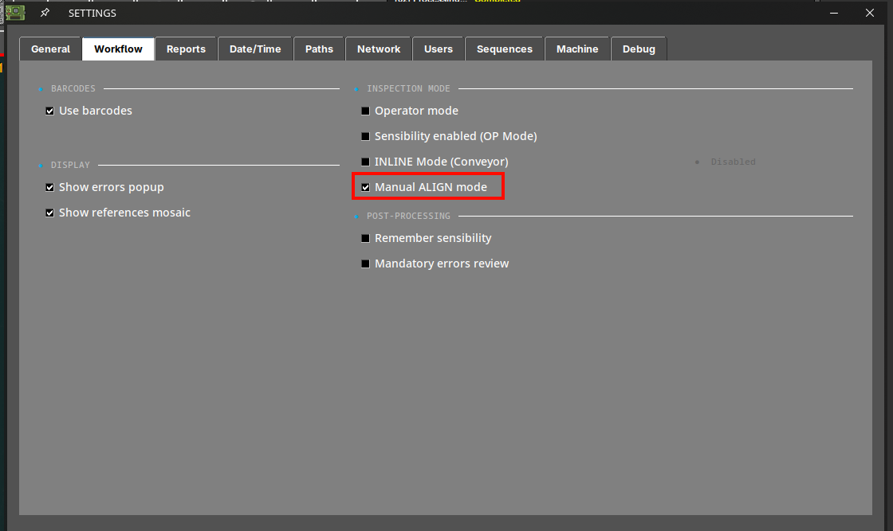
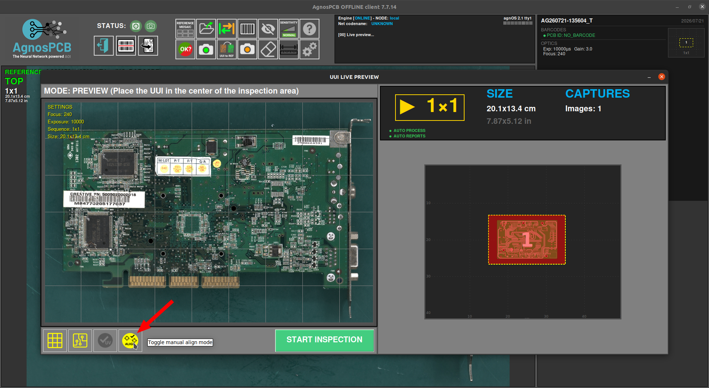
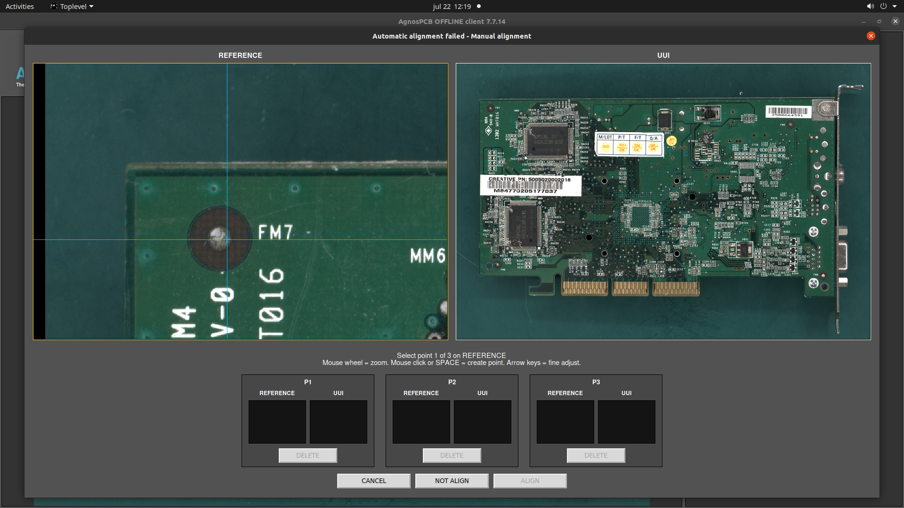
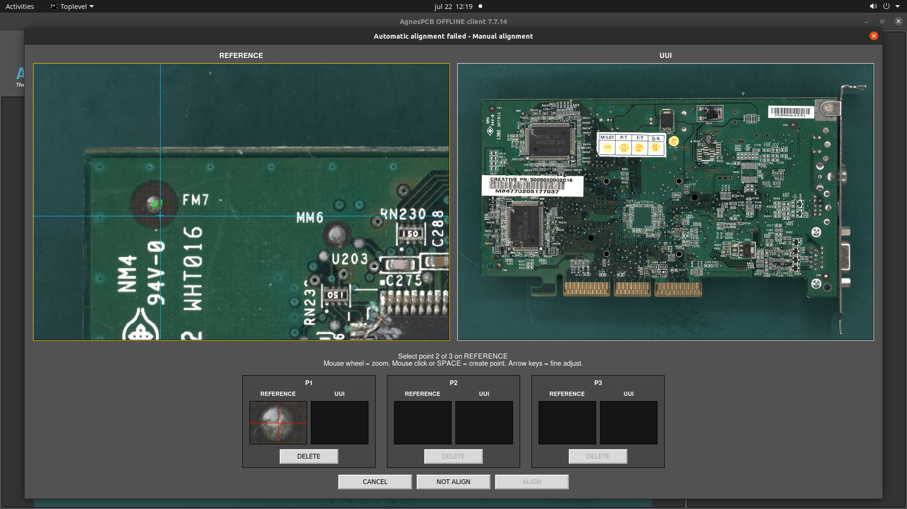
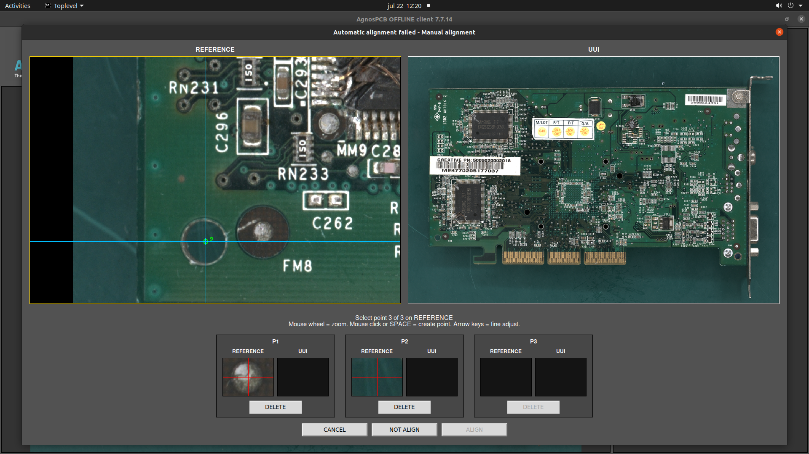
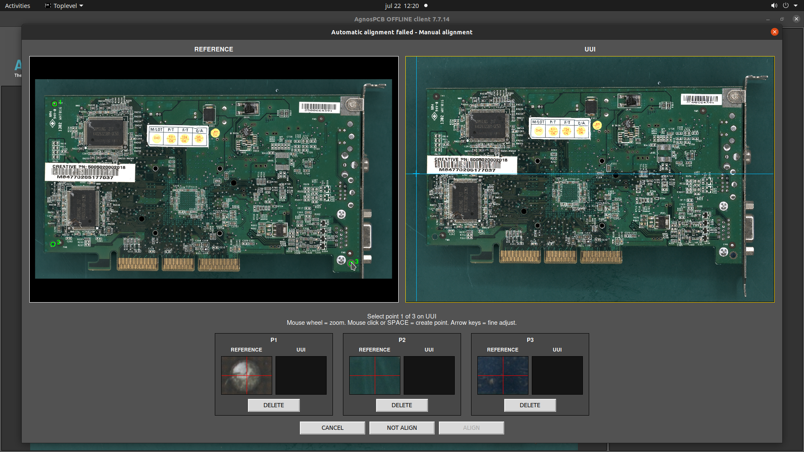
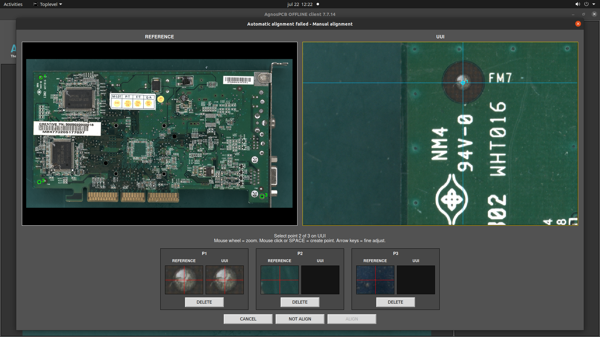
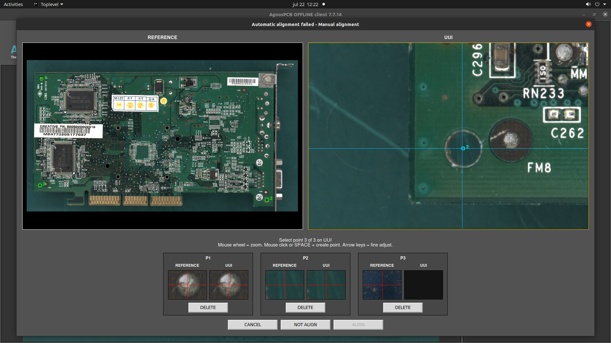
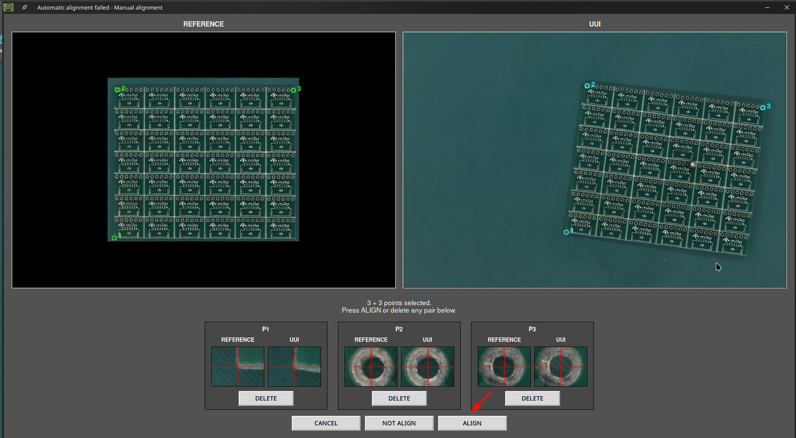
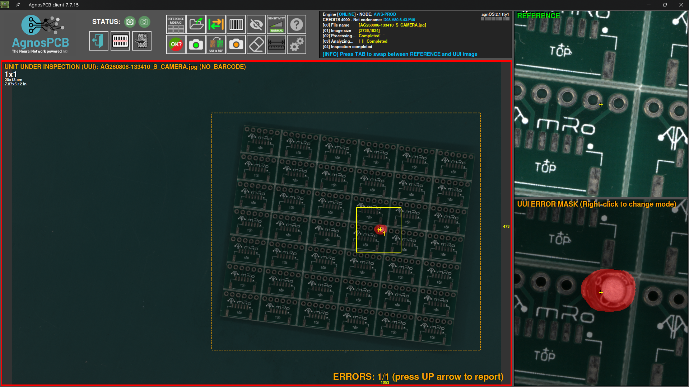

# Manual image alignment

When the REFERENCE and UUI images need to be aligned more precisely than the automatic alignment allows, the AgnosPCB software includes a manual alignment tool that improves the accuracy of the inspection.

## 1. Enabling the manual alignment

!!! info "Note"
    This feature is only available for **1x1 images inspections**.

When capturing a new UUI image, activate the manual alignment from the settings menu.

{.center}

Then, during the UUI image capturing, activate the manual alignment option.

{.center}

## 2. Aligning the images

Just after the UUI image has been captured, the manual alignment window pops up showing both REFERENCE and UUI images.

{.center}

Now mark three reference points in the REFERENCE image.

!!! warning "Important"
    Choose points that are easy to reproduce from panel to panel (holes, pads, etc.), close to the corners of the panel and as far apart from each other as possible.

!!! note "Note"
    Use the mouse wheel to zoom into the image and mark the points more precisely.

{.center}

{.center}

{.center}

Once the three alignment points are defined in the REFERENCE image, mark **the same three points** in the UUI image.

!!! warning "Important"
    To ensure a correct alignment, place each point on exactly the same feature of the panel as in the REFERENCE image.

{.center}

{.center}

{.center}

Once all the alignment points are placed, press the **ALIGN** button to start the process. The software aligns both images and then performs the inspection.

{.center}
