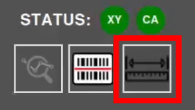
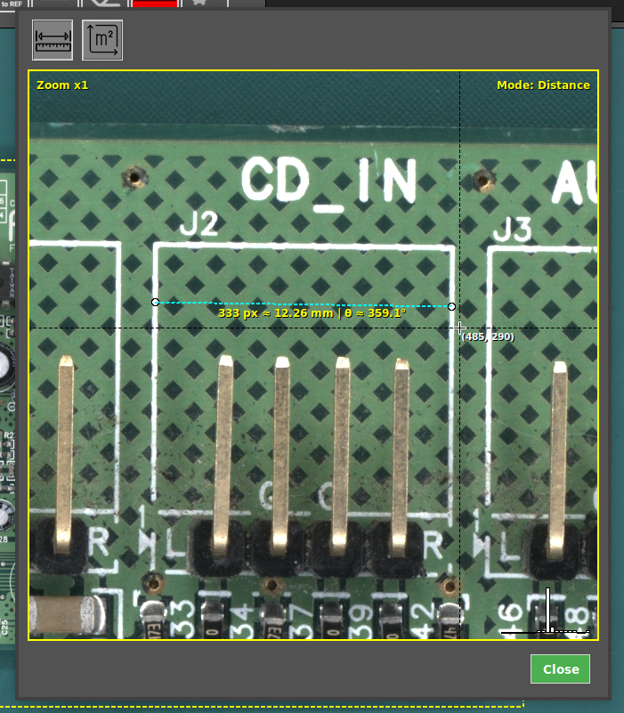
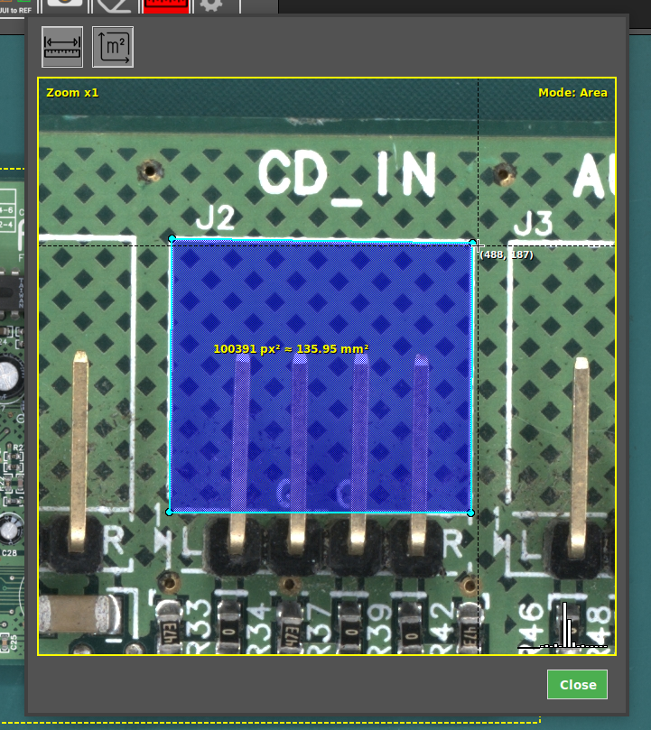

# Measurement tool

The AgnosPCB AOI system includes a Measurement Tool that allows operators to verify component dimensions, measure distances between components and calculate areas directly within the interface, without using external tools.

## Video 
___

For a complete walkthrough of this feature, watch the following video:

<iframe width="100%" height="400" src="https://www.youtube.com/embed/OfEmpK2Qjtc?start=39" title="YouTube video player" frameborder="0" allow="accelerometer; autoplay; clipboard-write; encrypted-media; gyroscope; picture-in-picture; web-share" referrerpolicy="strict-origin-when-cross-origin" allowfullscreen></iframe>
___

## 1. Select the image

[Select a reference image](../how_to/Screen-layout.md#load-reference-as-file) where you want to perform a measurement, or [capture a UUI](../how_to/Inspection_workflow.md#capturing-an-uui).

## 2. Open the Measurement Tool

Click the measure tool button in the top toolbar. Then, click on the area of interest to open a zoomed view of the selected region.

{width=200, .center}

## 3. Perform the measurement

Select the measurement mode:

- **Distance (mm/px)** to measure the distance between two points.
- **Area (mm²/px²)** to measure a surface.

{width=400, .center}

## Measure

Then, define the measurement by selecting the desired points or area on the image.
The system will display the measurement directly on the screen, allowing quick verification of sizes and areas with precision.

{width=500, .center}

{width=500, .center}