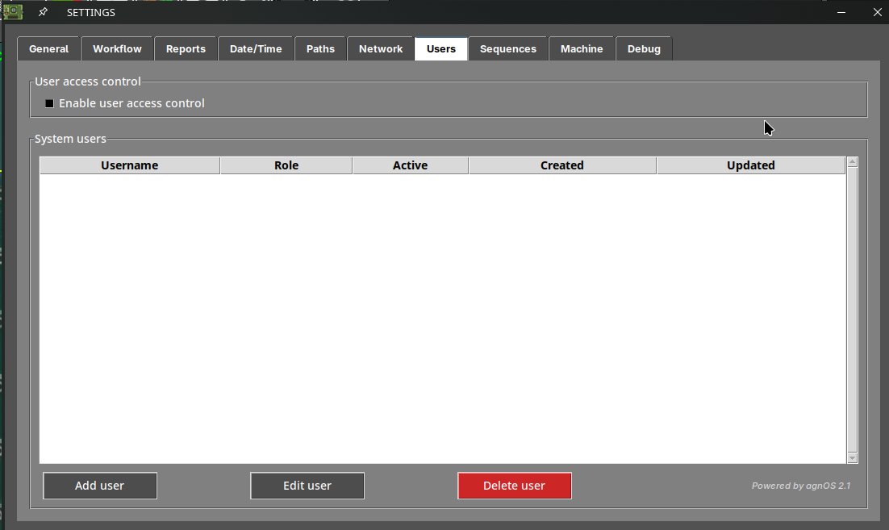
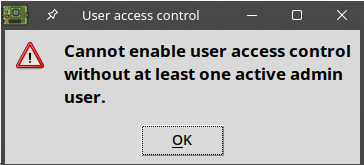
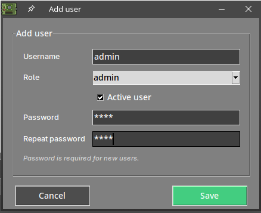
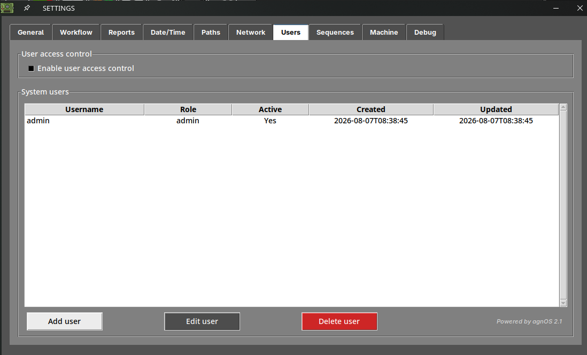
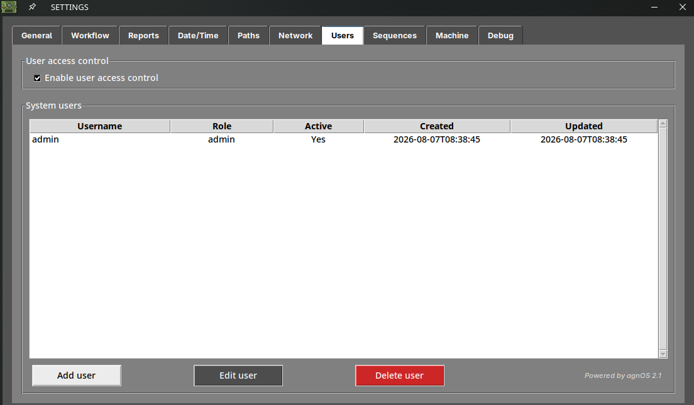
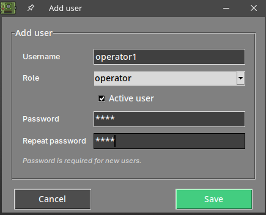
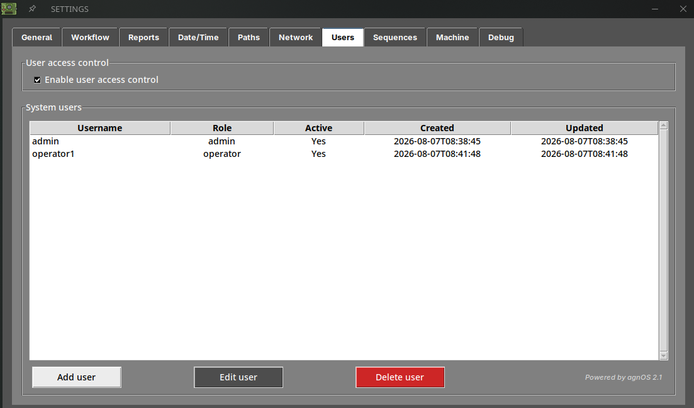
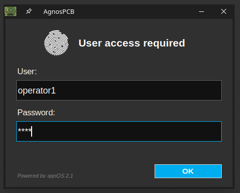

# Benutzerzugriffskontrolle

## Was ist die Benutzerzugriffskontrolle?

Standardmäßig kann jeder mit Zugriff auf die AOI die Software verwenden und alle ihre Einstellungen ändern.

Mit der **Benutzerzugriffskontrolle** können Sie individuelle Konten erstellen und bei jedem Start der Software einen **Benutzernamen und ein Passwort** verlangen. Jedes Konto hat eine Rolle, die festlegt, was der jeweilige Benutzer tun darf, sodass ein Bediener Inspektionen durchführen kann, während die Konfiguration der Maschine geschützt bleibt.

## Die beiden Rollen

Jedes Konto hat eine der beiden folgenden Rollen:

| | **admin** | **operator** |
| --- | --- | --- |
| Optionen General, Workflow und Report | Ja | Ja |
| Optionen Date/time, Path und Share | Ja | Nein |
| Users, Sequences, Machine und Debug | Ja | Nein |
| Ein REFERENZ-Bild aufnehmen | Ja | Nur wenn der Bedienermodus deaktiviert ist |
| Benutzer verwalten | Ja | Nein |
| Plattform kalibrieren | Ja | Nein |
| Einstellungspasswort festlegen | Ja | Nein |
| Ein Backup erstellen | Ja | Nein |

!!! note "Die Bedienerrolle und der Bedienermodus sind nicht dasselbe"

    Die hier beschriebene **Bedienerrolle** schränkt ein, welche Registerkarten des [Einstellungsmenüs](../how_to/Settings_menu.md) der Benutzer öffnen kann.

    Der **Bedienermodus**, unter *Settings → Workflow*, vereinfacht die Oberfläche und blockiert die Aufnahme von REFERENZ-Bildern. Er gilt für jeden, der die Maschine bedient, unabhängig von dessen Rolle.

    Beides lässt sich kombinieren: Ein Bedienerkonto mit aktiviertem Bedienermodus erhält sowohl die vereinfachte Oberfläche als auch die eingeschränkten Einstellungen.

## Einrichtung

### 1. Die Registerkarte Users öffnen

Öffnen Sie das [Einstellungsmenü](../how_to/Settings_menu.md) und wechseln Sie zur Registerkarte **Users**. Bei einer Maschine, die noch nie konfiguriert wurde, ist die Liste leer und die Zugriffskontrolle deaktiviert.

{.center}

### 2. Zuerst einen Administrator anlegen

Zunächst benötigen Sie ein **admin**-Konto. Versuchen Sie, die Zugriffskontrolle ohne ein solches zu aktivieren, verweigert die Software dies:

{width=350px .center}

Drücken Sie **Add user**, geben Sie den Benutzernamen ein, wählen Sie die Rolle **admin**, lassen Sie **Active user** aktiviert und geben Sie das Passwort zweimal ein.

{width=400px .center}

Drücken Sie **Save**. Das neue Konto erscheint in der Liste, mit dem Datum seiner Erstellung.

{.center}

!!! warning "Wichtig"

    Bewahren Sie das Administratorpasswort an einem sicheren Ort auf. Sobald die Zugriffskontrolle aktiviert ist, gelangen Sie nur über dieses Konto wieder in das Einstellungsmenü.

### 3. Die Zugriffskontrolle aktivieren

Aktivieren Sie bei einem aktiven Admin-Konto in der Liste die Option **Enable user access control**.

{.center}

### 4. Die übrigen Benutzer hinzufügen

Legen Sie für jede Person, die die Maschine bedienen wird, ein Konto an und weisen Sie die Rolle **operator** zu, sofern sie nicht die Konfiguration ändern muss.

{width=400px .center}

Die Liste zeigt jedes Konto mit seiner Rolle, ob es aktiv ist, sowie die Daten der Erstellung und der letzten Änderung.

{.center}

Drücken Sie **OK**, um zu speichern und das Einstellungsmenü zu schließen.

## Anmelden

Ab dem nächsten Start der Software fragt der Dialog **User access required** nach den Zugangsdaten eines der von Ihnen erstellten Konten.

{width=400px .center}

Die Software wird dann mit den Berechtigungen dieses Kontos geöffnet.

Um die Sitzung zu beenden und einen anderen Benutzer anmelden zu lassen, verwenden Sie die Schaltfläche **logout** im [Statusbereich der Plattform](../how_to/Screen-layout.md).

## Konten verwalten

Wählen Sie ein Konto in der Liste aus, um damit zu arbeiten:

- **Edit user** — ändert die Rolle, das Passwort oder den Aktivierungsstatus des ausgewählten Kontos.
- **Delete user** — löscht es dauerhaft. Es wird eine Bestätigung verlangt.

!!! tip "Deaktivieren statt löschen"

    Um jemanden von der Nutzung der Maschine auszuschließen, ohne den Datensatz seines Kontos zu verlieren, bearbeiten Sie den Benutzer und entfernen Sie das Häkchen bei **Active user**. Das Konto bleibt in der Liste, kann sich aber nicht mehr anmelden.

!!! note "Hinweis"
    Es muss immer mindestens ein **aktives Admin**-Konto vorhanden sein. Beachten Sie dies, bevor Sie einen Administrator deaktivieren oder löschen.
