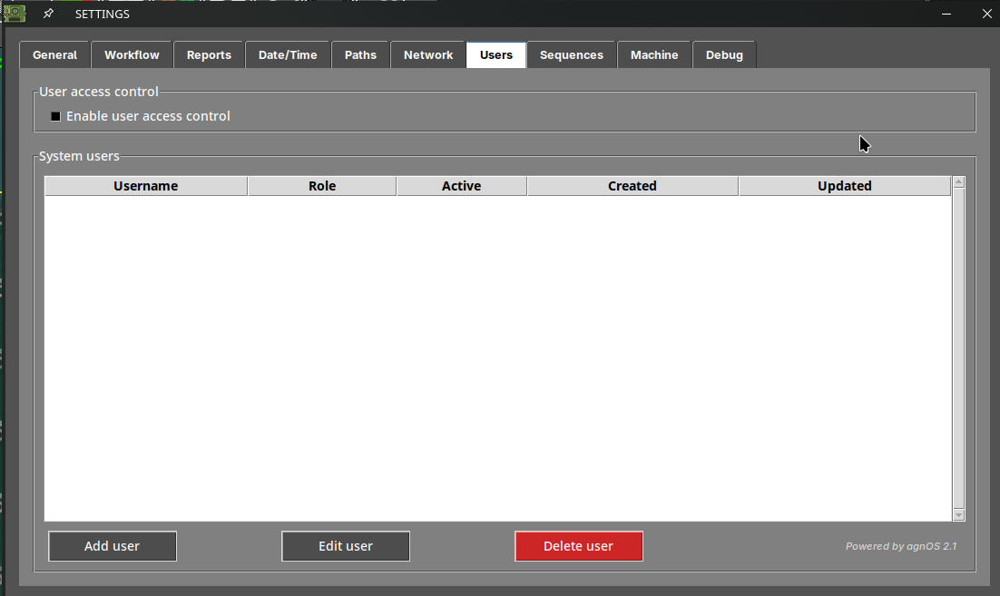
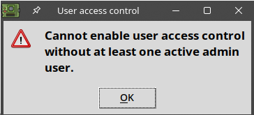
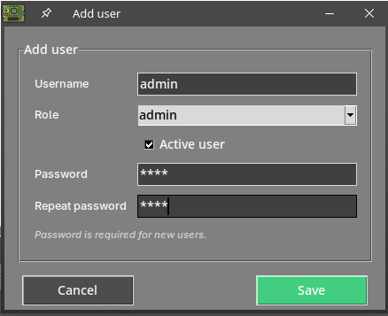
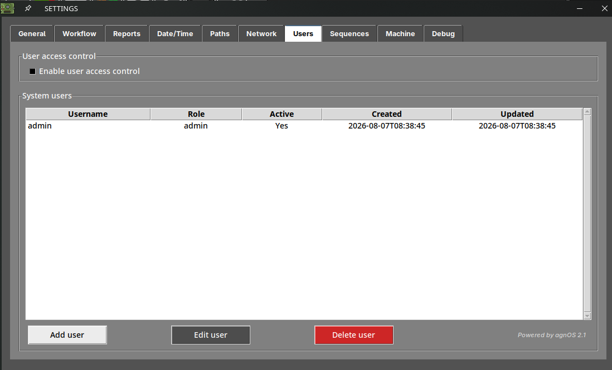
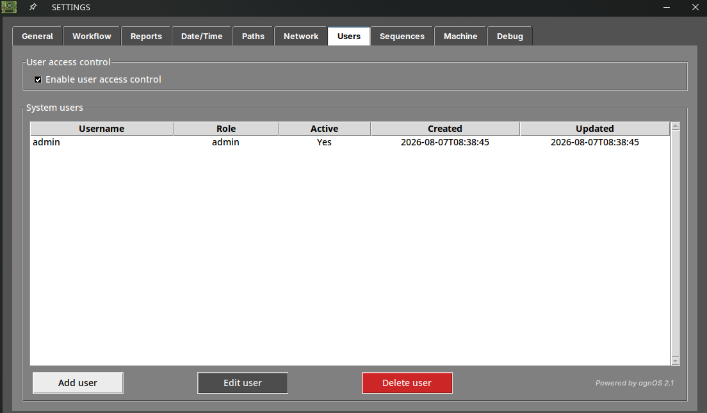
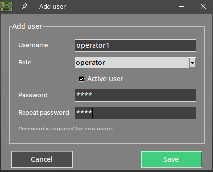
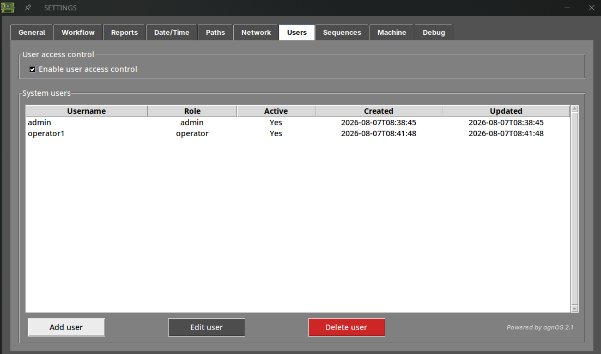
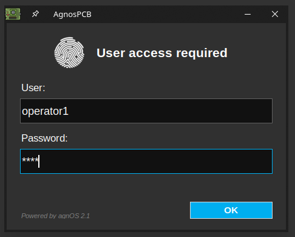

# **User access control**

## What is user access control?

By default, anyone with access to the AOI can use the software and change any of its settings.

**User access control** lets you create individual accounts and require a **username and password** every time the software starts. Each account has a role that determines what its user is allowed to do, so you can let an operator run inspections while keeping the configuration of the machine protected.

## The two roles

Every account has one of these two roles:

| | **admin** | **operator** |
| --- | --- | --- |
| General, Workflow and Report options | Yes | Yes |
| Date/time, Path and Share options | Yes | No |
| Users, Sequences, Machine and Debug | Yes | No |
| Take a REFERENCE image | Yes | Only if operator mode is disabled |
| Manage users | Yes | No |
| Calibrate the platform | Yes | No |
| Set the settings password | Yes | No |
| Generate a backup | Yes | No |

!!! note "The operator role and operator mode are not the same thing"

    The **operator role** described here limits which tabs of the [settings menu](../how_to/Settings_menu.md) the user can open.

    **Operator mode**, in *Settings → Workflow*, simplifies the interface and blocks the capture of REFERENCE images. It applies to whoever is using the machine, regardless of their role.

    They can be used together: an operator account with operator mode enabled gets both the simplified interface and the restricted settings.

## Setting it up

### 1. Open the Users tab

Open the [settings menu](../how_to/Settings_menu.md) and go to the **Users** tab. On a machine that has never been configured, the list is empty and the access control is disabled.

{.center}

### 2. Create an administrator first

Before anything else you need an **admin** account. If you try to enable the access control without one, the software refuses:

{width=350px, .center}

Press **Add user**, fill in the username, select the **admin** role, leave **Active user** checked and type the password twice.

{width=400px, .center}

Press **Save**. The new account appears in the list, with the date it was created.

{.center}

!!! warning "Important"

    Store the administrator password somewhere safe. Once the access control is enabled, this is the account that lets you back into the settings menu.

### 3. Enable the access control

With an active admin account in the list, enable **Enable user access control**.

{.center}

### 4. Add the rest of the users

Add an account for each person who will use the machine, giving them the **operator** role unless they need to change the configuration.

{width=400px, .center}

The list shows every account with its role, whether it is active, and the dates on which it was created and last modified.

{.center}

Press **OK** to save and close the settings menu.

## Logging in

From the next start of the software, the **User access required** dialog asks for the credentials of one of the accounts you created.

{width=400px, .center}

The software then opens with the permissions of that account.

To close the session and let a different user log in, use the **logout** button of the [platform status area](../how_to/Screen-layout.md).

## Managing the accounts

Select an account in the list to work with it:

- **Edit user** — changes the role, the password or the active state of the selected account.
- **Delete user** — permanently deletes it. A confirmation is requested.

!!! tip "Deactivate instead of deleting"

    To stop someone from using the machine without losing the record of their account, edit the user and clear the **Active user** checkbox. The account stays in the list but can no longer log in.

!!! note "Note"
    There must always be at least one **active admin** account. Keep this in mind before deactivating or deleting an administrator.
