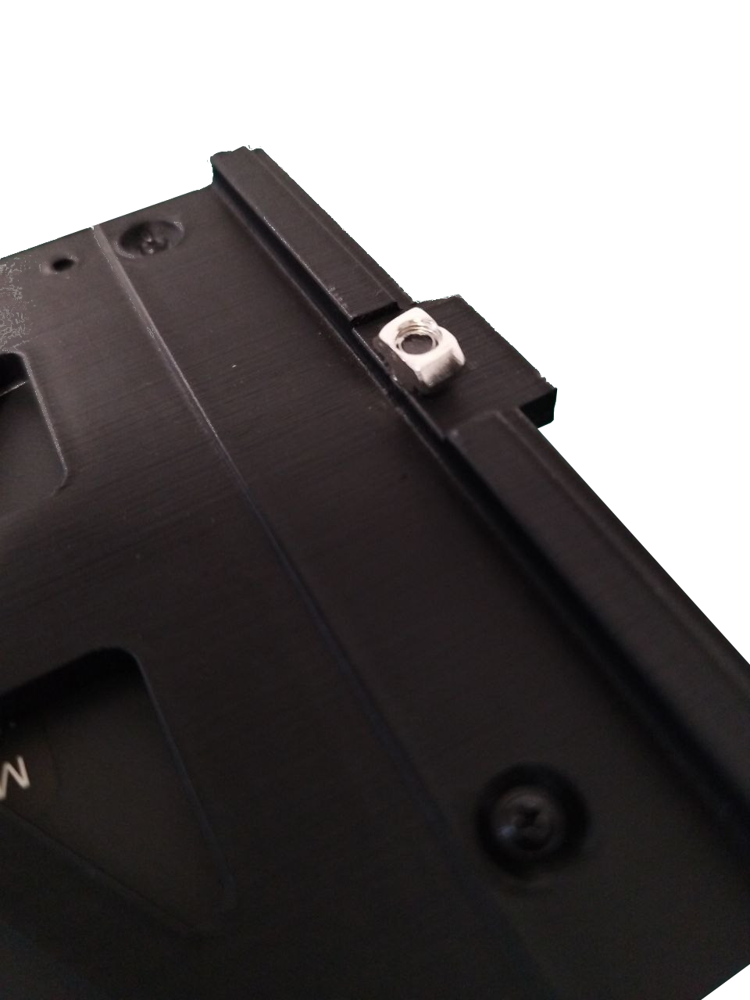
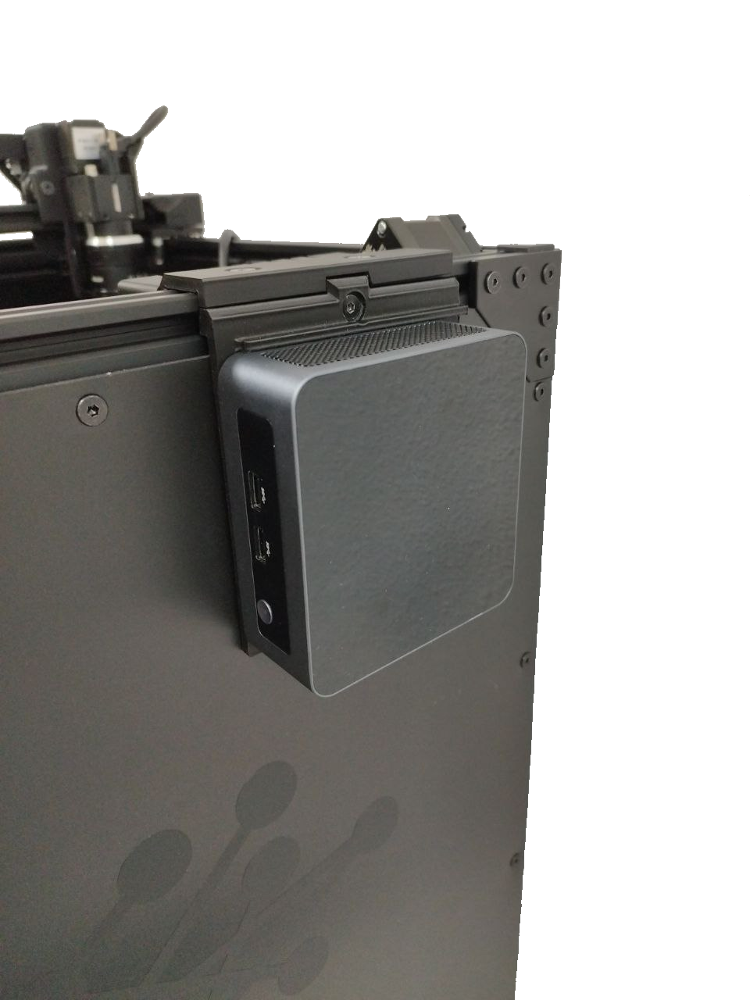
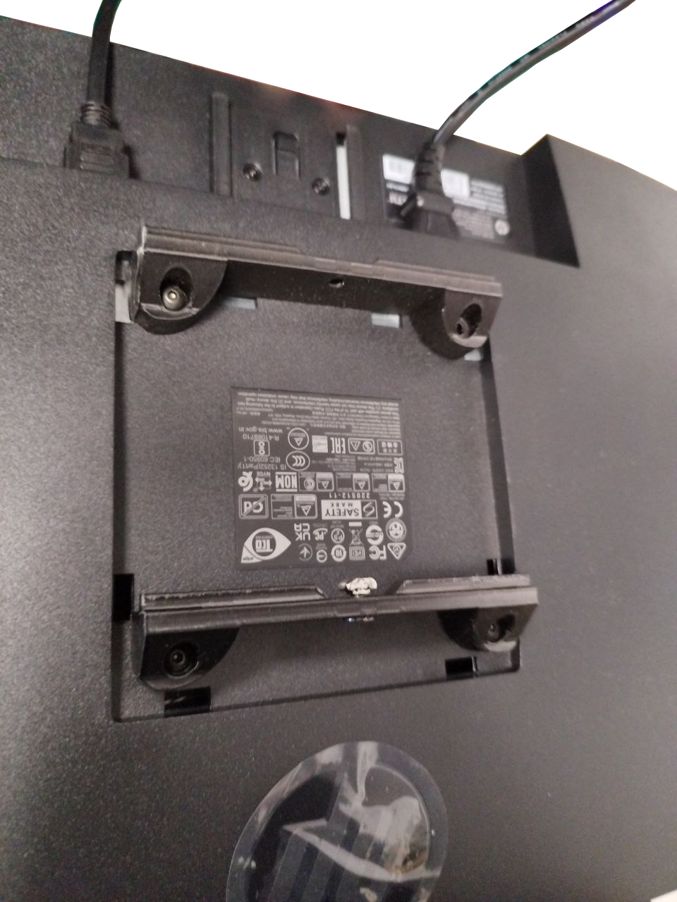
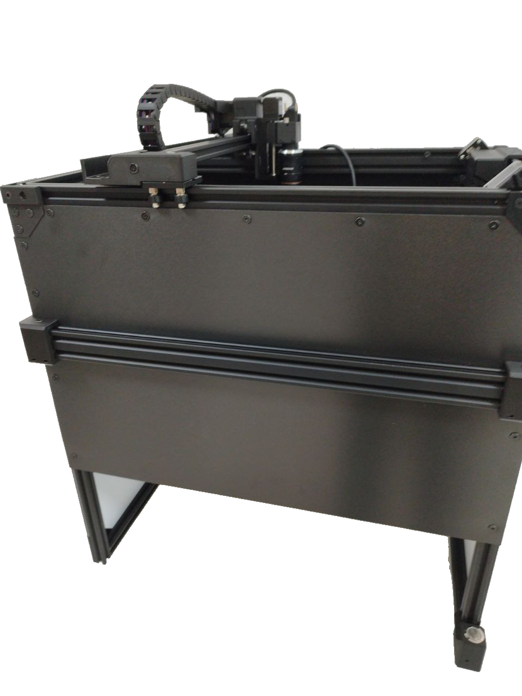
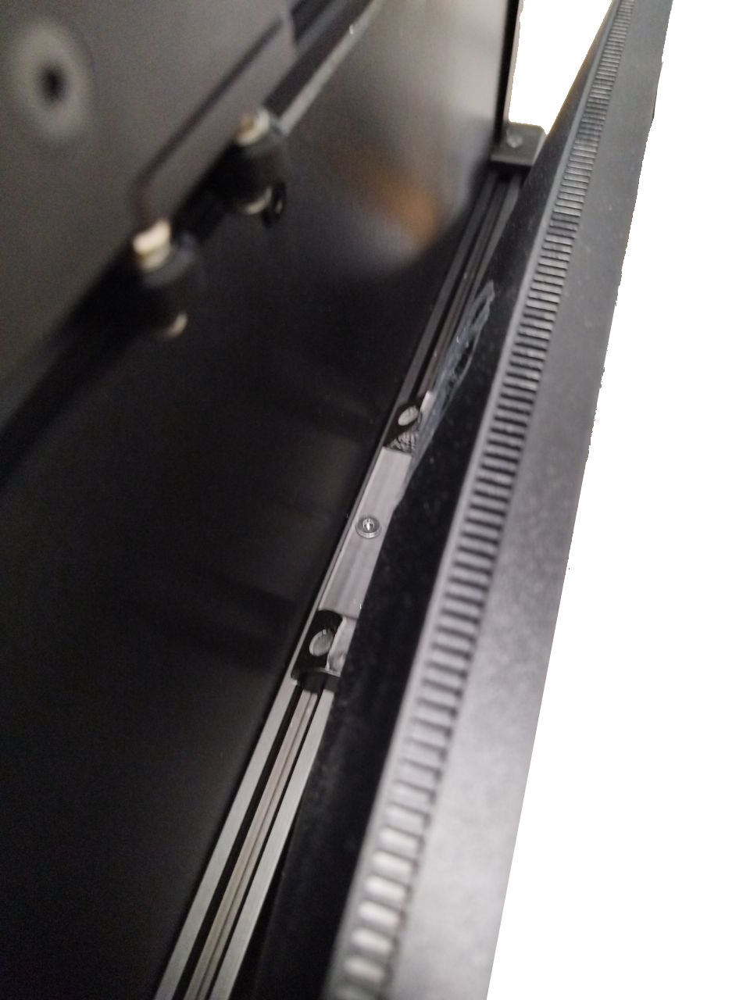

!!! warning "Importante"

    Seleccione su versión de AOI en las pestañas siguientes.

=== "Versión EN LÍNEA"
    1. Coloque la **alfombrilla verde** debajo de la plataforma de inspección. Asegúrese de que esté colocada correctamente y de que la mesa no sea visible en el área de inspección.
    2. Fije el **miniordenador** al lado derecho de la plataforma insertando el tornillo y la tuerca proporcionados en la ranura de aluminio. **Asegúrese de que la pieza de plástico encaje en la ranura de aluminio.**

        {width=300px, .center}
        {width=300px, .center}
    
    3. Conecte la **fuente de alimentación de 19V** al conector trasero del miniordenador.
    4. Conecte el cable USB A a USB B en ángulo entre el panel trasero de la plataforma y el miniordenador.
    5. Conecte la **fuente de alimentación de 12V** al panel trasero de la plataforma.
    6. Conecte el cable USB de la cámara al miniordenador.

        {width=600px, .center}

    7. Conecte el cable HDMI y el cable de alimentación al monitor.
    8. Fije el monitor al perfil de aluminio frontal de la plataforma utilizando el tornillo y la tuerca proporcionados en la parte posterior del monitor. **Asegúrese de que la pieza de plástico encaje en la ranura de aluminio.**

        {width=400px, .center}

        {width=400px, .center}

        {width=400px, .center}

    9. Conecte el cable HDMI a cualquier puerto HDMI y el teclado y ratón a los puertos USB frontales del miniordenador.

=== "Versión SIN CONEXIÓN (OFFLINE)"
    1. Coloque la **alfombrilla verde** debajo de la plataforma de inspección. Asegúrese de que esté colocada correctamente y de que la mesa no sea visible en el área de inspección.
    2. Desempaque el ordenador, abra el panel izquierdo y **retire la espuma** como se muestra en el video.

    

    <iframe width="560" height="315" src="https://www.youtube.com/embed/npedVH6Q4I0?si=yWQ4Yp_C_VUOfj0u" title="YouTube video player" frameborder="0" allow="accelerometer; autoplay; clipboard-write; encrypted-media; gyroscope; picture-in-picture; web-share" referrerpolicy="strict-origin-when-cross-origin" allowfullscreen></iframe>

    3. Conecte los siguientes cables a la parte trasera del ordenador:
        - USB A a USB B en ángulo al panel trasero de la plataforma
        - Cable HDMI
        - Cable USB de la cámara a un **puerto USB 3.0 (puertos azules)**
        - Teclado y ratón
        - Cable de corriente alterna (AC)

    4. Conecte la **fuente de alimentación de 12V** al panel trasero de la plataforma.
    5. Conecte el cable HDMI y el cable de alimentación al monitor.
    6. Fije el monitor al perfil de aluminio frontal de la plataforma utilizando el tornillo y la tuerca proporcionados en la parte posterior del monitor. **Asegúrese de que la pieza de plástico encaje en la ranura de aluminio.**

        {width=400px, .center}

        {width=400px, .center}

        {width=400px, .center}