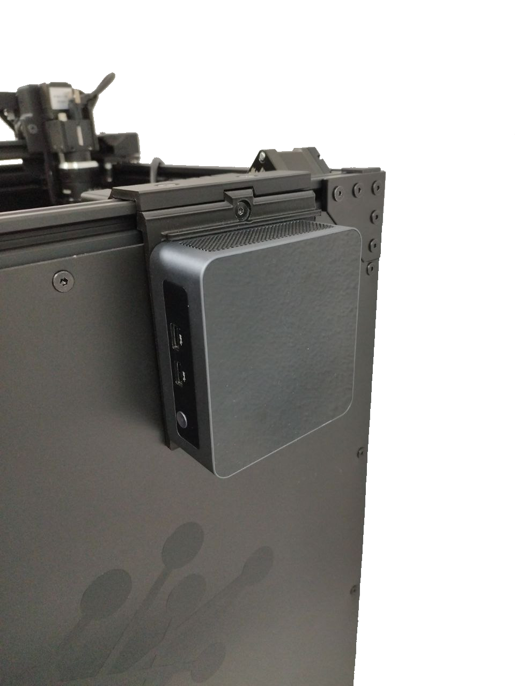

!!! warning "Important"

    Sélectionnez votre version d'AOI dans les onglets ci-dessous.

=== "Version EN LIGNE"
    1. Placez le **tapis vert** sous la plateforme d'inspection. Assurez-vous qu'il est correctement placé et que la table n'est pas visible dans la zone d'inspection.
    2. Fixez le **mini-ordinateur** sur le côté droit de la plateforme en insérant la vis et l'écrou fournis dans la fente en aluminium. **Assurez-vous que la partie en plastique s'insère dans la fente en aluminium.**

        {width=300px, .center}
        {width=300px, .center}
    
    3. Connectez le **bloc d'alimentation 19V** au connecteur arrière du mini-ordinateur.
    4. Connectez le câble USB A vers USB B coudé entre le panneau arrière de la plateforme et le mini-ordinateur.
    5. Connectez le **bloc d'alimentation 12V** au panneau arrière de la plateforme.
    6. Connectez le câble USB de la caméra au mini-ordinateur.

        {width=600px, .center}

    7. Connectez le câble HDMI et le cordon d'alimentation au moniteur.
    8. Fixez le moniteur au profilé en aluminium avant de la plateforme à l'aide de la vis et de l'écrou fournis à l'arrière du moniteur. **Assurez-vous que la partie en plastique s'insère dans la fente en aluminium.**

        {width=400px, .center}

        {width=400px, .center}

        {width=400px, .center}

    9. Connectez le câble HDMI à n'importe quel port HDMI, ainsi que le clavier et la souris aux ports USB avant du mini-ordinateur.

=== "Version HORS LIGNE"
    1. Placez le **tapis vert** sous la plateforme d'inspection. Assurez-vous qu'il est correctement placé et que la table n'est pas visible dans la zone d'inspection.
    2. Déballez l'ordinateur, ouvrez le panneau gauche et **retirez la mousse** comme indiqué dans la vidéo.

    

    <iframe width="560" height="315" src="https://www.youtube.com/embed/npedVH6Q4I0?si=yWQ4Yp_C_VUOfj0u" title="YouTube video player" frameborder="0" allow="accelerometer; autoplay; clipboard-write; encrypted-media; gyroscope; picture-in-picture; web-share" referrerpolicy="strict-origin-when-cross-origin" allowfullscreen></iframe>

    3. Connectez les câbles suivants à l'arrière de l'ordinateur :
        - USB A vers USB B coudé au panneau arrière de la plateforme
        - Câble HDMI
        - Câble USB de la caméra à un **port USB 3.0 (ports bleus)**
        - Clavier et souris
        - Cordon d'alimentation secteur

    4. Connectez le **bloc d'alimentation 12V** au panneau arrière de la plateforme.
    5. Connectez le câble HDMI et le cordon d'alimentation au moniteur.
    6. Fixez le moniteur au profilé en aluminium avant de la plateforme à l'aide de la vis et de l'écrou fournis à l'arrière du moniteur. **Assurez-vous que la partie en plastique s'insère dans la fente en aluminium.**

        {width=400px, .center}

        {width=400px, .center}

        {width=400px, .center}