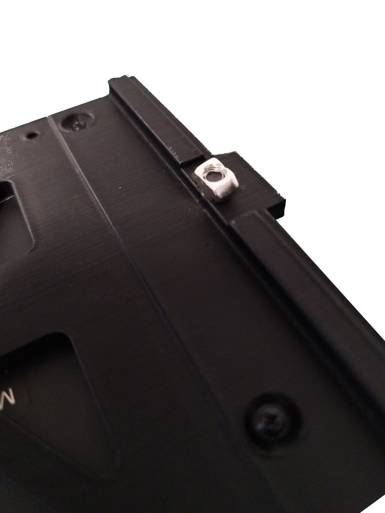

!!! warning "Importante"

    Seleziona la tua versione di AOI dalle schede qui sotto.

=== "Versione ONLINE"
    1. Posiziona il **tappetino verde** sotto la piattaforma di ispezione. Assicurati che sia posizionato correttamente e che il tavolo non sia visibile nell'area di ispezione.
    2. Fissa il **mini-computer** al lato destro della piattaforma inserendo la vite e il dado forniti nell'apposita fessura in alluminio. **Assicurati che la parte in plastica si inserisca nella fessura in alluminio.**

        {width=300px, .center}
        {width=300px, .center}
    
    3. Collega l'**alimentatore da 19V** al connettore posteriore del mini-computer.
    4. Collega il cavo USB A a USB B angolato tra il pannello posteriore della piattaforma e il mini-computer.
    5. Collega l'**alimentatore da 12V** al pannello posteriore della piattaforma.
    6. Collega il cavo USB della telecamera al mini-computer.

        {width=600px, .center}

    7. Collega il cavo HDMI e il cavo di alimentazione al monitor.
    8. Fissa il monitor al profilo frontale in alluminio della piattaforma utilizzando la vite e il dado forniti sul retro del monitor. **Assicurati che la parte in plastica si inserisca nella fessura in alluminio.**

        {width=400px, .center}

        {width=400px, .center}

        {width=400px, .center}

    9. Collega il cavo HDMI a una qualsiasi porta HDMI e la tastiera e il mouse alle porte USB frontali del mini-computer.

=== "Versione OFFLINE"
    1. Posiziona il **tappetino verde** sotto la piattaforma di ispezione. Assicurati che sia posizionato correttamente e che il tavolo non sia visibile nell'area di ispezione.
    2. Disimballa il computer, apri il pannello sinistro e **rimuovi la schiuma** come mostrato nel video.

    

    <iframe width="560" height="315" src="https://www.youtube.com/embed/npedVH6Q4I0?si=yWQ4Yp_C_VUOfj0u" title="YouTube video player" frameborder="0" allow="accelerometer; autoplay; clipboard-write; encrypted-media; gyroscope; picture-in-picture; web-share" referrerpolicy="strict-origin-when-cross-origin" allowfullscreen></iframe>

    3. Collega i seguenti cavi al retro del computer:
        - USB A a USB B angolato al pannello posteriore della piattaforma
        - Cavo HDMI
        - Cavo USB della telecamera a una **porta USB 3.0 (porte blu)**
        - Tastiera e mouse
        - Cavo di alimentazione AC

    4. Collega l'**alimentatore da 12V** al pannello posteriore della piattaforma.
    5. Collega il cavo HDMI e il cavo di alimentazione al monitor.
    6. Fissa il monitor al profilo frontale in alluminio della piattaforma utilizzando la vite e il dado forniti sul retro del monitor. **Assicurati che la parte in plastica si inserisca nella fessura in alluminio.**

        {width=400px, .center}

        {width=400px, .center}

        {width=400px, .center}