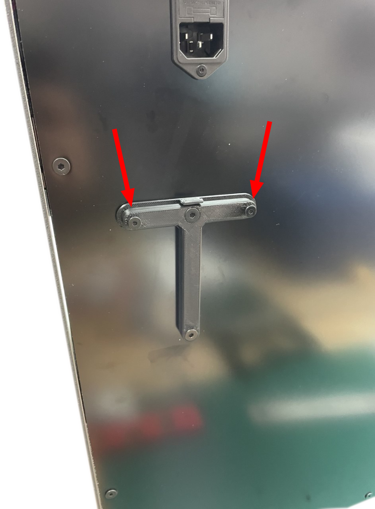
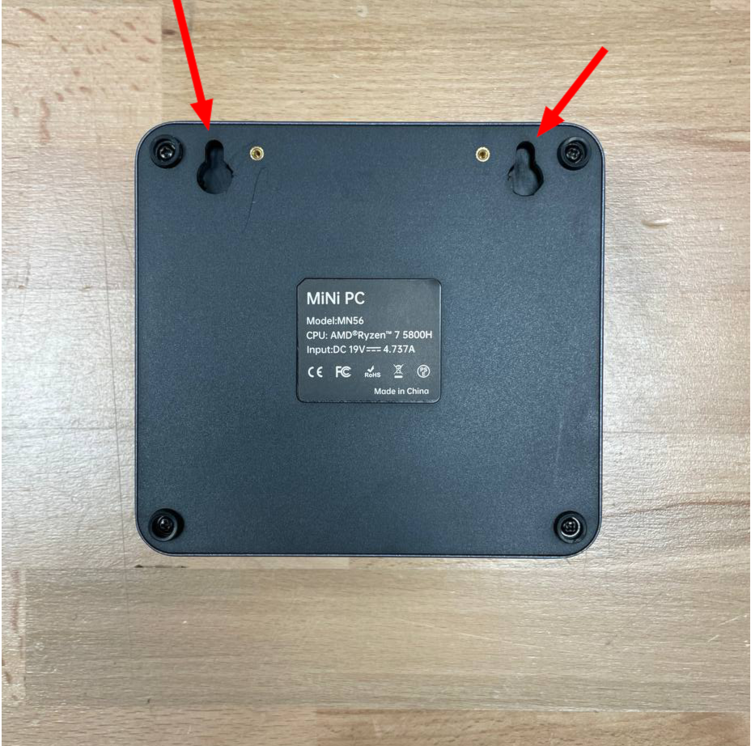
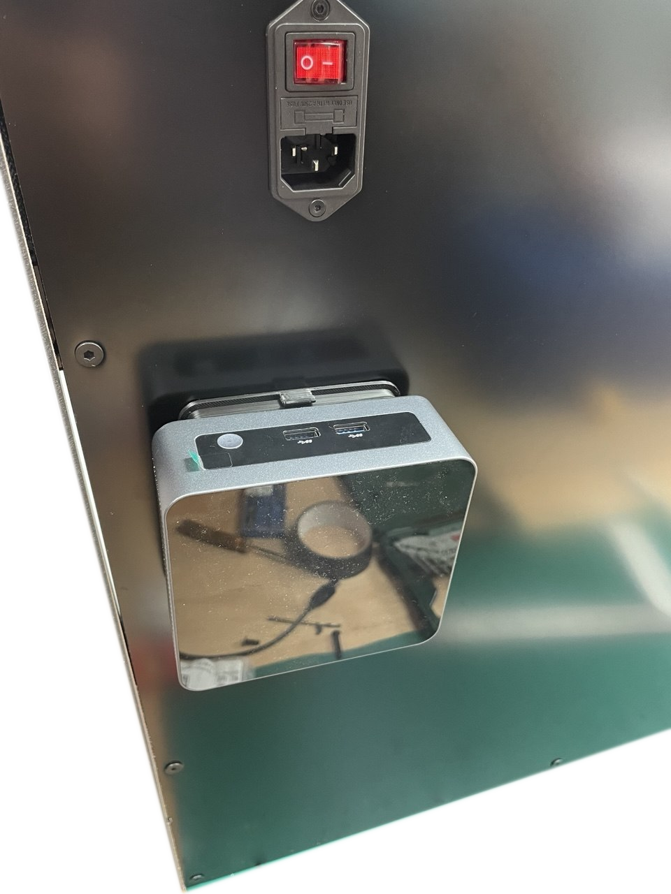
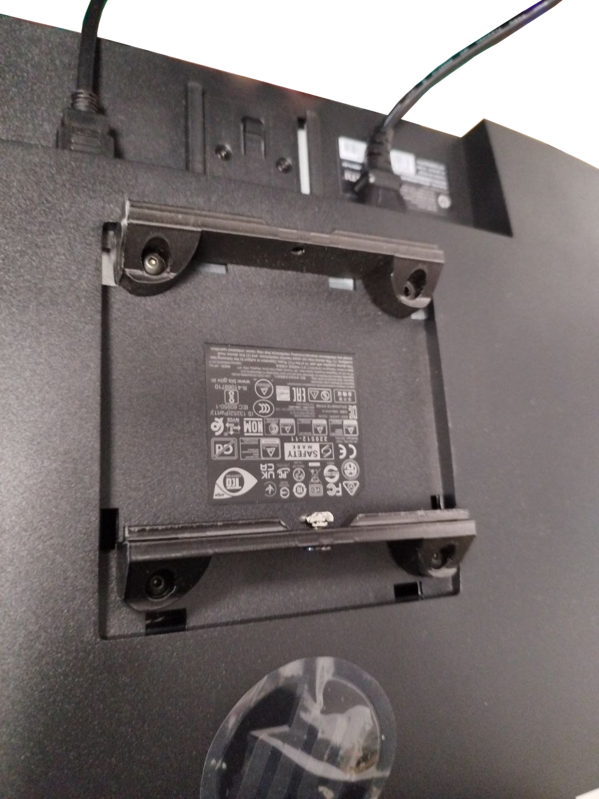
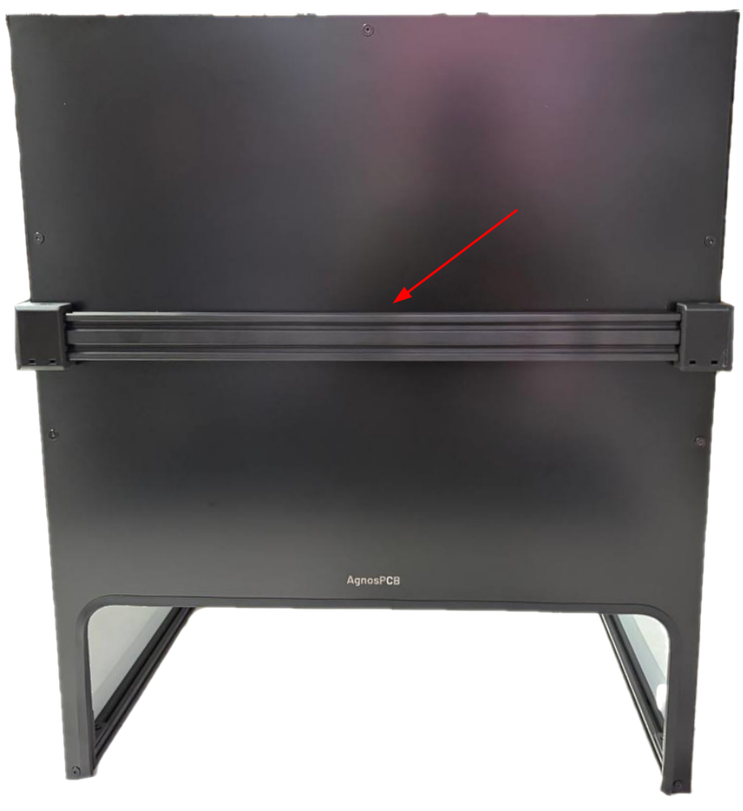
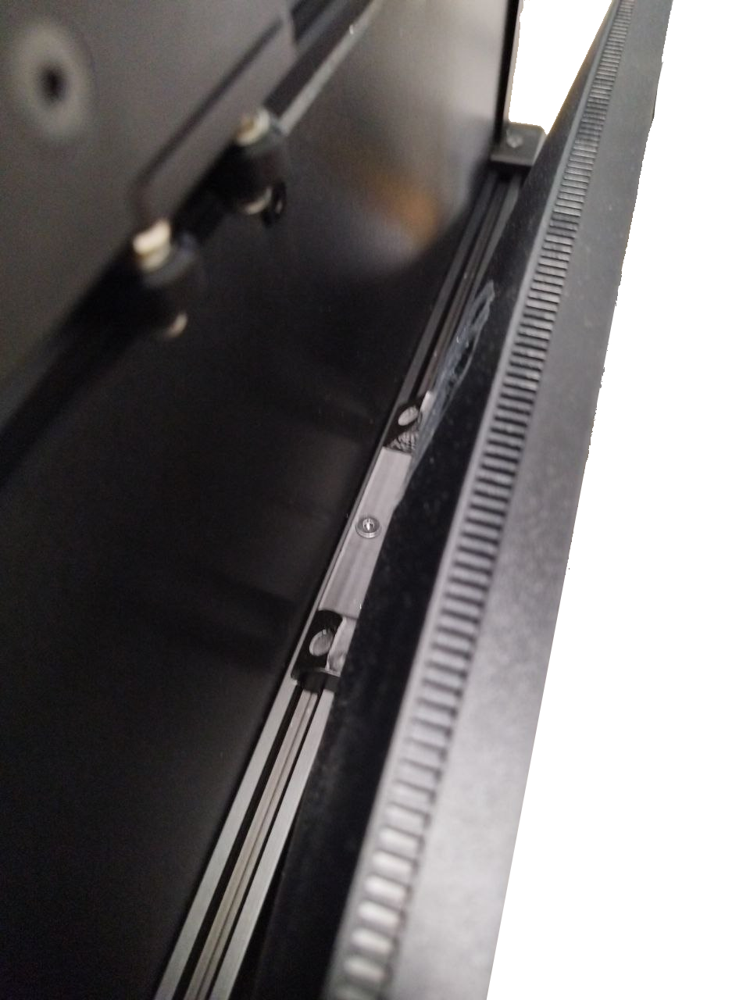

!!! warning "Important"

    Select your AOI version from the tabs below.

=== "ONLINE version"
    1. Place the green mat under the inspection platform. Ensure it is placed correctly and the table is not visible in the inspection area.
    2. Attach the mini computer to the support placed in the rear panel of the inspection platform. Aling the holes placed in the bottom side of the computer with the two screws of the support as shonw in the images.

        {width=400px, .center}

        {width=300px, .center}

        {width=300px, .center}

    
    3. Connect the **19V power supply** to the rear connector of the mini computer.
    4. Connect the USB A to USB B angled cable between the rear panel of the platform and the mini computer.
    5. Connect the **AC power cord** to the rear panel of the platform.
    6. Connect the USB cable from the camera to the minicomputer.
    7. Connect the HDMI cable and power cord to the monitor.
    8. Attach the monitor to the front aluminium profile of the platform using the screw and nut provided on the back of the monitor.  **Make sure that the plastic part fits into the aluminium slot.**

        {width=400px, .center}

        {width=400px, .center}

        {width=400px, .center}

    9. Connect the HDMI cable to a HDMI port and the keyboard and mouse to the USB front ports of the mini computer.

=== "OFFLINE version"
    1. Place the green mat under the inspection platform. Ensure it is placed correctly and the table is not visible in the inspection area.
    2. Unpackage the computer, open the left panel and **remove the protective foam** as shown in the video.

    

    <iframe width="560" height="315" src="https://www.youtube.com/embed/npedVH6Q4I0?si=yWQ4Yp_C_VUOfj0u" title="YouTube video player" frameborder="0" allow="accelerometer; autoplay; clipboard-write; encrypted-media; gyroscope; picture-in-picture; web-share" referrerpolicy="strict-origin-when-cross-origin" allowfullscreen></iframe>

    3. Connect the following cables to the back of the computer:
        - USB A to USB B angled to the rear panel of the platform
        - HDMI cable
        - USB camera cable to a **USB 3.0 port (blue ports)**
        - Keyboard and mouse
        - AC wire

    4. Connect the **AC power cord** to the rear panel of the platform.
    5. Connect the HDMI cable and power cord to the monitor.
    6. Attach the monitor to the front aluminium profile of the platform using the screw and nut provided on the back of the monitor.  **Make sure that the plastic part fits into the aluminium slot.**

        {width=400px, .center}

        {width=400px, .center}

        {width=400px, .center}
