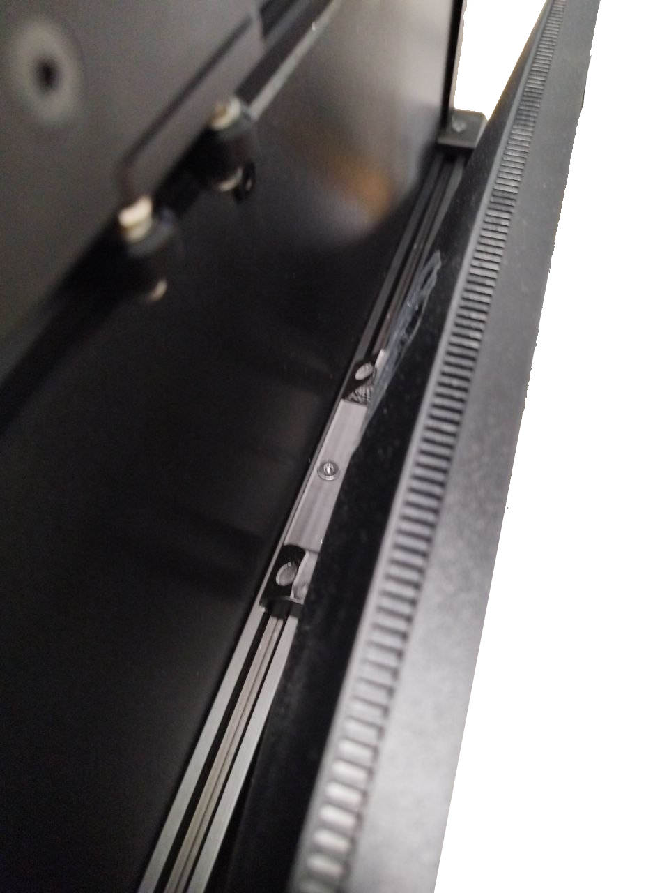

!!! warning "Important"

    Select your AOI version from the tabs below.

=== "ONLINE version"
    1. Place the green mat under the inspection platform. Ensure it is placed correctly and the table is not visible in the inspection area.
    2. Attach the mini computer to the right side of the platform inserting the screw and nut provided in the aluminium slot. **Make sure that the plastic part fits into the aluminium slot.**

        {width=300px, .center}
        {width=300px, .center}
    
    3. Connect the **19V power supply** to the rear conector of the mini computer.
    4. Connect the USB A to USB B angled cable between the rear panel of the platform and the mini computer.
    5. Connect the **12V power supply** to the rear panel of the platform.
    6. Connect the USB cable from the camera to the minicomputer.

        {width=600px, .center}

    7. Connect the HDMI cable and power cord to the monitor.
    8. Attach the monitor to the front aluminium profile of the platform using the screw and nut provided on the back of the monitor.  **Make sure that the plastic part fits into the aluminium slot.**

        {width=400px, .center}

        {width=400px, .center}

        {width=400px, .center}

    9. Connect the HDMI cable to any HDMI port and the keyboard and mouse to the USB front ports of the mini computer.

=== "OFFLINE version"
    1. Place the green mat under the inspection platform. Ensure it is placed correctly and the table is not visible in the inspection area.
    2. Unpackage the computer, open the left panel and **remove the foam** as shown in the video.

    

    <iframe width="560" height="315" src="https://www.youtube.com/embed/npedVH6Q4I0?si=yWQ4Yp_C_VUOfj0u" title="YouTube video player" frameborder="0" allow="accelerometer; autoplay; clipboard-write; encrypted-media; gyroscope; picture-in-picture; web-share" referrerpolicy="strict-origin-when-cross-origin" allowfullscreen></iframe>

    3. Connect the following cables to the back of the computer:
        - USB A to USB B angled to the rear panel of the platform
        - HDMI cable
        - USB camera cable to a **USB 3.0 port (blue ports)**
        - Keyboard and mouse
        - AC wire

    4. Connect the **12V power supply** to the rear panel of the platform.
    5. Connect the HDMI cable and power cord to the monitor.
    6. Attach the monitor to the front aluminium profile of the platform using the screw and nut provided on the back of the monitor.  **Make sure that the plastic part fits into the aluminium slot.**

        {width=400px, .center}

        {width=400px, .center}

        {width=400px, .center}
