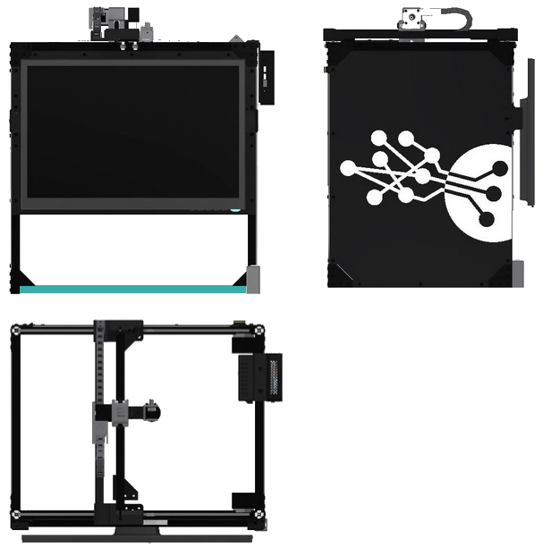
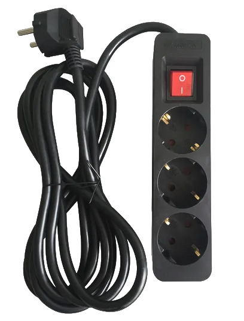
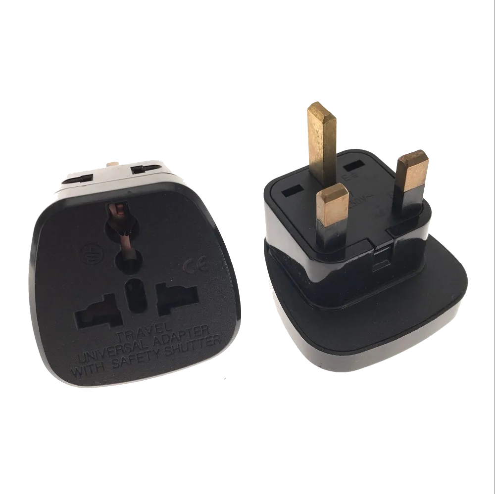
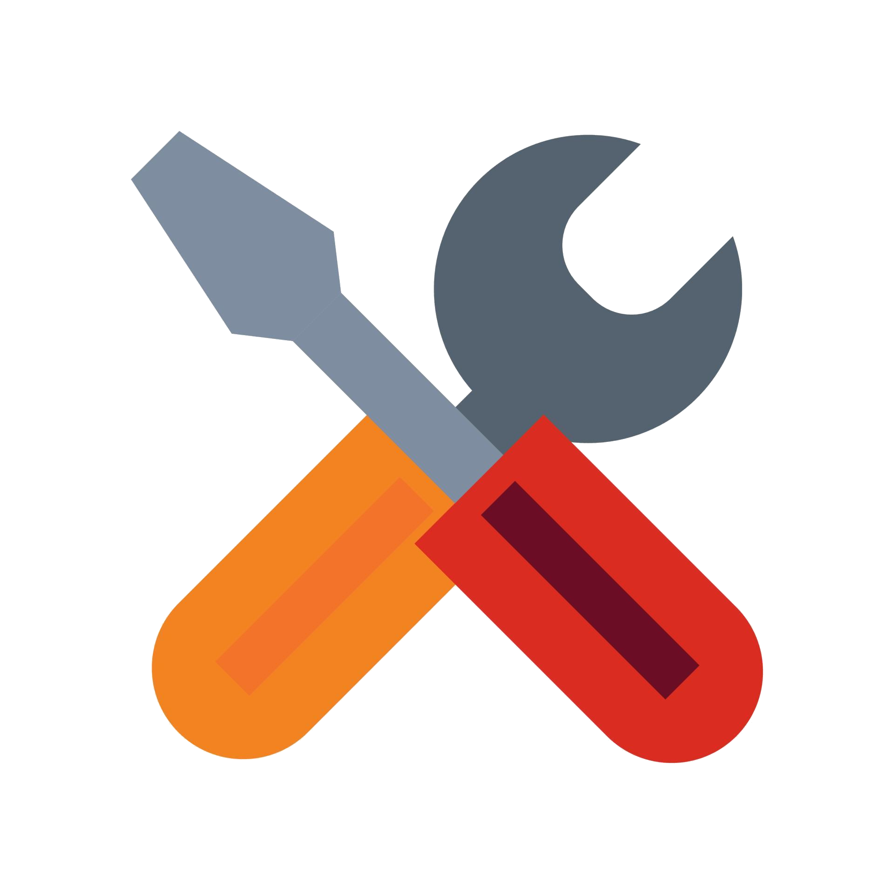

# **Paketinhalt**
___

Die im Paket enthaltenen Elemente werden nachstehend beschrieben.

!!! warning "Wichtig"

    Falls ein Teil fehlt oder defekt ist, [senden Sie uns bitte eine E-Mail](mailto:support@agnospcb.com).

## **Komponenten**
___

| Komponente | Bild |
| --------- | :-----: |
| Vormontierte AOI-Plattform|  {width=300px} |
|1x AC-Netzkabel (Wechselstromkabel)|  {width=300px}|
| Steckdosenleiste |  {width=300px}|
| EU zu UK/USA AC-Adapter (falls erforderlich) |  {width=300px}|
| ESD-Matte + ESD-Handgelenkband + Erdungskabel |  {width=300px}|
| Wartungskit |  {width=300px} |
| Maus & Tastatur |  {width=300px}|
|HDMI-Kabel|  {width=300px}|
|Abgewinkeltes USB A-zu-USB B-Kabel |  {width=300px}|
| 24¨ FULL-HD IPS Monitor | {width=300px} |
|  **\*NUR ONLINE-EINHEITEN\*** Vorprogrammierter Mini-Computer + Tastatur und Maus |  {width=300px} |
|  **\*NUR OFFLINE-EINHEITEN\*** Vorprogrammierter Desktop-Computer + Tastatur und Maus |  {width=300px} |