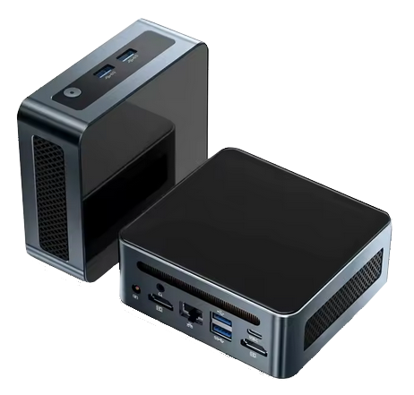

# **Contenido del Paquete**
___

A continuación, se describen los elementos incluidos en el paquete.

!!! warning "Importante"

    Si falta alguna pieza o está defectuosa, [envíenos un correo electrónico](mailto:support@agnospcb.com).

## **Componentes**
___

| Componente | Imagen |
| --------- | :-----: |
| Plataforma AOI premontada|  {width=300px} |
|1x Cable de alimentación CA|  {width=300px}|
| Regleta (Tira de enchufes) |  {width=300px}|
| Adaptador CA de EU a UK/USA si es necesario |  {width=300px}|
| Alfombrilla ESD + Muñequera ESD + Cable de tierra |  {width=300px}|
| Kit de mantenimiento |  {width=300px} |
| Ratón y teclado |  {width=300px}|
|Cable HDMI|  {width=300px}|
|Cable USB A a USB B en ángulo |  {width=300px}|
| Monitor IPS FULL-HD de 24¨ | {width=300px} |
|  **\*SOLO UNIDADES EN LÍNEA\*** Miniordenador preprogramado + Ratón y teclado |  {width=300px} |
|  **\*SOLO UNIDADES SIN CONEXIÓN (OFFLINE)\*** Ordenador de escritorio preprogramado + Ratón y teclado |  {width=300px} |